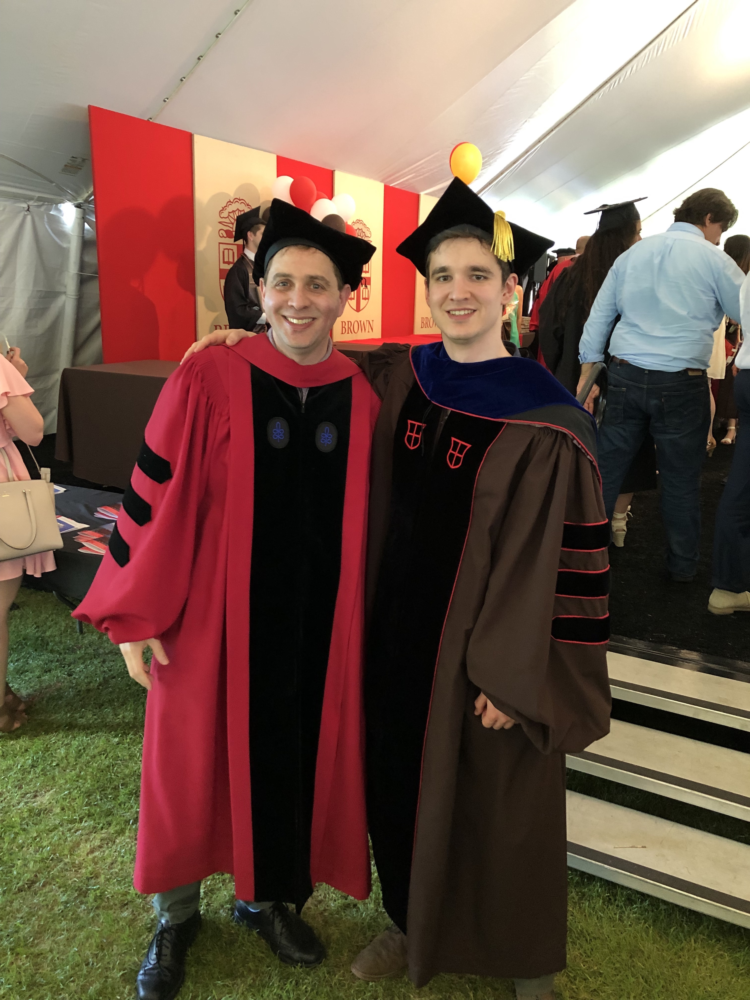
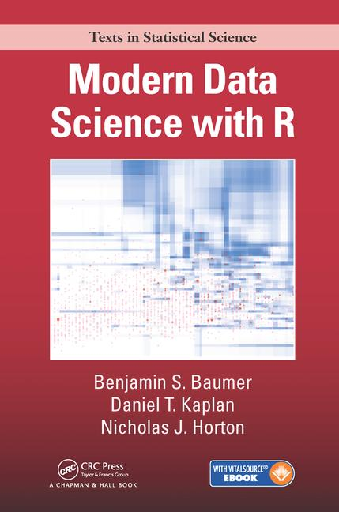

```{r xaringan-themer, include = FALSE}
library(xaringanthemer)
mono_accent(base_color = "#4682B4") #3E8A83?
```

```{r, include = FALSE}
library(tidyverse)
library(babynames)
```

<!--
pagedown::chrome_print("~/Dropbox/Teaching/03-Simmons Courses/MATH228-Introduction to Data Science/Lecture Slides/01-Introduction/01-Introduction.html")
-->

class: center, middle, frame

# Introduction to Data Science

---

# Data Science, Version 1.0

.center[
```{r, echo = FALSE, out.width = "75%"}

```
]

---

# Data Science, Version 2.0

.center[
```{r, echo = FALSE, out.width = "75%"}
knitr::include_graphics("ds_v2.png")
```
]

---

# Data Science, Version 3.0

.center[
```{r, echo = FALSE, out.width = "75%"}
knitr::include_graphics("ds_v3.png")
```
]

---

# Data Science = Science?

.center[
```{r, echo = FALSE, out.width = "75%"}

```
]

---

# Data Science, Version 228?

.center[
```{r, echo = FALSE, out.width = "50%"}
circleFun <- function(center = c(0,0),diameter = 1, npoints = 100){
    r = diameter / 2
    tt <- seq(0,2*pi,length.out = npoints)
    xx <- center[1] + r * cos(tt)
    yy <- center[2] + r * sin(tt)
    return(data.frame(x = xx, y = yy))
}
dat <- circleFun(c(1,-1),2.3,npoints = 100)
#geom_path will do open circles, geom_polygon will do filled circles
ggplot(dat,aes(x,y)) + 
  geom_path() + 
  annotate("text", x = 1, y = -1, label = "Data Science", size = 10) + 
  theme_void() + ggpubr::theme_transparent() + theme(legend.position = "none")
```
]

> **Data Science**: The science of extracting meaningful information from data

---

class: center, middle, frame

# Case Study: Popular baby names since 1880

---

# Collect Data

.center[
```{r, echo = FALSE}

```
]

---

# "Babynames" Dataset
```{r, echo = T, comment = ""}
data(babynames)
babynames
```

---

# Visualization

**How many male babies have been named "Anthony" since 1880?**

```{r, echo = T, comment = "", out.width = "40%"}
babynames %>%
  filter(name == "Anthony" & sex == "M") %>%
  ggplot(aes(x = year, y = n)) +
  geom_point() +
  geom_line() +
  labs(x = "Year", y = "Name Count by Year")
```

---

# Interpretation

**What does the visualization tell us?**

- It tells us how many *male* babies were named *Anthony* in a given year

- The name *Anthony* has (mostly) grown in **number** since 1880. 

--

But what has also grown since 1880?

- **More babies!**

--

> What would be a more useful analysis than simply looking at the NUMBER of babies born with a given name each year?

--

- Comparing multiple babies in the same visualization?

- Some measure of rank within year?

---

class: center, middle, frame

# Course Introductions

---

# Who am I?

.pull-left[
- Asst. Prof of Statistics

- Website: [https://scotinastats.rbind.io/](https://scotinastats.rbind.io/)

- Ph.D. (Biostatistics), Brown U
    - M.S. (Statistics), UMass
    
    - B.A. (Math, Psychology), Holy Cross
    
- Hobbies include **R**. That's it. 
]

.pull-right[
```{r, echo = FALSE}

```
]

---

# Where are you?

**Introduction to Data Science!**

**Some information**

- Grading:
    - Assignments and self-assessments [**30%**]: Individual assignments completed in *R Markdown*. You will critically self-assess your own work using the solution key (see syllabus for details). 
    
    - Mini-projects [**70%**; 45% for the first three, 25% for the final]: Four blogpost-style projects will be assigned throughout the semester. 

---

# Where are you?

**Introduction to Data Science!**

**Some information**

- Student Hours (~~in my office~~ on Zoom):
    - Monday, 11am-12pm; Thursday, 2pm-3pm (all times EST)
    
    - or by appointment (*please Slack message/email me if you'd like to meet*!!!)
    
---

# Textbook
    
.pull-left[
```{r, echo = FALSE, out.width = "75%"}

```
]
   
.pull-right[
- On [Amazon](https://www.amazon.com/Modern-Data-Science-Download-Statistical/dp/1498724485)

- Also **openly** available [online](https://beanumber.github.io/mdsr2e/)
    - This is a *working draft*, and the section numbers aren't all the same as in the first edition. 
    
- **Read the assigned sections** *before* each class! 

Other (open-source) books:

- [R for Data Science](https://r4ds.had.co.nz/)

- [Statistical Inference via Data Science: A Modern Dive](https://moderndive.com/)
]

---

# What this course is:

.center[
```{r, echo = FALSE, dpi = 300}
knitr::include_graphics("ds_pipeline.png")
```
]

--

.pull-left[
- Data visualization

- Data wrangling/cleaning

- Writing functions

- Version control

- Interactive graphics

- Spatial/text data

- Modeling
]

.pull-right[
```{r, echo = FALSE, out.width = "35%"}
knitr::include_graphics("ggplot2_hex.png")
knitr::include_graphics("dplyr_hex.png")
```
```{r, echo = FALSE, out.width = "35%"}
knitr::include_graphics("tidyr_hex.png")
knitr::include_graphics("shiny_hex.png")
```

]


---

# Overarching Themes

.pull-left[
```{r, echo = FALSE, out.width = "35%"}
knitr::include_graphics("rmarkdown_hex.png")
knitr::include_graphics("r_logo.png")
```
```{r, echo = FALSE, out.width = "35%"}
knitr::include_graphics("pipe_hex.jpg")
knitr::include_graphics("tidyverse_hex.png")
```
]

.pull-right[
- Reproducible workflows

- R + R Markdown + R Studio

- `tidyverse`

- Communication

- R + R Markdown + R Studio
]

---
    
# Computing

.pull-left[
We will be doing **a ton** of computing in this class!

Install **BOTH** R and R Studio using the links below:

**Installing R**

- [r-project.org (click)](https://www.r-project.org/)

**Installing R Studio** (Desktop version)

- [https://rstudio.com/products/rstudio/](https://rstudio.com/products/rstudio/)
]

.pull-right[
```{r, echo = FALSE, out.width = "50%"}
knitr::include_graphics("r_logo.png")
```

```{r, echo = FALSE}

```
]

---

# "Super" Flexibility

For maximum benefit, complete the assigned reading in advance and come to class ready with questions, and try your best to stick with the assignment schedule posted on the syllabus.

- But...

--

> I am aiming for total flexibility. *We're still in a pandemic and learning in this environment is HARD*. Issues will arise, and that’s ok! Let’s communicate and we can figure out a plan together. **My main goal is to support you and your learning**. 


---

class: center, middle, frame

# Introduction to R

---

# Using R Studio

1. Open **R Studio** (never open **R**). 

2. In the menu bar at the top of your screen: **File** -- **New File** -- **New Script**

.center[
```{r, echo = FALSE, out.width = "75%"}

```
]

---

# The R Studio Window

.center[
```{r, echo = FALSE, out.width = "50%"}

```
]

**The Four Panels**:

1. **Console** (bottom-left): This is where you can perform simple calculations or run/execute commands. 
    - Either type code directly into the console, or run from a the *editor*...
2. **Editor** (top-left): This is where you can save and edit *R code* and *text* into a **script** or **R Markdown files**.
    - Save all of your code in a script (.R) or R Markdown (.Rmd) files!!!
3. **Files, Packages, Help, Plots** (bottom-right): See your files, packages, help screens, and plots (more in a few...).
4. **Environment** (top-right): Your current workspace (more in a few...).

---

# Pep Talk

Learning R can be difficult at first. 

Hadley Wickham, the chief data scientist at R Studio and the author of some **amazing** R packages (many of which we'll use in this course), made this observation:

> It’s easy when you start out programming to get really frustrated and think, “Oh it’s me, I’m really stupid,” or, “I’m not made out to program.” But, that is absolutely not the case. Everyone gets frustrated. I still get frustrated occasionally when writing R code. It’s just a natural part of programming. So, it happens to everyone and gets less and less over time. Don’t blame yourself. Just take a break, do something fun, and then come back and try again later.

If you're finding yourself stuck on a particular exercise and not understanding, **take a break**, **talk to classmates**, **e-mail/Slack message me**, **schedule a Zoom meeting with me**, etc.

I *promise* you can do this!

---

# Basic Programming Concepts

**Vectors**: a series of values, created using the `c()` command. 
- Type
    ```{r, eval = FALSE, comment = ""}
    c(8, 6, 7, 5, 3, 0, 9)
    ```

    into the **console** (bottom-left) and press "Enter".
- Type 
    ```{r, eval = FALSE, comment = ""}
    c(8, 6, 7, 5, 3, 0, 9)
    ```

    into your **script** (top-left) and click "Run" *while your cursor is on the same line*.
    
Think of `c()` as standing for "*concatenate*" or "*combine*".
    
---

# Basic Programming Concepts

- Type 
    ```{r, eval = FALSE, comment = ""}
    c("Never", "gonna", "give", "you", "up,", 
      "never", "gonna", "let", "you", "down")
    ```

    into your **script** and click "Run".
- Type 
    ```{r, echo = TRUE, eval = FALSE, comment = ""}
    c(Never, gonna, give, you, up, never, gonna, let, you, down)
    ```

    into your **script** and click "Run". What happened?
    
--

Make sure any **character** variable (e.g., non-numerical) is surrounded by *quotation marks*! 

--

**Pro-tip**: Press [command] + [return] (Mac) while your cursor is on the same line as your code, and the line will run!

---

# Basic Programming Concepts

**Assignment**: Let's *assign* the vector `c(8, 6, 7, 5, 3, 0, 9)` to a variable, so we don't have to keep typing it out. 
- Type 
    ```{r, eval = FALSE}
    jenny = c(8, 6, 7, 5, 3, 0, 9)
    ```

    and click "Run".
    
    - **Note**: The symbol `<-` also works in place of `=`, so you can use *either* for assignment. 

--

- You might think nothing happened after that last example. But look to the **Environment** panel (top-right). 
    - Now, type 
        ```{r, eval = FALSE}
        mean(jenny)
        ```
    
        and click "Run".

---

# Arithmetic

At its core, R Studio can act as a simple calculator:
- `+` : addition
- `-` : subtraction
- `*` (shift + 8) : multiplication
- `/` : division
- `^` (shift + 6) : exponent

--

Run the following equations:
- `2+2`
- `753-342`
- `359*315`
- `118/21`
- `5^3`
- `8/2*(2+2)`
- `8/(2*(2+2))`

---

# R Packages

We will be using **R packages** extensively.
- R is *open-source*, which means that members in the community can provide additional functions, data, or documentation in a *package*. 
- Packages are *free* and can be easily downloaded. 

--

**Downloading packages in R Studio**

> **Packages** tab (bottom-right) -- **Install** -- Type package name and press *Install*

- **Right now**: Install the `tidyverse` package. 

- **For homework**: Install the following packages (separate by a comma when typing the names):
    - `mosaic`, `skimr`: packages for data analysis
    - `patchwork`, `ggthemes`: packages for data visualization
    - `mdsr`: package that accompanies one of the course textbooks
    - `babynames`, `dslabs`, `nycflights13`: packages with useful datasets
    - `devtools`: helps with installing some independent packages
    
---

# Loading R Packages

We load R packages with the `library()` function. 
- Note that, while you only **install** packages once, you must **load** them *each time you open a new R session*. 

Run the following:
```{r, message = FALSE, warning = FALSE}
library(tidyverse)
```

Now this suite of packages (and their **dependencies**) is loaded!
    
---

# Functions

Once we define **objects**, **variables**, and/or **datasets**, much of data analysis involves applying a series of **functions** to the data. 

We have already used several functions!
- `c()`
- `mean()`
- `install.packages()` 

--

R functions typically require one or more *arguments*. 
- Some arguments are *pre-set* to **default values**. 

Run the following:
```{r, eval = FALSE}
?mean
?sum
?sqrt
```

---

# Data Frames

**Data frames**:  analogous to rectangular spreadsheets you would see in Excel or Google Spreadsheets. 

- Rows of a data frame correspond to *observations*, and columns correspond to *variables*. 

--

The `mpg` data frame (contained in the `ggplot2` package, which is part of `tidyverse`), contains fuel economy data for 38 popular car models from [http://fueleconomy.gov](http://fueleconomy.gov). 

Run the following two lines:
```{r, eval = FALSE}
library(tidyverse) # Run only if you haven't loaded this yet
mpg
```

```{r, eval = FALSE}
View(mpg)
```

---

# `mpg` Data Frame

A few notes on this dataset...

- A "tibble" is a type of data frame in R. The `mpg` data frame has:
    - 234 **rows**
    - 11 **columns**
    
- The 11 columns correspond to 11 different **variables**. Some of which are: *manufacturer*, *model*, *cty*, *hwy*, etc.

- In the console, we are shown the first 10 rows by default, since the rest can't fit on the screen. 

---

# Exploring Data

The `$` operator allows us to explore a single variable within a data frame. For example, run the following in your console:
```{r, eval = FALSE}
mpg
```

```{r, eval = FALSE}
mpg$manufacturer
```

```{r, eval = FALSE}
mpg$cty
```

- The `$` extracts only the `manufacturer` or `cty` variable from the `mpg` data frame and returns it as a **vector**. 

---

# Exploring Data

We can use the `$` operator to calculate descriptive statistics for variables within a dataset:

```{r, comment = ""}
mean(mpg$cty)
```

**What do you think `cty` means?**

--

You can get help in R by entering a `?` before the name of a function or data frame (*if it comes in an R package*), and a page will appear in the bottom-right panel. 

- Try the following:
```{r}
?mpg
```

I use the help files **all the time**, and you should too, especially if you're stuck with a specific function!

---

# Types of Variables

The object `mpg$city` is not one object, but *several*, contained within a **vector**. 

The `class()` function gives the `class` of an object (e.g., *variable types*). 
```{r}
class(mpg$cty)
```

```{r}
class(mpg$class)
```

---

# Coercion

Elements of a vector must all be of the *same type*. If we try to combine *numbers* and *characters*, strange things can happen:
```{r}
giant_glass = c(1, 800, 54, "giant")
giant_glass
class(giant_glass)
```

--

R **coerced** the data into *characters*! 
- It thinks that, because you put a *character string* in the vector, you mean for the numbers in the vector to be characters as well. 

--

Why doesn't this give a numeric answer?

```{r, eval = FALSE}
mean(giant_glass)
```

---

# Logical Vectors

Another important type of vector is a **logical** vector. These must be either `TRUE` or `FALSE`. 

Is 3 equal to 2?!
```{r}
test = (3 == 2)
test
```

Note that while `=` (and `<-`) are used for **assignment**, a double `==` is used to *test for equality*. 

--

**Example**

Before you run this, try to guess what the result will be!
```{r, eval = FALSE}
test_vec = c(3 == 2, 3 == 3, 3 < 4, 3 < 2)
test_vec
```

---

# Other Functions

`seq()` generates a *sequence* of numbers 

```{r}
# Vector:
x = c(1,2,3)

# We can also define a vector that is a sequence of numbers
y = seq(1, 10, by = 2)
y
```

--

```{r}
# Combine x and y into one vector
c(x, y)
```

--

When `by = 1`, we can use a shortcut...

```{r}
1:10
```

---

# Indexing

In order to retrieve a *specific element* of a vector or data frame, we can use square brackets `[ ]`:
```{r}
# Retrieve the 5th element of mpg$hwy
mpg$hwy[5]

# Retrieve the 5th THROUGH 10th elements of mpg$hwy
mpg$hwy[5:10]
```

--

We can get pretty creative with indexing...

```{r}
# Retrieve only mpg$hwy ABOVE 35
mpg$hwy[mpg$hwy > 35]
```

--

**Note** (to Python users): In R indexing begins at `1`, *not* `0`. 

---

# Indexing

Of course, the previous exercise is pretty meaningless since we don't know *which cars* have good fuel economy. 
- We can index a data frame by specifying both the *row number(s)* and *column number(s)*. 

```{r, eval = FALSE}
# Access the 5th ROW across ALL columns
mpg[5, ]
```

```{r, eval = FALSE}
# Access the 5th ROW of the columns named "manufacturer" and "hwy"
mpg[5, c("manufacturer", "hwy")] 
```

```{r, eval = FALSE}
# Check which cars get more than 35 highway miles per gallon
mpg[mpg$hwy > 35, ]
```

---

class: center, middle, frame

# R Markdown

```{r, echo = FALSE, out.width = "50%"}
knitr::include_graphics("rmarkdown_hex.png")
```

---

# R Markdown

**R Markdown** provides a way for R (and python/SQL) users to produce a single file containing code, output, and notes. 

.center[
```{r, echo = FALSE, out.width = "80%"}
knitr::include_graphics("rmarkdown.png")
```
]

Time for a **demo**! 
    
---

# Chunk Options

- `echo = FALSE`: Don't *show* code

- `eval = FALSE`: Don't *evaluate* the code

- `include = FALSE`: Don't show the code or the results

- `message = FALSE`: Don't show the messages
    - This is usually relevant when you load a package but want to suppress the different "welcome" messages they might give. 
    
- `warning = FALSE`: Don't show warning messages

- `out.width = "50%"` Makes a figure half the size (you can change the percentage to fit your needs). 

In general, show your code and your results, but not your messages. 

**Some references**

- R Markdown: The Definitive Guide, by Xie, Allaire, and Grolemund ([here](https://bookdown.org/yihui/rmarkdown/))

- R Markdown Cookbook, by Xie, Dervieux, and Riederer ([here](https://bookdown.org/yihui/rmarkdown-cookbook/))
