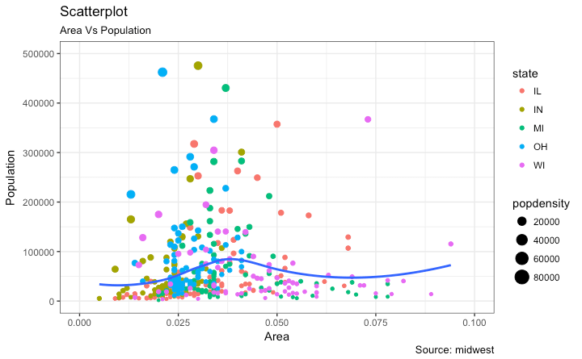

```{r xaringan-themer, include = FALSE}
library(xaringanthemer)
mono_accent(base_color = "#4682B4") #3E8A83?
```

```{r, include = FALSE}
library(tidyverse)
library(mdsr)
library(babynames)
library(ggsci)
library(nycflights13)
library(ggthemes)
library(patchwork)
```

<!--
pagedown::chrome_print("~/Dropbox/Teaching/03-Simmons Courses/STAT228-Introduction to Data Science/Lecture Slides/02-Data_Visualization/02-Data_Visualization.html")
-->

class: center, middle, frame

# Taxonomy of Data Graphics

---

# The Data Science  Pipeline

From *R for Data Science*:

```{r, echo = FALSE, out.width = "75%"}
knitr::include_graphics("ds_pipeline.png")
```

--

**What is a Data Visualization (aka "Dataviz")?**
- A *visual representation of data*

--

**Two main types of dataviz**

1. *Exploratory*

2. *Explanatory*

---

# Exploratory

```{r, echo = FALSE, eval = FALSE}
library(ggplot2movies)
library(reshape2)

movies <- movies %>%
  select(title, year, length, rating, votes, Action, Animation, Comedy, Drama, Documentary, Romance, Short)

movies_cats <- movies %>%
  select(Action, Animation, Comedy, Drama, Documentary, Romance, Short)

#add id column (presumably you have ids more meaningful than row numbers)
movies_cats$row = 1:nrow(movies_cats)

#melt to "long" format
long = melt(movies_cats,id = "row")

#only keep 1's
long = long[which(long$value==1),]

#merge in ids for NA entries
long = merge(movies_cats[,"row", drop = FALSE], long,all.x = TRUE)

long_sum <- long %>%
  group_by(row) %>%
  summarize(Genre = paste(variable, collapse = ", "))

movies$Genre <- long_sum$Genre

movies <- movies %>%
  filter(Genre %in% c("Drama", "Comedy", "Short", "Documentary", "Action", "Romance"))
```

```{r, echo = FALSE, message = FALSE}
movies <- read_csv("~/Dropbox/Teaching/03-Simmons Courses/STAT228-Introduction to Data Science/Data/movies.csv")
movies <- filter(movies, votes >= 30)
set.seed(228)
movies <- movies %>%
  group_by(Genre) %>%
  sample_n(150) %>%
  ungroup()
```
```{r, echo = FALSE, dpi = 300, out.width = "50%"}
ggplot(movies, aes(x = Genre, y = rating)) +
  geom_boxplot() +
  coord_flip() +
  scale_y_continuous(limits = c(0, 10))
```

- Understand the data
- *Explore* hypotheses/results

---

# Explanatory

```{r, echo = FALSE, warning = FALSE, dpi = 300, out.width = "50%"}
# Calculate genre averages
movies <- movies %>%
  group_by(Genre) %>%
  mutate(rating_avg_genre = mean(rating, na.rm = T)) %>%
  ungroup()

# Calculate overall average
rating_avg <- movies %>%
  summarize(avg = mean(rating, na.rm = T)) %>%
  pull(avg)

## coordinates for arrows
arrows <- tibble(
  x1 = c(6, 4.6, 2.6, 2.6, 1.3),
  x2 = c(5.6, 5, 2.1, 2.1, 1.1),
  y1 = c(rating_avg + 1.3, 4.5, 4.5, 4.5, 8.5),
  y2 = c(rating_avg + 0.1, 5.58, 3.5, 5.2, 9.3)
)

## final plot
## set seed to fix position of jittered points
set.seed(228)

## final plot
movies %>%
  ungroup() %>%
  mutate(Genre = fct_reorder(Genre, -rating_avg_genre)) %>%
  ggplot(aes(x = Genre, y = rating, color = Genre)) +
  geom_segment(aes(x = Genre, xend = Genre,
                   y = rating_avg, yend = rating_avg_genre),
               size = 0.8) +
  geom_hline(aes(yintercept = rating_avg), color = "gray70", size = 0.6) +
  stat_summary(fun.y = mean, geom = "point", size = 5) +
  geom_jitter(size = 2, alpha = 0.25, width = 0.2) +
  coord_flip() +
  annotate("text", x = 6.4, y = 7.2, fontface = "italic",
           size = 2.7, color = "gray20",
           label = glue::glue("Overall average:\n{round(rating_avg, 1)} rating")) +
  annotate("text", x = 4.4, y = 4.5, fontface = "italic",
           size = 2.7, color = "gray20",
           label = "Average rating \nby genre") +
  annotate("text", x = 2.7, y = 4.5, fontface = "italic",
           size = 2.7, color = "gray20",
           label = "Movies per genre") +
  annotate("text", x = 1.5, y = 8.1, fontface = "italic",
           size = 2.7, color = "gray20",
           label = "The 'Last Just Man' has the \n highest rating in the sample") +
  geom_curve(data = arrows, aes(x = x1, xend = x2,
                                y = y1, yend = y2),
             arrow = arrow(length = unit(0.08, "inch")), size = 0.5,
             color = "gray20", curvature = -0.3) +
  scale_y_continuous(limits = c(1, 10), expand = c(0.005, 0.005),
                     breaks = c(seq(1, 10, by = 1))) +
  scale_color_uchicago() +
  labs(x = NULL, y = "IMDb.com rating",
       caption = 'Data: IMDb.com') +
  theme_light(base_size = 15) +
  theme(legend.position = "none",
        axis.title = element_text(size = 12),
        axis.text.x = element_text(size = 10),
        plot.caption = element_text(size = 9, color = "gray50"),
        panel.grid = element_blank())
```

- **Communicate** results
- Tell a story!

---

# Babynames Example

Should I focus on the *number* of babies born with the name **Anthony**?

```{r, echo = FALSE, dpi = 300, out.width = "60%"}
arrows <- tibble(
  x1 = c(1975),
  x2 = c(1988),
  y1 = c(3000),
  y2 = c(5000)
)

babynames %>%
  filter(name =="Anthony" & sex == "M") %>%
  ggplot(aes(year, n)) +
  geom_line() +
  geom_point(size = 0.7) +
  geom_vline(xintercept = 1989, col = "blue", linetype = "dashed", size = 0.7) + 
  geom_curve(data = arrows, aes(x = x1, xend = x2,
                                y = y1, yend = y2),
             arrow = arrow(length = unit(0.08, "inch")), size = 0.5,
             color = "gray20", curvature = -0.3) + 
  annotate("text", x = 1975, y = 2200, fontface = "italic",
           size = 2.7, color = "gray20",
           label = "Anthony was \n born HERE") + 
  labs(x = "Year", y = "Name Count by Year", title = "Trends for Babies Named Anthony", 
       caption = 'Data: ssa.gov') + 
  theme_minimal()
```

---

# Babynames Example

Or, should I focus on the **rank** of the name *Anthony* by year?

```{r, echo = FALSE, dpi = 300, out.width = "60%"}
babynames =
  babynames %>%
  group_by(year, sex) %>%
  mutate(rank = row_number())

arrows <- tibble(
  x1 = c(1975),
  x2 = c(1988),
  y1 = c(80),
  y2 = c(74)
)

## Line plot for trends in Anthony name RANK
babynames %>%
  filter(name == "Anthony" & sex == "M") %>%
  ggplot(aes(x = year, y = rank)) +
  geom_line() +
  geom_point(size = 0.7) +
  geom_vline(xintercept = 1989, col = "blue", linetype = "dashed", size = 0.7) + 
  geom_curve(data = arrows, aes(x = x1, xend = x2,
                                y = y1, yend = y2),
             arrow = arrow(length = unit(0.08, "inch")), size = 0.5,
             color = "gray20", curvature = -0.3) + 
  annotate("text", x = 1975, y = 83, fontface = "italic",
           size = 2.7, color = "gray20",
           label = "Anthony was \n born HERE") +
  labs(x = "Year", y = "Name Rank by Year", title = "Anthony Rank",
       caption = 'Data: ssa.gov') + 
  scale_y_reverse() +
  theme_minimal()
```

---

# Composing Data Graphics

*Yao (2013)*: 
- Creating data graphics is like **cooking**. Anyone can do it, but *mastery of their tools, knowledge of their ingredients, insight, and creativity* separates the "great chefs" from the novices. 

--

How data graphics convey information can be understood in terms of *four basic elements*:

1. **visual cues**

2. **coordinate system**

3. **scale** 

4. **context**

---

# Visual Cues

.pull-left[
**Nine distinct visual cues**:

- **Position**
- **Length**
- **Angle**
- **Direction**
- **Shape**
- **Area**
- **Volume**
- **Shade**
- **Color**

Our ability to perceive differences in magnitude descends **in this order**. 
- In other words, we can judge differences in position *very well*, but not so much angles, shade, or color. 
]

--

.pull-right[
```{r, echo = FALSE, dpi = 300}

```

- *Yao (2013)*
]

---

# Coordinate System

**How are the points organized?**

Three common coordinate systems:

- **Cartesian**: The familiar (*x*, *y*) coordinate system that you usually see. 

- **Polar**: Each point is identified by its *distance from the origin* and its **angle**. 

- **Geographic**: Locations are based on geographic coordinates on the surface of Earth (more on this later!). 

--

The choice of coordinate system is **crucial**!

- If you choose the *polar coordinate system* when you should've chosen *Cartesian*, you might not enjoy the result...

---

# Scale

**Three choices**

- **Numerical**
    - Examples: *continuous* (e.g., temperature), *discrete* (e.g., STAT 228 enrollment)
    - Values could be *evenly spaced*, on a *logarithmic scale*, or represent *percentages*

- **Categorical**
    - Examples: nominal or *ordinal* categorical variables

- **Time**
    - Months? Days? Hours? Season??
    
---

# Context

Don't distract, but provide enough useful information in a visualization to provide *context* to the viewer. 
- Can be done with axis labels, titles, annotations, etc. 

--

**Which visual is more useful?**

.pull-left[
```{r, echo = FALSE, dpi = 300, out.width = "85%"}
babynames %>%
  filter(name == "Anthony" & sex == "M") %>%
  ggplot(aes(x = year, y = rank)) +
  geom_line() +
  geom_point(size = 0.7) +
  labs(x = "Year", y = "Rank")
```
]

.pull-right[
```{r, echo = FALSE, dpi = 300, out.width = "85%"}
babynames %>%
  filter(name == "Anthony" & sex == "M") %>%
  ggplot(aes(x = year, y = rank)) +
  geom_line() +
  geom_point(size = 0.7) +
  geom_vline(xintercept = 1989, col = "blue", linetype = "dashed", size = 0.7) + 
  geom_curve(data = arrows, aes(x = x1, xend = x2,
                                y = y1, yend = y2),
             arrow = arrow(length = unit(0.08, "inch")), size = 0.5,
             color = "gray20", curvature = -0.3) + 
  annotate("text", x = 1975, y = 83, fontface = "italic",
           size = 2.7, color = "gray20",
           label = "Anthony was \n born HERE") +
  labs(x = "Year", y = "Name Rank by Year", title = "Anthony Rank",
       caption = 'Data: ssa.gov') + 
  scale_y_reverse() +
  theme_minimal()
```
]

---

# Small Multiples (Facets)

A single graphic can be composed of smaller plot, with *one variable* changing in each plot. 

.center[
```{r, echo = FALSE, dpi = 300, out.width = "50%", message = FALSE, warning = FALSE}
weather_day <- weather %>%
  group_by(month, day) %>%
  summarize(avg_temp = mean(temp, na.rm = TRUE))
month_labels <- c("January", "February", "March", "April", "May", "June", 
                  "July", "August", "September", "October", "November", "December")
names(month_labels) <- c(1:12)

ggplot(data = weather_day, mapping = aes(x = avg_temp)) + 
  geom_histogram(color = "white", binwidth = 5) + 
  facet_wrap( ~ month, labeller = labeller(month = month_labels)) + 
  theme_bw() + 
  labs(x = "Temperature (in degrees Fahrenheit)", y = "Frequency (days)", 
       title = "Daily Average Temperature in NYC")
```
]

---

# Layers

Sometimes it might be preferable to draw new **layers** on top of an *existing graphic*. 

.center[
```{r, echo = FALSE, dpi = 300, out.width = "50%", message = FALSE, warning = FALSE}
ggplot(data = weather_day, mapping = aes(x = avg_temp, color = factor(month))) + 
  geom_density() + 
  theme_bw() + 
  labs(x = "Temperature (in degrees Fahrenheit)", y = "Density", 
       title = "Daily Average Temperature in NYC") + 
  scale_color_discrete(name = "Month", 
                       labels = c("January", "February", "March", "April", "May", "June", 
                                  "July", "August", "September", "October", "November",
                                  "December"))
```
]

- **Be careful!** There is a *limit* to how many layers we can effectively parse. 

---

# Animation

An **animation** can sometimes effectively convey the changes in an additional variable, especially if that variable is **time**. 
- However, it can't be used on the *printed page*. 

--

.center[
```{r, echo = FALSE, eval = TRUE, dpi = 300, out.width = "50%", message = FALSE, warning = FALSE}
library(gganimate) #install 'png' and 'gifski' if it doesn't work
weather_day$month[weather_day$month == 1] <- "Jan"
weather_day$month[weather_day$month == 2] <- "Feb"
weather_day$month[weather_day$month == 3] <- "Mar"
weather_day$month[weather_day$month == 4] <- "Apr"
weather_day$month[weather_day$month == 5] <- "May"
weather_day$month[weather_day$month == 6] <- "Jun"
weather_day$month[weather_day$month == 7] <- "Jul"
weather_day$month[weather_day$month == 8] <- "Aug"
weather_day$month[weather_day$month == 9] <- "Sep"
weather_day$month[weather_day$month == 10] <- "Oct"
weather_day$month[weather_day$month == 11] <- "Nov"
weather_day$month[weather_day$month == 12] <- "Dec"
weather_day$month <- factor(weather_day$month, 
                            levels = c("Jan", "Feb", "Mar", "Apr", 
                                       "May", "Jun", "Jul", "Aug", "Sep", 
                                       "Oct", "Nov", "Dec"))

ggplot(data = weather_day, mapping = aes(x = avg_temp)) + 
  geom_histogram(color = "white", binwidth = 5) + 
  theme_bw() + 
  labs(x = "Temperature (in degrees Fahrenheit)", y = "Frequency (days)", 
       title = "Daily Average Temperature in NYC: {closest_state}") +
  transition_states(month,
                    transition_length = 0.1,
                    state_length = 0.1)
```

]

---

# Animation

Let's look at one more...

.center[
```{r, echo = FALSE, eval = TRUE, dpi = 300, out.width = "50%", message = FALSE, warning = FALSE}
weather_month <- weather_day %>%
  group_by(month) %>%
  summarize(avg_temp = mean(avg_temp))

ggplot(weather_month, aes(month, avg_temp, fill = avg_temp)) +
  geom_col() +
  scale_fill_distiller(palette = "Reds", direction = 1) +
  labs(x = "", 
       y = "Monthly Average Temperature in NYC (in degrees Fahrenheit)") + 
  theme_minimal() +
  theme(
    axis.text.x = element_text(size = 10),
    panel.grid = element_blank(),
    panel.grid.major.y = element_line(color = "white"),
    panel.ontop = TRUE, 
    legend.position = "none"
  ) + 
  transition_states(month, wrap = FALSE) +
  shadow_mark()
```
]

---

# Dissecting Data Visualizations

.center[
```{r, echo = FALSE, out.width = "40%", dpi = 300, warning = FALSE}
library(nycdogs)
bite_tab = nyc_bites %>%
  count(breed) %>%
  arrange(desc(n)) %>%
  slice(1:6)
bite_tab$breed[c(3,4)] <- c("Pit Bull Mix", "Terrier-Pit Bull")
names(bite_tab) <- c("Breed", "Count")

bite_tab %>%
  ggplot(aes(x = reorder(Breed, Count), y = Count)) + 
  geom_col() + 
  coord_flip() + 
  labs(x = "", title = "Dog bites by breed in NYC, 2014-2015", 
       caption = "Top 6 breeds only") + 
  theme_bw()
```
]

- **Visual cues**: position, length
- **Coordinate system**: Cartesian (though the *y*-coordinate is categorical here)
- **Scale**: categorical *y* (arranged in order of `Count`); *x* measured on **linear** scale (i.e., values are *evenly spaced*)
- **Context**: provided by axis labels and title

---

# Dissecting Data Visualizations

.center[
```{r, echo = FALSE, out.width = "60%", dpi = 300, warning = FALSE}
babynames %>%
  filter(name %in% c("Anthony", "Robert") & sex == "M") %>%
  ggplot(aes(x = year, y = rank, color = name)) +
  geom_line() +
  geom_point(aes(shape = name)) +
  geom_vline(xintercept = 1989, col = "black", linetype = "dashed", size = 0.7) + 
  geom_curve(data = arrows, aes(x = x1, xend = x2,
                                y = y1, yend = y2),
             arrow = arrow(length = unit(0.08, "inch")), size = 0.5,
             color = "gray20", curvature = -0.3) + 
  annotate("text", x = 1975, y = 83, fontface = "italic",
           size = 2.7, color = "gray20",
           label = "Anthony was \n born HERE") +
  annotate("text", x = 1920, y = 20, fontface = "italic", 
           size = 2.7, color = "gray20", 
           label = "Not sure when \n Robert was born...") +
  labs(x = "Year", y = "Name Rank by Year", title = "Anthony and Robert Rank",
       caption = 'Data: ssa.gov', 
       color = "Name", shape = "Name") + 
  scale_y_reverse() +
  theme_minimal()
```
]

**Visual cues?** **Coordinate system?** **Scale?** **Context?**

---

# Dissecting Data Visualizations

.pull-left[
```{r, echo = FALSE, dpi = 300, warning = FALSE}
bite_tab = nyc_bites %>%
  count(breed) %>%
  arrange(desc(n)) %>%
  slice(1:6)

bite_tab_bor = nyc_bites %>%
  count(breed, borough) %>%
  arrange(desc(n)) %>%
  filter(breed %in% bite_tab$breed)

bite_tab_bor = bite_tab_bor[-which(bite_tab_bor$borough == "Other"), ]

bite_tab_bor$breed[c(5, 7, 10, 19, 20, 21, 24, 25, 27, 30)] <- c("Terrier-Pit Bull", "Pit Bull Mix", "Pit Bull Mix",
                                                                 "Pit Bull Mix", "Terrier-Pit Bull", "Pit Bull Mix",
                                                                 "Terrier-Pit Bull", "Terrier-Pit Bull", "Pit Bull Mix", 
                                                                 "Terrier-Pit Bull")

names(bite_tab_bor) <- c("Breed", "Borough", "Count")

bite_tab_bor = bite_tab_bor %>%
  group_by(Borough) %>%
  mutate(Breed = fct_reorder(Breed, Count))

ggplot(data = bite_tab_bor, aes(x = factor(1), y = Count, fill = Breed)) + 
  geom_col(width = 1, position = "fill") + 
  coord_polar(theta = "y") + 
  facet_wrap( ~ Borough) + 
  labs(x = "", y = "", fill = "", 
       title = "Dog Bite Incidents by Breed and Borough") + 
  theme(axis.text.y = element_blank(), 
        axis.ticks = element_blank())
```
]

.pull-right[
- **Visual cues**: color (distinguishing `Breed`), angle (to quantify differences in bite proportion within `Borough`)

- **Coordinate system**: polar coordinate system

It would probably be easier to just view the percents in a **table**, or in a **better plot**. 

]

---

# A Better Plot than a Pie Chart

.center[
```{r, echo = FALSE, out.width = "60%", dpi = 300, warning = FALSE}
bite_tab_bor %>%
  ggplot(aes(x = Borough, y = Count, fill = Breed, color = Breed)) + 
  geom_linerange(aes(x = Borough, ymin = 0, ymax = Count), 
                 position = position_dodge(width = 1)) + 
  geom_vline(xintercept = 4.5, col = "gray20", linetype = "dashed", size = 0.7) +
  geom_vline(xintercept = 3.5, col = "gray20", linetype = "dashed", size = 0.7) +
  geom_vline(xintercept = 2.5, col = "gray20", linetype = "dashed", size = 0.7) +
  geom_vline(xintercept = 1.5, col = "gray20", linetype = "dashed", size = 0.7) +
  geom_point(size = 4, alpha = 0.6, position = position_dodge(width = 1)) + 
  coord_flip() + 
  labs(y = "Number of bite incidents") + 
  theme_bw()
```

**Lollipop Chart!**
]

---

# Pie charts are bad!

*Do not. Use. Pie charts.* 

.center[
```{r, echo = FALSE, out.width = "60%"}
knitr::include_graphics("batman.jpg")
```

**The Batman (Ben Affleck version) of Dataviz**
]

---

class: center, middle, frame

# The Grammar of Graphics

.pull-left[
```{r, echo = FALSE, dpi = 350, out.width = "85%"}
knitr::include_graphics("ggplot2_hex.png")
```
]

.pull-right[
```{r, echo = FALSE, dpi = 250}

```
]

---

# Needed Packages

```{r, eval = FALSE, message = FALSE, warning = FALSE}
library(mdsr) 
library(tidyverse) # includes ggplot2
```

---

# Dataviz with ggplot2

.center[
```{r, echo = FALSE, dpi = 300, out.width = "75%"}

```
]

--

`ggplot2` is just *one engine* in R used to create graphics. 

- Other examples: **base** (e.g., `plot(x, y)`), **lattice** (used in the `mosaic` package)

---

# The Grammar of Graphics

.pull-left[
```{r, echo = FALSE}

```
]

.pull-right[
```{r, echo = FALSE}

```
]

--

A theoretical framework for data visualization

- *Idea*: You construct plots in the same way that you construct sentences, by combining many different elements. 

---

# What is a statistical graphic?

The **grammar of graphics** defines a "statistical graphic" as the following:

- **statistical graphic**: a mapping of `data` variables to `aes()`thetic attributes of `geom_`etric objects

--

Let's look back at the statistical graphic on area vs. population in US cities. 

.center[
```{r, echo = FALSE}
tab <- data.frame(data = c("Area", "Population", "State", "PopDensity"), aes = c("x", "y", "color", "size"), geom = c("point, smooth", "point, smooth", "point", "point"))
knitr::kable(tab, format = "html")
```
]

---

# Components of the Grammar

We can break a graphic into three essential components:

1. `data`: the dataset composed of variables that we *map*
2. `aes`: aesthetic attributes of the geometric object. 
    - x/y position, color, shape, and size
3. `geom`: the shape or visual representation of our data. 
    - `geom_` ... point, line, boxplot, histogram, bar, etc.

--

.center[
```{r, echo = FALSE, out.width = "75%"}
knitr::include_graphics("grammar-of-graphics.png")
```
]
---

# The `CIACountries` Data Frame

```{r}
head(CIACountries, 5) # Show the first 5 rows of CIACountries
```

```{r, eval = FALSE}
?CIACountries # Help page 
View(CIACountries) # View the raw data in a separate window
```

---

# Basic Template

How can we make a plot of `educ` (education spending, % of GDP) versus `gdp` (GDP per capita, &#36;/person)?

--

```{r, eval = FALSE}
ggplot(data = CIACountries, mapping = aes(x = educ, y = gdp))
```

- What happened? What do you think we're missing?

---

# Basic Template

```{r, warning = FALSE, dpi = 300, out.width = "50%"}
ggplot(data = CIACountries, mapping = aes(x = educ, y = gdp)) + 
  geom_point(size = 3) #<<
```

---

# Basic Template

```{r, eval = FALSE}
ggplot(data = CIACountries, mapping = aes(x = educ, y = gdp)) + 
  geom_point(size = 3)
```

Graphics in `ggplot2` are built *incrementally* by different elements:


--

- `ggplot()` creates the plot, and any arguments within the function are applied globally throughout the plot.  
    
--

- The two **aesthetics** (`aes()`) map the *horizontal coordinate* (*x*) to `educ`, and the *vertical coordinate* (*y*) to `gdp`. 
    - Aesthetics *always* map *variables* to *visual cues*. 

--

- `geom_point()` plots *points*, where are (currently) the only element in the plot. 
    - `size = 3` is **not an aesthetic**; it only controls the *size* of the points. 
    - The *only thing* distinguishing one point from another is *location*. 

---

# Adding Aesthetics

We can define *additional aesthetics*:

```{r, warning = FALSE, dpi = 300, out.width = "45%"}
ggplot(data = CIACountries, mapping = aes(x = educ, y = gdp)) + 
  geom_point(aes(color = net_users), size = 3) #<<
```

---

# Adding Aesthetics

```{r, eval = FALSE}
ggplot(data = CIACountries, mapping = aes(x = educ, y = gdp)) + 
  geom_point(aes(color = net_users), size = 3) 
```

Here we mapped the **color** of each point to the categorical `net_users` variable (fraction of Internet users). 

- Because `color = ` is inside of `aes()`, this *must be mapped to a variable*. 

Run the following instead:

```{r, eval = FALSE}
ggplot(data = CIACountries, mapping = aes(x = educ, y = gdp)) + 
  geom_point(color = "hotpink", size = 3) 
```

---

# Adding Aesthetics

```{r, warning = FALSE, dpi = 300, out.width = "50%"}
ggplot(data = CIACountries, mapping = aes(x = educ, y = gdp)) + 
  geom_point(aes(color = net_users, size = roadways)) #<<
```

---

# Facets

Sometimes, having many **aesthetics** specified in a single plot can result in a visualization that is difficult to read. 

- **Facets** are multiple side-by-side visualizations that each show a different level of a categorical variable. 

--

Run the following:

```{r, eval = FALSE}
ggplot(data = CIACountries, mapping = aes(x = educ, y = gdp)) + 
  geom_point(aes(size = roadways)) + 
  facet_wrap( ~ net_users)
```

--

The `facet_wrap()` function creates a **facet** for each level of a *single categorical variable*, where the name of the categorical variable (`net_users`) follows the "tilde" (`~`). 

- You can also run `facet_wrap( ~ net_users, nrow = 1)` to force each facet to the *same row*. 

---

# Labels

Remember, in order to *tell a story* with your data visualization, appropriate labels are crucial!

- The `labs()` layer can add custom labels to each mapping in your plot:

```{r, eval = FALSE}
ggplot(data = CIACountries, mapping = aes(x = educ, y = gdp)) + 
  geom_point(aes(color = net_users, size = roadways)) + 
  labs(x = "Education spending (% of GDP)", y = "GDP per capita", 
       color = "% Internet users", size = "Roadways per unit area")
```

--

Each argument in `labs()` changes the **label of the aesthetic** as it appears in the visualization. 

- `x = ` and `y = ` change *axis labels*, while `color = ` and `size = ` change *legend labels*. 

---

# Labels

```{r, warning = FALSE, dpi = 300, out.width = "45%"}
ggplot(data = CIACountries, mapping = aes(x = educ, y = gdp)) + 
  geom_point(aes(color = net_users, size = roadways)) + 
  labs(x = "Education spending (% of GDP)", y = "GDP per capita", 
       color = "% Internet users", size = "Roadways per unit area")
```

---

# Practice

The `mpg` data frame in the `ggplot2` package contains fuel economy data from 1999 and 2008 for 38 popular car models. 

```{r, eval = FALSE}
View(mpg)
```

Using the `mpg` data, create a visualization that depicts the relationship between *city miles per gallon* (`cty`) and *highway miles per gallon* (`hwy`). 

- Add a **color** aesthetic for `class` (the "type" of car). 

```{r, eval = FALSE, echo = FALSE}
ggplot(data = mpg, aes(x = cty, y = hwy)) + 
  geom_point(aes(color = class))
```


    
    
    