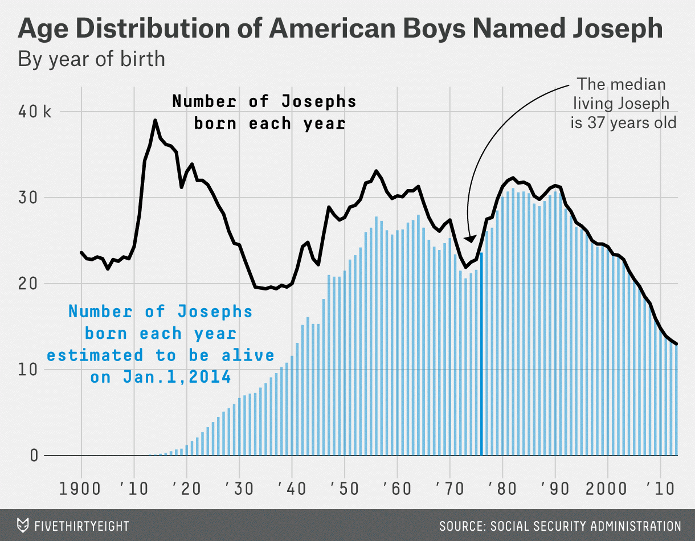

```{r xaringan-themer, include = FALSE}
library(xaringanthemer)
mono_accent(base_color = "#4682B4") #3E8A83?
```

```{r, include = FALSE}
library(tidyverse)
library(mdsr)
library(babynames)
library(ggsci)
library(nycflights13)
library(ggthemes)
library(patchwork)
```

class: center, middle, frame

# Canonical Data Graphics

---

# Needed Packages

```{r, eval = FALSE, message = FALSE, warning = FALSE}
library(mdsr) 
library(tidyverse) # includes ggplot2
library(nycflights13)
library(babynames)
library(ggridges)
library(patchwork)
```

---

# Canonical Data Graphics

**Why?**

- While making data graphics fun and flashy is... *fun*, knowing *how to interpret* them is critical. 

A **univariate display** is useful in describing how a *single variable* is distributed. 

A **multivariate display** is useful in describing how *multiple variables* are *related*. 

--

We will look at several displays over the next several classes, though keep in mind there are *many other possibilities* which each have their uses. 

- Except **pie charts**. Those will always be **bad**. 

--

.center[
```{r, echo = FALSE, out.width = "20%"}

```
]

---

# Histograms

**Histograms** provide a visualization of the *distribution* of a single *numerical* variable. 

- You need only specific an `x` *aesthetic* in a histogram. 

- By default, the `y` variable is *count*. 

--

Suppose we are interested in the *distribution* of hourly temperature recordings in New York. 

**Histograms** share the following information:

- What is the smallest and largest temperatures, and how often are they observed?
- What is the "center" temperature?
- How are the temperatures spread out?
- What are frequent and infrequent values?
- Is there any skewness?

---

# Histograms

Let's use the `weather` data frame in the `nycflights13` package:

```{r, message = FALSE, warning = FALSE, dpi = 300, out.width = "45%"}
ggplot(data = weather, aes(x = temp)) + 
  geom_histogram()
```

---

# Histograms

Before we even discuss the histogram, **always** use `color = "white"` (or some other color) in `geom_histogram()`!!!

```{r, message = FALSE, warning = FALSE, dpi = 300, out.width = "40%"}
ggplot(data = weather, aes(x = temp)) + 
  geom_histogram(color = "white")
```

---

# Histograms

.pull-left[
```{r, warning = FALSE, message = FALSE, echo = F, eval = T}
ggplot(data = weather, aes(x = temp)) + 
  geom_histogram(color = "white")
```
]

.pull-right[
What do we notice about the histogram?

- The **middle** temperatures are around 55-60 degrees Fahrenheit. 

- The **range** is from ~10 degrees to ~100 degrees. 

- There are **two prominent peaks** at ~30 degrees and ~70 degrees. 
    - What do you think could account for these two peaks?
    - (Side note: Facets by *month* would be useful here!)
]

---

# Changing the color of histograms

The `color` argument changes the *outline* of each bar in the histogram. 

If you want to change the color of each *bar*, use the `fill` argument. 

- Try running this!
```{r, eval = FALSE, echo = TRUE}
ggplot(data = weather, aes(x = temp)) + 
  geom_histogram(color = "white", fill = "mediumpurple")
```

- R has **many colors**. See [this](http://www.stat.columbia.edu/~tzheng/files/Rcolor.pdf). 

---

# Changing the bin width of histograms

Note that R usually yells at you when you plot a histogram
```{r, echo = TRUE, fig.show = "hide", warning = FALSE}
ggplot(data = weather, aes(x = temp)) + 
  geom_histogram(color = "white", fill = "mediumpurple")
```

You can use the `binwidth` argument in `geom_histogram()` to specify the **width of the bins** in the histogram. 

- In general, the bin width can change the appearance of a histogram *considerably*, and there usually isn't a single "best" choice. 

--

```{r, eval = FALSE}
ggplot(data = weather, aes(x = temp)) + 
  geom_histogram(color = "white", fill = "mediumpurple", 
                 binwidth = 10)
```

Here, each bin contains a ten-point range of temperatures. 

---

# Density Plots

**Density Plots** are an alternate way to visualize the distribution of a single *numerical* variable. 

- Rather than grouping observations into **bins**, a density plot is a single continuous curve over the entire set of observations. 

- The *y*-axis is **density**, and the *area under the curve* totals to 1. 

In `ggplot2`, we can create a density plot using `geom_density()`:

```{r, eval = FALSE}
ggplot(data = weather, aes(x = temp)) + 
  geom_density()
```

---

# Density Plots 

```{r, message = FALSE, warning = FALSE, dpi = 300, out.width = "50%"}
ggplot(data = weather, aes(x = temp)) + 
  geom_density()
```

---

# Ridgeline Plots (Density Plots by group)

**Ridgeline plots** consist of multiple, overlapping density plots. These usually resemble a mountain range, hence the name. 

- The `ggridges` package contains an additional **geom**, `geom_density_ridges()`, that allows us to create ridgeline plots. 

--

Using the `weather` data, let's create ridgeline plots that separate temperature by month:

```{r, eval = FALSE}
ggplot(data = weather, aes(x = temp, y = factor(month))) + 
  geom_density_ridges()
```

--

**Note**: `geom_density_ridges()` *requires* the *y* aesthetic to be categorical (i.e., a **factor**). 

- Since the `month` variable is technically *numerical* here, we first convert it to a factor when adding it to the *y* aesthetic. 

---

# Boxplots

**Boxplots**, like **histograms** and **density plots**, show the *distribution* of a *numerical* variable. 

- However, boxplots are constructed using information provided by a **five-number summary**. 

**Five-number summary**: Minimum, 1st quartile (25th percentile), Median, 3rd quartile (75th percentile), Maximum

--

In R, a five-number summary of any numerical variable can be found using the `summary()` function:
```{r}
summary(mpg$hwy)
```

(Recall that we can use the `$` operator to view individual variables in a data frame!)

---

# Boxplots

```{r, echo = F, eval = T, out.width = "65%", message = FALSE}
five_number <- tibble(
  hwy = summary(mpg$hwy)[c(1,2,3,5,6)]
)
mpg %>% 
  ggplot(mapping = aes(x = factor(1), y = hwy)) +
  #geom_boxplot() +
  geom_hline(data = five_number, aes(yintercept = hwy), linetype = "dashed") +
  geom_jitter(width = 0.05, height = 0.5, alpha = 0.1) +
  labs(x = "")+ theme(axis.ticks = element_blank(), axis.text.x = element_blank())
```

---

# Boxplots

```{r, echo = F, eval = T, out.width = "65%", message = FALSE}
five_number <- tibble(
  hwy = summary(mpg$hwy)[c(1,2,3,5,6)]
)
mpg %>% 
  ggplot(mapping = aes(x = factor(1), y = hwy)) +
  geom_boxplot() +
  geom_hline(data = five_number, aes(yintercept = hwy), linetype = "dashed") +
  #geom_jitter(width = 0.05, height = 0.5, alpha = 0.1) +
  labs(x = "") + theme(axis.ticks = element_blank(), axis.text.x = element_blank())
```

---

# Boxplots

**How can we make a boxplot?**

Same as before, we just need to change the `geom_` object. 

```{r, echo = TRUE, eval = FALSE}
ggplot(data = mpg, aes(y = hwy)) + 
  geom_boxplot()
```

(Notice we also use the `y` variable here, not the `x`!)

---

# Side-by-side Boxplots

Boxplots are more interesting when you compare several side-by-side. 

- Let's compare *highway miles per gallon* for different *types* of cars. 

--

```{r, message = FALSE, warning = FALSE, dpi = 300, out.width = "40%"}
ggplot(data = mpg, aes(x = class, y = hwy)) + 
  geom_boxplot()
```

---

# Violin Plots

**Violin plots** are a sort of *hybrid* of density plots and boxplots:

```{r, message = FALSE, warning = FALSE, dpi = 300, out.width = "45%"}
ggplot(data = mpg, aes(x = class, y = hwy)) + 
  geom_violin()
```

---

# Strip Plots

**Strip plots** are a *stripped-down* version of boxplots.
- Use `geom_jitter()` with a **categorical** *x*  and a **numerical** *y* aesthetic.

```{r, message = FALSE, warning = FALSE, dpi = 300, out.width = "35%"}
ggplot(data = mpg, aes(x = class, y = hwy)) + 
  geom_jitter()
```

---

# Note on Categorical x-axis

When using **boxplots**, **violin plots**, or **strip plots**, the *x* and *y* aesthetics are identical. 

- The *x* is **categorical**, and the *y* is **numerical**. 

--

But if you have *too many categories* in your *x* variable, the labels could get jumbled together in the plot. 

- Use `coord_flip()` to fix this!

```{r, eval = FALSE}
ggplot(data = mpg, aes(x = class, y = hwy)) + 
  geom_jitter() + 
  coord_flip()
```

---

# Bar Plots

**Bar Plots** provide a visualization of the distribution of a *categorical variable*. 

- The x-axis shows *levels* of the categorical variable. 
- The y-axis shows the *count* of observations within each level. 

--

To illustrate bar plots, we will use the `HELPrct` dataset, which contains data from a clinical trial for adult inpatients recruited from a detoxification unit. 
- This dataset is loaded when you load the `mdsr` package. 

```{r, eval = FALSE}
View(HELPrct)
```

---

# Bar Plots

```{r, message = FALSE, warning = FALSE, dpi = 300, out.width = "50%"}
ggplot(data = HELPrct, aes(x = homeless)) + 
  geom_bar() + 
  labs(x = "") # Remove redundant x-axis label
```

---

# Stacked Bar Plots

If we map a *second categorical variable* to the `fill` **aesthetic**, we can construct **stacked bar plots**. 

```{r, message = FALSE, warning = FALSE, dpi = 300, out.width = "40%"}
ggplot(data = HELPrct, aes(x = homeless)) + 
  geom_bar(aes(fill = substance)) + 
  labs(x = "") # Remove redundant x-axis label
```

---

# Bar Plots (on proportion scale)

Add `position = "fill"` to `geom_barplot()` to convert the *y*-axis to **proportion** *out of each sub-category*.

```{r, message = FALSE, warning = FALSE, dpi = 300, out.width = "40%"}
ggplot(data = HELPrct, aes(x = homeless)) + 
  geom_bar(aes(fill = substance), position = "fill") + 
  labs(x = "", y = "Proportion") 
```

---

# Color 

Because *I know* you were wondering...

```{r, message = FALSE, warning = FALSE, dpi = 300, out.width = "40%"}
ggplot(data = HELPrct, aes(x = homeless)) + 
  geom_bar(aes(fill = substance), position = "fill") + 
  labs(x = "", y = "Proportion") +
  scale_fill_manual(values = c("dodgerblue", "chartreuse", "hotpink")) #<<
```

---

# Practice

Using the `diamonds` dataset from the `ggplot2` package, construct an appropriate display for **price** of diamonds. 

- If you think `price` might vary along a *categorical variable* in the dataset (e.g., `cut`, `color`), include it in the plot!
    - [Hint: *violin plots*, *side-by-side boxplots*, *strip plots* could be options if you include a categorical variable.]

```{r, eval = FALSE}
View(diamonds)
?diamonds
```

**Note**: This is a larger dataset than those we've used so far (> 50,000 rows), so run this code to take a sample of 1,000 diamonds if it otherwise takes a while to run. 

```{r, eval = FALSE}
diamonds = diamonds %>%
  sample_n(1000)
```

---

# Scatterplots

**Scatterplots** are one of the most *effective* forms of data visualization. 

- In their simplest forms, they allow one to display the relationship between *two numerical variables*. 

--

Better yet, we've already seen how to make scatterplots!

```{r, eval = FALSE}
ggplot(data = CIACountries, mapping = aes(x = educ, y = gdp)) + 
  geom_point()
```

---

# Scatterplots

In general, we use `geom_point()` to construct a scatterplot, where we can specify *additional aesthetics* (e.g., `color`, `size`) either within `geom_point()`, or *globally* within `ggplot()`. 

We saw this earlier:
```{r, eval = FALSE}
ggplot(data = CIACountries, aes(x = educ, y = gdp, color = net_users)) + 
  geom_point()
```

- Additionally, add `geom_smooth()` to add a smooth trend line to the plot:

```{r, eval = FALSE}
ggplot(data = CIACountries, aes(x = educ, y = gdp)) + 
  geom_point() + 
  geom_smooth()
```

---

# Scatterplots

Add `method = "lm"` and `se = FALSE` to `geom_smooth()` to (i) change the line to a *linear regression line* and (ii) remove the *confidence bands*. 
```{r, message = FALSE, warning = FALSE, dpi = 300, out.width = "32%"}
ggplot(data = CIACountries, aes(x = educ, y = gdp)) + 
  geom_point() + 
  geom_smooth(method = "lm", se = FALSE) + 
  labs(x = "Education spending (% of GDP)", y = "GDP per capita ($/person)")
```

---

# Scatterplots by group

By adding the `color = net_users` *aesthetic* to `ggplot()`, different colors will be used for different levels of `net_users`, *and* we will also obtain different trend lines. 

```{r, message = FALSE, warning = FALSE, dpi = 300, out.width = "35%"}
ggplot(data = CIACountries, aes(x = educ, y = gdp, color = net_users)) + 
  geom_point() + 
  geom_smooth(method = "lm", se = FALSE) + 
  labs(x = "Education spending (% of GDP)", y = "GDP per capita ($/person)", 
       color = "Fraction of Internet users")
```

---

# Line Graphs (Time Series)

**Line Graphs** are similar to scatterplots. They show the relationship between two *numerical* variables. 

- However, linegraphs are useful when the `x` variable is *sequential*, or *ordered*. 

- One of the most common ordered numerical variables is time. 

For example, let's take a look at the `weather` dataset in the `nycflights13` package. Specifically, let's look at **November** *hourly temperature* at the **JFK airport** in New York:

```{r}
jfk_nov = weather %>%
  filter(origin == "JFK" & month == 11)
```

(Don't worry about the syntax yet. Just copy and run!)

---

# Line Graphs

```{r, message = FALSE, warning = FALSE, dpi = 300, out.width = "50%"}
ggplot(jfk_nov, aes(x = time_hour, y = temp)) + 
  geom_line()
```

---

# Practice

Using the `diamonds` dataset in the `ggplot2` package (and from a previous example), construct a scatterplot that displays the relationship between `carat` and `price`. 

- Add the `color` aesthetic for the `cut` variable (five categories). 

**Note**: This is a larger dataset than those we've used so far (> 50,000 rows), so run this code to take a sample of 1,000 diamonds if it otherwise takes a while to run. 

```{r, eval = FALSE}
diamonds = diamonds %>%
  sample_n(1000)
```

```{r, echo = FALSE, eval = FALSE}
ggplot(diamonds, aes(x = carat, y = price, color = cut)) + 
  geom_point() + 
  geom_smooth(method = "lm", se = FALSE)
```

---

class: center, middle, frame

# Extended Example: Baby Names!

---

# Baby Name Distributions

.center[
```{r, echo = FALSE, message = FALSE, warning = FALSE, dpi = 300, out.width = "60%"}

```
]

Let's try to **replicate** the black portion of this graph in `ggplot2` (except with the name **Anthony**)!
- We'll need to cover a bit more information before we can add the blue portion. 

---

# Baby Name Distributions

First, we get the **data**:
```{r, eval = FALSE}
library(babynames) # Load if you haven't yet. 
View(babynames)
```

The `babynames` package (and the dataset with the same name) contains data dating back to 1880, provided by the US Social Security Administration. 

--

Let's `filter` the dataset for only male babies named **Anthony**:
```{r}
babynames_ant = babynames %>%
  filter(name == "Anthony" & sex == "M")
```

---

# Step 1

```{r, message = FALSE, warning = FALSE, dpi = 300, out.width = "45%"}
ggplot(data = babynames_ant, aes(x = year, y = n)) + 
  geom_line()
```

**What do we still need to modify?**

---

# Step 2

Change the line `size`, add (and remove) **labels**. 

```{r, eval = FALSE, message = FALSE, warning = FALSE, dpi = 300, out.width = "35%"}
ggplot(data = babynames_ant, aes(x = year, y = n)) + 
  geom_line(size = 2) + 
  labs(x = "", y = "", 
       title = "Age Distribution of American Boys Named Anthony", 
       subtitle = "By year of birth", 
       caption = "Source: Social Security Administration")
```

---

# Step 3

Add `geom_text()` within the plot. 

```{r, eval = FALSE, message = FALSE, warning = FALSE, dpi = 300, out.width = "40%"}
ggplot(data = babynames_ant, aes(x = year, y = n)) + 
  geom_line(size = 2) + 
  labs(x = "", y = "", 
       title = "Age Distribution of American Boys Named Anthony", 
       subtitle = "By year of birth", 
       caption = "Source: Social Security Administration") + 
  geom_text(x = 1915, y = 21000, 
            label = "Number of Anthonys \n born each year", 
            fontface = "bold", family = "mono") 
# In geom_text(), the text is *centered* at (1915, 21000)
```

Check [http://www.cookbook-r.com/Graphs/Fonts/](http://www.cookbook-r.com/Graphs/Fonts/) for font `family` types. 

---

# Step 4

Customize *axis tick labels*. 

```{r, eval = FALSE, message = FALSE, warning = FALSE, dpi = 300, out.width = "40%"}
ggplot(data = babynames_ant, aes(x = year, y = n)) + 
  geom_line(size = 2) + 
  labs(x = "", y = "", 
       title = "Age Distribution of American Boys Named Anthony", 
       subtitle = "By year of birth", 
       caption = "Source: Social Security Administration") + 
  geom_text(x = 1915, y = 21000, 
            label = "Number of Anthonys \n born each year", 
            fontface = "bold", family = "mono") +
  scale_x_continuous(breaks = seq(1880, 2010, by = 10), #<<
                     labels = c("1880", "'90", "1900", "'10", "'20", "'30", "'40", 
                                "'50", "'60", "'70", "'80", "'90", "2000", "'10")) + 
  scale_y_continuous(breaks = seq(0, 25000, by = 5000), #<<
                     labels = c("0", "5", "10", "15", "20", "25 k")) 
```

**What's left?!**

---

# Step 5

Change **theme**. 
- Hello, `ggthemes`!

```{r, eval = FALSE, message = FALSE, warning = FALSE, dpi = 300, out.width = "40%"}
library(ggthemes) # Install this! 
ggplot(data = babynames_ant, aes(x = year, y = n)) + 
  geom_line(size = 2) + 
  labs(x = "", y = "", 
       title = "Age Distribution of American Boys Named Anthony", 
       subtitle = "By year of birth", 
       caption = "Source: Social Security Administration") + 
  geom_text(x = 1915, y = 21000, 
            label = "Number of Anthonys \n born each year", 
            fontface = "bold", family = "mono") +
  scale_x_continuous(breaks = seq(1880, 2010, by = 10),
                     labels = c("1880", "'90", "1900", "'10", "'20", "'30", "'40",
                                "'50", "'60", "'70", "'80", "'90", "2000", "'10")) +
  scale_y_continuous(breaks = seq(0, 25000, by = 5000),
                     labels = c("0", "5", "10", "15", "20", "25 k")) +
  theme_fivethirtyeight() #<<
```

---

# Step 6

Change **font characteristics**

```{r, eval = TRUE, message = FALSE, warning = FALSE, dpi = 300, fig.show = 'hide'}
baby_plot = ggplot(data = babynames_ant, aes(x = year, y = n)) + 
  geom_line(size = 2) + 
  labs(x = "", y = "", 
       title = "Age Distribution of American Boys Named Anthony", 
       subtitle = "By year of birth", 
       caption = "Source: Social Security Administration") + 
  geom_text(x = 1915, y = 21000, 
            label = "Number of Anthonys \n born each year", 
            fontface = "bold", family = "mono") +
  scale_x_continuous(breaks = seq(1880, 2010, by = 10),
                     labels = c("1880", "'90", "1900", "'10", "'20", "'30", "'40",
                                "'50", "'60", "'70", "'80", "'90", "2000", "'10")) +
  scale_y_continuous(breaks = seq(0, 25000, by = 5000),
                     labels = c("0", "5", "10", "15", "20", "25 k")) +
  theme_fivethirtyeight() + 
  theme(axis.text.x = element_text(size = 12), #<<
        axis.text.y = element_text(size = 12)) #<<
baby_plot
```

---

# Step 7

Add annotation. *Tell a story!*

```{r, eval = FALSE, message = FALSE, warning = FALSE, dpi = 300, out.width = "40%"}
baby_plot +
  geom_vline(xintercept = 1989, col = "blue", linetype = "dashed", size = 0.8) + 
  geom_curve(x = 1975, xend = 1988, y = 3000, yend = 5000, 
             arrow = arrow(length = unit(0.08, "inch")), size = 0.5, 
             color = "gray20", curvature = -0.3) + 
  annotate("text", x = 1975, y = 2000, fontface = "italic", 
           label = "Anthony was \n born HERE") 
```

---

# BEFORE and AFTER

.pull-left[
```{r, echo = FALSE, message = FALSE, warning = FALSE, dpi = 300}
ggplot(data = babynames_ant, aes(x = year, y = n)) + 
  geom_line()
```

**Before**
]

--

.pull-right[
```{r, echo = FALSE, message = FALSE, warning = FALSE, dpi = 300}
baby_plot +
  geom_vline(xintercept = 1989, col = "blue", linetype = "dashed", size = 0.8) + #<<
  geom_curve(x = 1975, xend = 1988, y = 3000, yend = 5000, #<<
             arrow = arrow(length = unit(0.08, "inch")), size = 0.5, #<<
             color = "gray20", curvature = -0.3) + #<<
  annotate("text", x = 1975, y = 2000, fontface = "italic", label = "Anthony was \n born HERE") #<<
```

**After**
]

---

# Summary

**Data visualization** is an important part of the *data science pipeline*. 

- Both *creating* and *interpreting* visualizations

--

`ggplot2` is one engine used to create effective visualizations. 

- Based on the **Grammar of Graphics**
    - We construct data visualizations in the same way that we construct sentences. 
    
--

Creating effective visualizations *can take time*. 

- There can be a lot of *trial and error* (e.g., finding appropriate coordinates in a plot for text, line thickness, etc.)

- Google is your friend!
    - There is a **huge** `#rstats` community. 