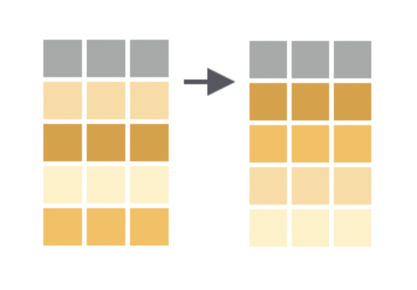

```{r xaringan-themer, include = FALSE}
library(xaringanthemer)
mono_accent(base_color = "#4682B4") #3E8A83?
```

```{r, echo = FALSE}
knitr::opts_chunk$set(warning = FALSE, message = FALSE)
```

```{r, include = FALSE}
library(tidyverse)
library(mdsr)
library(babynames)
library(ggsci)
library(nycflights13)
library(ggthemes)
library(gapminder)
library(gganimate)
```

<!--
pagedown::chrome_print("~/Dropbox/Teaching/03-Simmons Courses/MATH228-Introduction to Data Science/Lecture Slides/03-Data_Wrangling/03-Data_Wrangling.html")
-->

# What have we done so far?

**Data Exploration**

```{r, comment = ""}
library(nycflights13)
flights
```

---

# What have we done so far?

**Data Visualization**

```{r, eval = FALSE, echo = TRUE}
flights_frontier = flights %>%
  filter(carrier == "F9")

ggplot(flights_frontier, aes(x = dep_delay, y = arr_delay)) + 
  geom_point(alpha = 0.2) + 
  labs(x = "Departure Delay (in minutes)", 
       y = "Arrival Delay (in minutes)", 
       title = "Flights from NYC via Frontier Airlines", 
       subtitle = "Year: 2013") + 
  theme_minimal()
```

---

# What have we done so far?

**Data Visualization**

```{r, eval = TRUE, echo = FALSE, dpi = 300, warning = FALSE, out.width = "60%"}
flights %>%
  filter(carrier == "F9") %>%
  ggplot(mapping = aes(x = dep_delay, y = arr_delay)) + 
  geom_point(alpha = 0.2) + 
  labs(x = "Departure Delay (in minutes)", y = "Arrival Delay (in minutes)", 
       title = "Flights from NYC via Frontier Airlines", 
       subtitle = "Year: 2013") + 
  theme_minimal()
```

---

# What will we do now?

**Data Wrangling**

```{r, eval = FALSE, echo = TRUE}
flights_frontier = flights %>% #<<
  filter(carrier == "F9") #<<

ggplot(flights_frontier, aes(x = dep_delay, y = arr_delay)) + 
  geom_point(alpha = 0.2) + 
  labs(x = "Departure Delay (in minutes)", 
       y = "Arrival Delay (in minutes)") + 
  theme_minimal()
```

---

# Data Wrangling in R? 

**dplyr** (D-plyer, **NOT** *dipler*)

.center[
```{r, echo = FALSE, out.width = "40%"}
knitr::include_graphics("dplyr_hex.png")
```
]

---

# Needed Packages 

```{r, eval = FALSE}
library(tidyverse) # Automatically loads ggplot2 and dplyr
library(nycflights13)
library(mdsr)
library(gapminder)
```

---

class: middle, center

# The Pipe Operator `%>%`

---

# The Pipe Operator `%>%`

Say you want to perform a set of operations on the `flights` data frame:

1. Take `flights`, then...

--

2. `filter` for *only* Jet Blue flights (carrier code "B6"), then...

--

3. `group_by` departure airport (`origin`), then...

--

4. `summarize` the *average flight distance* (`distance`) by departure airport. 

---

# The Pipe Operator `%>%`

Say you want to perform a set of operations on the `flights` data frame:

Use the **pipe operator** (`%>%`), and write a *pipeline*:

```{r, echo = TRUE, eval = TRUE, comment = ""}
flights %>%
  filter(carrier == "B6") %>%
  group_by(origin) %>%
  summarize(mean_distance = mean(distance))
```

---

# The Pipe Operator `%>%`

You would read this sequence as:

1. Take `flights`, then...

2. Use this output as the input to the next function, `filter`, then...

3. Use this output as the input to the next function, `group_by`, then...

4. Use this output as the input to the next function, `summarize`.

--

**The starting value will always be the data frame!**

- The subsequent arguments say *what to do* to the data frame. 

- The result will the transformed/modified data frame that you want. 
    
---

# The Pipe Operator `%>%`

In `dplyr`, the pipe operator (`%>%`) plays a very similar role to the `+` operator when adding layers in `ggplot2`.

You can even save "piped" operations as a new data frame. In fact, we have already done it!

**Example** (from earlier): November weather at the JFK airport in New York:

```{r}
jfk_nov = weather %>%
  filter(origin == "JFK" & month == 11)
```

---

# `%>%` Intuition

## My *morning routine*

```{r, eval = FALSE}
anthony %>%
  wake_up(time = "7:30") %>%
  get_out_of_bed() %>%
  make_smoothie(ingredients = c("spinach", "raspberries", 
                                "blueberries", "strawberries",
                                "protein", "milk")) %>%
  drink_coffee() %>%
  boot_up_laptop(RStudio = TRUE, Zoom = TRUE, Spotify = TRUE)
```

---

# The Pipe Operator `%>%`

**Keyboard "shortcut"**

[control]+[shift]+[m]

.pull-left[
```{r, echo = FALSE}
knitr::include_graphics("pipe.jpg")
```
]

.pull-right[
```{r, echo = FALSE}
knitr::include_graphics("pipe_hex.jpg")
```
]

---

class: middle, center

# A Grammar for Data Wrangling

---

# A Grammar for Data Wrangling

Similar to how `ggplot2` provides a *grammar* for **data visualization**... 

- `dplyr` provides a *grammar* for **data transformation**. 

--

**Five verbs for working with data in a data frame**:

- `select()`: take a subset of *columns* (e.g., variables)

- `filter()`: take a subset of *rows* (e.g., observations, cases, individuals)

- `mutate()`: add or modify *existing columns*

- `arrange()`: sort rows

- `summarize()`: aggregate data *across rows* (e.g., grouped means)


Each of these functions takes a *data frame* as its first argument (similar to `ggplot()`). 

- They can also be used in conjunction with each other (e.g., in a *pipeline*). 

---

# `select()` columns

.center[
```{r, echo = FALSE, dpi = 300}
knitr::include_graphics("dplyr_select.png")
```
]

`select()` allows you to return a *subset* of **columns** of a data frame. 

- This might not seem like much, but data frames with *many* columns (i.e., hundreds of variables) are not uncommon. 

---

# `select()` columns

The `gapminder` data frame in the `gapminder` package contains data on life expectancy, GDP per capita, and population by country, spanning 1952-2007 (in increments of 5 years). 

```{r, eval = FALSE}
View(gapminder)
```

--

Suppose we want a data frame with *only* the `country`, `year`, and `lifeExp` variables (columns). 

```{r, eval = FALSE}
gapminder_new = gapminder %>%
  select(country, year, lifeExp)
```

---

# `filter()` rows

While `select()` is useful in cutting out unwanted columns (especially if there are *many* columns), we might still need to perform other operations on the data. 

.center[
```{r, echo = FALSE, dpi = 300}
knitr::include_graphics("dplyr_filter.png")
```
]

`filter()` allows you to return a *subset* of **rows** of a data frame. 

- Specify criteria about the values of a variables in your dataset.

- `filter()` out only those rows that match that criteria.

---

# `filter()` rows

Using the same `gapminder` data from earlier, let's obtain data for *only the United States*:

```{r, eval = FALSE}
gapminder_new = gapminder %>%
  filter(country == "United States")
```

**Reminder**: While `=` (and `<-`) are used for **assignment**, a double `==` is used to *test for equality*. 

---

# `select()` and `filter()` together

Similar to when using *only* `select()`, we might want to perform other operations on the data in conjunction with `filter()`. 

- We can conveniently construct a single *pipeline* with all of the operations!

```{r, eval = FALSE}
gapminder_new = gapminder %>%
  select(country, year, lifeExp) %>%
  filter(country == "United States")
```

--

You can even add a plot at the end of a pipeline!

```{r, eval = FALSE}
gapminder %>%
  select(country, year, lifeExp) %>%
  filter(country == "United States") %>%
  ggplot(aes(x = year, y = lifeExp)) + 
  geom_line() + 
  labs(x = "Year", y = "Life Expectancy", 
       title = "US Life Expectancy")
```

---

# Non-pipeline equivalent

Here is the equivalent code that does not use the `%>%` operator:

```{r, eval = FALSE}
gapminder_new = select(gapminder, country, year, lifeExp)
gapminder_new = filter(gapminder_new, country == "United States")
ggplot(gapminder_new, aes(x = year, y = lifeExp)) + 
  geom_line() + 
  labs(x = "Year", y = "Life Expectancy", 
       title = "US Life Expectancy")
```

---

# Filtering on multiple criteria

We are not limited to a single criterion when using `filter()`. 

- We can string together multiple criteria with `&` ("and"). 

```{r, eval = FALSE}
gapminder_new = gapminder %>%
  filter(country %in% c("United States", "Canada") &
           year >= 1980)
```

The result of this pipeline is a data frame that includes data on *only* the countries **United States** *or* **Canada**, in **1980 or later**.

--

**Note**: We use the `%in%` to check for rows with `country` equal to *either* `"United States"` **or** `"Canada"`.

---

# Practice

Using the `flights` dataset in the `nycflights13` package...

1. Filter `flights` for all rows that:

    - Departed from JFK (`origin == "JFK"`) airport **and**

    - Were heading to Burlington, Vermont (`dest == "BTV"`) **or** Seattle, Washington (`dest == "SEA"`) **and**

    - Departed in the months of October, November, or December.

2. Select the destination, departure delay, arrival delay, and flight carrier variables from the data. 

3. If you're feeling up to it, use the resulting data to make a **scatterplot** of arrival delay versus departure delay!

```{r, eval = FALSE, echo = FALSE}
flights_new = flights %>%
  filter(origin == "JFK" &
           dest %in% c("BTV", "SEA") & 
           month %in% c(10, 11, 12)) %>%
  select(dest, dep_delay, arr_delay, carrier)

flights_new %>%
  ggplot(aes(x = dep_delay, y = arr_delay)) + 
  geom_point(alpha = 0.4) +
  theme_bw() + 
  labs(x = "Departure Delay (in mins)", y = "Arrival Delay (in mins)")
```
 
---

# `mutate()` existing columns

`mutate()` is a function that defines and inserts *new variables* into a data frame as *columns*. 

.center[
```{r, echo = FALSE, dpi = 300}
knitr::include_graphics("dplyr_mutate.png")
```
]

---

# `mutate()` existing columns

Suppose we wanted to recover each state's **total GDP**. 

```{r}
head(gapminder, 5)
```

The `gapminder` dataset has the `pop` and `gdpPercap` variables already, so we can *create* a new `gdp` variable by multiplying them together. 

---

# `mutate()` existing columns

Using `mutate()`, we can create a new variable called `gdp` by multiplying `pop` and `gdpPercap`:

```{r, eval = FALSE}
gapminder_new = gapminder %>%
  mutate(gdp = pop*gdpPercap)
```

--

We could use `mutate()` along with `filter()` and `select()` to see how the total GDP has changed in the United States over the years:
```{r, eval = FALSE}
gapminder %>%
  filter(country == "United States") %>%
  mutate(gdp = pop*gdpPercap) %>%
  select(country, year, gdp)
```

---

# `mutate()`

In the `weather` data frame from the `nycflights13` package, the variable `temp` is temperature in **degrees Fahrenheit**. To convert this to **degrees Celcius**, we use the formula:

$$\text{temp in C}=\frac{\text{temp in F}-32}{1.8}$$

--

Using `mutate`, we can create the variable `temp_C` using the existing `temp`:
```{r, eval = FALSE}
weather = weather %>%
  mutate(temp_C = (temp - 32)/1.8)
View(weather)
```

---

# `mutate()`

```{r}
weather = weather %>%
  mutate(temp_C = (temp - 32)/1.8)
```

Note that by calling this new data frame `weather`, we *overwrite* the existing one that comes with the `nycflights13` package. 

- **Why?** We are not *losing* any information; only *adding* new information. 

- The original `temp` variable is still part of the data frame. 

---

# `rename()`

`rename()` is a relatively simple `dplyr` function that, you guessed it, *renames* existing variables. 

Because we just created a variable named `temp_C`, let's *rename* the `temp` variable to `temp_F`:
```{r}
weather = weather %>%
  rename(temp_F = temp)
```

- This *will* overwrite the `temp` column (unless you assign this pipeline to a name other than `weather`), but analyzing `temp.F` and `temp.C` is probably more straightforward. 

---

# `arrange()` rows

The `arrange()` function will *sort the rows* of a data frame by a pre-specified *column*. 

.center[
```{r, echo = FALSE, dpi = 300}

```
]

While we can do this as an *exploratory* step in the `View()` window, `arrange()` allows us to perform additional operations on a custom-sorted data frame. 

---

# `arrange()` rows

The `gapminder` data frame is currently arranged by *country*, followed by *year*. 

```{r}
head(gapminder, 5)
```

Suppose we instead would like to sort `gapminder` by *year*, followed by *country*. 

---

# `arrange()` rows

```{r}
gapminder %>%
  arrange(year, country)
```

---

# `arrange()` rows (in descending order)

By default, `arrange()` will sort rows in **ascending order** (least to greatest, or *alphabetically*) based on the column(s) specified. 

- To sort in **descending order**, use `desc()` around any of the variables specified in `arrange()`. 

--

Let's take *only data from 2007* and sort by the *largest to smallest* life expectancy:

```{r, eval = FALSE}
gapminder %>%
  filter(year == 2007) %>%
  arrange(desc(lifeExp)) 
```

---

# `summarize()` with `group_by()`

The *verb-named functions* that we have looked at so far have all provided different ways to **manipulate** a data frame. 

- `select()`, `filter()`, `mutate()`, `rename()`, `arrange()`

- The extent of the analysis we can perform *solely by manipulating a data frame* is limited. 

--

`summarize()` and `group_by()` allow us to make calculations and *comparisons*. 

- `summarize()` (with or without `group_by()`) collapses the data into rows based on **summary statistics**. 

.center[
```{r, echo = FALSE, dpi = 300}
knitr::include_graphics("dplyr_summarize.png")
```
]

---

# `summarize()`

The important step in `summarize()` is specifying **how** we want to reduce the data to a single set of summary statistics. 
- **Examples**: `mean()`, `sd()`, `median()`, `IQR()`, `max()`, `n()`, and many more

--

Using the `weather` data frame, let's calculate the **mean** and **standard deviation** of `temp_F`:
```{r}
weather %>%
  summarize(mean_temp_F = mean(temp_F, na.rm = TRUE), 
            sd_temp_F = sd(temp_F, na.rm = TRUE))
```

--

**Note**: We added `na.rm = TRUE` to remove `NA` (missing values) from each calculation. 
- Otherwise, the output for `mean()` and `sd()` would also be `NA`. 

---

# `summarize()`

Given the nature of the `weather` data frame, why might the summary statistics in the previous slide contain *redundant information*?

--

```{r}
weather %>%
  count(origin)
```

Temperature was recorded each hour in 2013 at *three different NYC airports*. 

- Presumably, the temperature will be similar at each of the three airports at any given hour. 

--

**Also**, there are definitely *seasonal/monthly* trends in temperature, especially in a state like New York. 

---

# `group_by()` rows

This is where `group_by()` comes in!

The `summarize()` function is *almost always* used in conjunction with `group_by()`. 

.center[
```{r, echo = FALSE, out.width = "70%"}

```
]

We just used `summarize()` to calculate the **mean** and **standard deviation** of New York temperature in 2013. 

- But what if we want to calculate these summary statistics *for each month*?

- We can use `group_by()` in the pipeline to generate *aggregate* summary statistics!

---

# `group_by()`

Before running the code below, *what do you think it does*?

```{r, eval = FALSE}
weather_temp_month = weather %>%
  filter(origin == "JFK") %>% # Just focus on one NYC airport
  group_by(month) %>%
  summarize(mean_temp_F = mean(temp_F, na.rm = TRUE), 
            sd_temp_F = sd(temp_F, na.rm = TRUE))
weather_temp_month
```

--

Because **temperature** usually varies by *season*, or *month*, it makes sense to calculate monthly summary statistics. 

- We could've also grouped by `origin` (i.e., `group_by(month, origin)`), but the monthly average temperature is probably very similar at the three airports. 

---

# `group_by()`

The code on the previous slide is *identical* to the code we used when introducing `summarize()`...

- Except we added the first step `group_by(month)`, which does exactly what it sounds like: it **groups by** *month* before calculating summary statistics. 

--

**Note**: We never use the `group_by()` operation by itself. We always combine it with a function that performs a calculation, such as `summarize()`. 

For example, run the following. You'll notice that nothing really changes from the initial data frame. 
```{r, eval = FALSE}
weather %>%
  group_by(month)
```

---

# Recap: The S.S. FAM

.pull-left[
- `select()`: choose columns by name

- `summarize()` (usually with `group_by()`): reduce variables to summary values

- `filter()`: pick a subset of rows matching criteria

- `arrange()`: reorder rows

- `mutate()`: add new variables
]

.pull-right[
```{r, echo = FALSE}
knitr::include_graphics("boat.jpg")
```
]

There are a *handful* of other functions we'll cover, but you can do a lot with these five!

