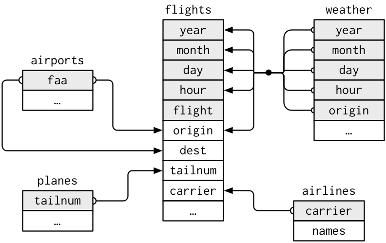

```{r xaringan-themer, include = FALSE}
library(xaringanthemer)
mono_accent(base_color = "#4682B4") #3E8A83?
```

```{r, echo = FALSE}
knitr::opts_chunk$set(warning = FALSE, message = FALSE)
```

```{r, include = FALSE}
library(tidyverse)
library(mdsr)
library(babynames)
library(ggsci)
library(nycflights13)
library(ggthemes)
library(gapminder)
library(gganimate)
```

<!--
pagedown::chrome_print("~/Dropbox/Teaching/03-Simmons Courses/MATH228-Introduction to Data Science/Lecture Slides/03-Data_Wrangling/03-Data_Wrangling.html")
-->

# Needed Packages

```{r, eval = FALSE}
library(tidyverse)
library(nycflights13)
```

---

class: center, middle, frame

# Combining Multiple Tables

---

# Combining Multiple Tables

So far we have been working with *single data frames*, which are reminiscent of single *spreadsheets/tables*. 

- However, many data projects contain *multiple tables* used together. 

- Luckily, `dplyr` gives efficient means to work with multiple tables. 

--

One family of verbs that we will use to work with multiple tables is called **mutating joins**. 

- These add new variables to one data frame from *matching observations* in another

(i) `inner_join()`

(ii) `full_join()`

(iii) `left_join()` and `right_join()`

(iv) `anti_join()`
    
---

# Introductory Example

For the next few slides:

```{r}
table1 = data.frame(
  value = c(1, 2, 3), 
  x = c("a", "b", "c"))
table1
```

```{r}
table2 = data.frame(
  value = c(1, 2, 4), 
  y = c("b", "c", "d"))
table2
```

---

# `inner_join()` and `left_join()`

```{r}
table1 %>%
  inner_join(table2, by = "value")
```

--

```{r}
table1 %>% 
  left_join(table2, by = "value")
```

---

# `full_join()` and `right_join()`

```{r}
table1 %>%
  full_join(table2, by = "value")
```

--

```{r}
table1 %>% 
  right_join(table2, by = "value")
```

---

# `anti_join()`

```{r}
table1 %>% 
  anti_join(table2, by = "value")
```

```{r}
table2 %>% 
  anti_join(table1, by = "value")
```

---

# `nycflights13`

The `nycflights13` package contains *five data frames*, though we've mainly worked with two. 
- `flights`, `weather`, `airlines`, `airports`, `planes`

--

From *R for Data Science*:

.center[
```{r, echo = FALSE, dpi = 200}

```
]

---

# Why so many data frames?

```{r}
dim(flights)
```

```{r}
head(airlines, 5)
```

Each row in `flights` is a *single flight*. 

- One variable, `carrier` is an abbreviated carrier code for each of the 336,776 departing flights. 
- It would be computationally inefficient to store the *complete airline name* in every row of `flights`. 

---

# Why so many data frames?

```{r}
flights %>%
  select(carrier, dep_delay, dest) %>%
  slice(1:5)
```

While `flights` doesn't contain the complete name of each airline, it does have a **key** that links the data to the full airline names in the `airlines` data frame.

- The **key** is `carrier`, which is a shared variable between `flights` and `airlines`. 

---

# `inner_join()`

`inner_join()` will allow us to append the *full names of the airlines that managed each flight* to the main `flights` data frame. 

- To do so, we match up the *rows* in `flights` wil the rows in `airlines` that share the same *key* (`carrier`). 

```{r}
flightsJoined = flights %>%
  inner_join(airlines, by = "carrier") %>%
  select(carrier, name, flight, origin, dest, dep_delay) 
head(flightsJoined, 5)
```

---

# `inner_join()`

```{r, eval = FALSE}
flightsJoined = flights %>%
  inner_join(airlines, by = "carrier") %>%
  select(carrier, name, flight, origin, dest, dep_delay) 
```

The resulting data frame from `inner_join()` contains *only the rows that have matching key values in both tables* (`flights` and `carrier`). 
- Each row in `flights` has *exactly one* corresponding entry in `airlines`. 

```{r}
nrow(flights)
nrow(flightsJoined)
```

--

**Note**: *Always* check your row count after using a `_join()` function to make sure it is what you expect. 

---

# `inner_join()`

Instead of appending `carrier` names from `airlines`, let's instead append the **destination** airport names via the `airports` table (run `View(airports)`).

--

The **matching key** between the `flights` and `airports` tables are:

- `dest` (from `flights`)
- `faa` (from `airports`)

--

```{r}
flightsJoinedDest = flights %>%
  inner_join(airports, by = c("dest" = "faa"))

nrow(flights)
nrow(flightsJoinedDest)
```

--

But... $329174\neq336776$! This means that there were *some* destination airports in `flights` that didn't actually appear in `airports`. 

---

# `left_join()`

We use `left_join()` when we want to include **all** rows in one table (the "left" table), and *only* rows in the other table with a matching "key" variable. 

- `right_join()` works similarly, just in the other direction. 

```{r}
flightsJoinedLeft = flights %>%
  left_join(airports, by = c("dest" = "faa"))

nrow(flights)
nrow(flightsJoinedLeft)
```

--

If a value of `dest` **does not** appear in `airports`, the `airports` columns will appear as `NA` in the left-joined table. 

---

# A Closer Inspection

We can use the `setdiff()` function to see which elements are in one vector, but not the other. 

```{r}
setdiff(flights$dest, airports$faa)
```

--

**From Google**:

`BQN`: Rafael Hernandez Airport (in Puerto Rico)

`SJU`: Luis Muñoz Marín International Airport (in Puerto Rico)

`STT`: Cyril E. King Airport (in the U.S. Virgin Islands)

`PSE`: Mercedita/Ponce International Airport (in Puerto Rico)

--

This means that any flights recorded in the `flights` table that had destinations (i.e., `dest`) to any of these airports cannot be joined with the `airports` table. 

- Because these `dest` airports are not included in the `airports` table!

---

# `left_join()`

When using `left_join()` between `flights` and `airports`, the four airports *that don't appear in* `airports` **will still be included in the joined table**. 

- Their `tzone` (and all other values in `airports`) will be `NA`. 

```{r}
flights %>%
  left_join(airports, by = c("dest" = "faa")) %>%
  filter(dest %in% c("LAX", "BQN", "SJU", "STT", "PSE")) %>%
  select(dest, dep_delay, name, lat, lon, tzone) %>%
  head(5)
```

---

# `right_join()`

We use `right_join()` when we want to include **all** rows in one table (the "right" table), and *only* rows in the other table with a matching "key" variable. 

- `left_join()` works similarly, just in the other direction. 

```{r}
flightsJoinedRight = flights %>%
  right_join(airports, by = c("dest" = "faa"))

nrow(flights)
nrow(flightsJoinedRight)
```

```{r, eval = FALSE}
setdiff(airports$faa, flights$dest) # Too many!
```

---

# `full_join()`

`full_join()` works similarly to `inner_join()`, it just doesn't remove *any* rows. 

- If any rows from either table **DO NOT** share a matching key, those will still be included with `NA` values under the columns from the *other* table. 

```{r}
flightsJoinedFull = flights %>%
  full_join(airports, by = c("dest" = "faa"))

nrow(flights)
nrow(flightsJoinedFull)
```

--

This included *all* of the airports that did not appear in `flights`. 

- Since these airports were *not* destinations from NYC in 2013, their flight information includes `NA` values. 

---

# `anti_join()`

To be honest, I haven't used this one very much...it's basically the *opposite* of `inner_join()`. 

- `anti_join()` returns all rows from one table **without** a match in the other table. 

```{r}
flightsJoinedAnti = flights %>%
  anti_join(airports, by = c("dest" = "faa"))

nrow(flights)
nrow(flightsJoinedAnti)
```

--

In `flightsJoinedAnti`, the **only rows kept** are the ones that have values of `dest` that do **NOT** appear in `airports`. 

---

# Putting it all together

**Let's compute the number of flights from NYC to each destination, but also include information about each destination airport (i.e., the full name)**

--

```{r, eval = FALSE}
dest_counts = flights %>%
  group_by(dest) %>%
  summarize(num_flights = n()) %>%
  arrange(desc(num_flights)) %>%
  left_join(airports, by = c("dest" = "faa")) %>%
  rename(airport_name = name) 
```

---

# Putting it all together

**Let's compute the number of flights from NYC to each destination, but also include information about each destination airport (i.e., the full name)**

1. `summarize()` calculated the *number* of flights to *each destination* (using `group_by()`)

2. `arrange()` sorted flight counts in *descending order* based on most "popular" destination

3. `left_join()` linked the airport `name` in the `airports` data frame to the summarized data frame based on the *keys* `dest` and `faa`. 
    - `NA` values were returned if a `dest` was not in `airports`

4. `rename()` renamed the `name` column to `airport_name` for clarity. 

---

# Practice (joining on multiple keys)

Use `inner_join()` to join the `weather` data to the `flights` data. 

- **Hint**: There are multiple *keys* you must link in each table, but they share the same names. 
    - In other words, multiple columns act to *uniquely identify* each row in `weather` (`month == 1`, `day == 1` is different from `month == 2`, `day == 1`).
    
After using `inner_join()`, `select()` the following columns: `month`, `day`, `origin`, `dep_delay`, `temp_F` (or `temp` if you're using the original data). 

.center[
```{r, echo = FALSE, dpi = 200}

```
]

---

# Solution

```{r, eval = FALSE}
flights_weather_joined = flights %>%
  inner_join(weather, by = c("year", "month", "day", "hour", "origin")) %>%
  select(month, day, origin, dep_delay, temp) 
nrow(flights_weather_joined)
View(flights_weather_joined)
```

**Note**: Using `left_join()` would've returned a table with the *same number of rows as* `flights`. 

- The difference in row counts between `inner_join()` and `left_join()` is probably due to flights not departing in *every hour*.
    - The `hour` column in `flights` won't contain the numbers 0 through 23 for *all days* like the `weather` table does. 

---

class: center, middle, frame

# Writing Functions in R

---

# Functions

A **function** is a *powerful* way to *automate* a common task in R (or in any programming language). 

--

Have you ever found yourself with code that looks like this?
```{r, eval = FALSE}
data_name_1 %>%
  # Do something here 
  ...

data_name_2 %>%
  # Do that SAME something here
  ...

data_name_3 %>%
  # I'm getting sick of typing the
  # same thing over and over...
  ...
```

---

# Functions vs. Copy/Paste

From *R for Data Science*:

**Three advantages to functions vs. copy/paste**:

1. You can give a function an evocative name that makes your code easy to understand. 

2. As requirements change, you only need to update code in one place, instead of many.

3. You eliminate the chance of making incidental mistakes when you copy and paste. 

--

Writing *good functions* is an art, and we are all constantly learning better ways to improve writing functions (and code in general). 

---

# Functions vs. Copy/Paste

.center[
```{r, echo = FALSE, dpi = 300}

```
]

---

# When should you write a function?

```{r}
# Generating fake data...
set.seed(12)
fake_data = data.frame(
  a = rnorm(10), b = rnorm(10), 
  c = rnorm(10), d = rnorm(10)
)
```

--

**Example**: What do you think this code does?

```{r}
fake_data$z_a = (fake_data$a - mean(fake_data$a))/sd(fake_data$a)

fake_data$z_b = (fake_data$b - mean(fake_data$b))/sd(fake_data$b)

fake_data$z_c = (fake_data$c - mean(fake_data$c))/sd(fake_data$c)

fake_data$z_d = (fake_data$d - mean(fake_data$d))/sd(fake_data$d)
```

---

# When should you write a function?

```{r}
fake_data$z_a = (fake_data$a - mean(fake_data$a))/sd(fake_data$a)
```

This *looks like* the formula for a *z*-score, $z=(x-\bar{x})/s$. 

- But imagine having to calculate *z*-scores for *hundreds* of observations!

--

Luckily, we can write a **function**:
```{r}
z_score = function(data){
  z = (data - mean(data))/sd(data)
  
  return(z)
}
```

--

```{r}
# Check function
head(z_score(data = fake_data$a))
```

---

# Writing Functions

```{r, eval = FALSE}
my_function = function(input1, imput2 = 2, ...){
  ...
  x = <valid R code>
  ...
  return(x)
}
```

*Inputs*:

- the **arguments**: `input1`, `input2`
- `input2` is *optional*, and has the default value of 2 unless otherwise specified

*Output*:

- The value in `return()`
- If `return()` isn't present, the function will return output from the last line by default. 

---

# Example Function

The *factorial* function is defined as $n!=n\times(n-1)\times\cdots\times1$. 

We can write a function for this, called `factorial()`, where the *only* argument is `n`:

```{r}
n_factorial = n_factorial = function(n){ # input: n
# Calculate n factorial
n_fact = prod(1:n) # take the product of all integers from 1 to n

return(n_fact) # output: n!
}
```

--

**Test**: 

```{r}
n_factorial(4)
```

---

# Another Example Function

Now let's write a function that gives a **plot** as output. 

- We will require *at least* two variables from `data`, and set *any additional variables* to `NULL` by default. 

```{r}
my_plot = function(data, var1, var2, var3 = NULL){
  p = ggplot(data, aes(x = var1, y = var2)) + 
    geom_point(aes(color = var3), size = 1.5) + 
    geom_smooth(se = FALSE) +# Remove CI bands
    theme_bw()
  
  return(p)
}
```

---

# Another Example Function

**Test 1**:

```{r, dpi = 300, out.width = "50%", warning = FALSE, message = FALSE}
my_plot(data = CIACountries,
        var1 = CIACountries$educ, var2 = CIACountries$gdp)
```

---

# Another Example Function

**Test 2**:

```{r, dpi = 300, out.width = "50%", warning = FALSE, message = FALSE}
my_plot(data = CIACountries,
        var1 = CIACountries$educ, var2 = CIACountries$gdp, 
        var3 = CIACountries$net_users)
```

---

# Practice

We can add additional arguments to `my_plot()` so that we can add appropriate **labels**: 

```{r}
my_plot = function(data, var1, var2, var3 = NULL, 
                   lab_x = NULL, lab_y = NULL, lab_col = NULL){ #<<
  p = ggplot(data, aes(x = var1, y = var2)) + 
    geom_point(aes(color = var3), size = 1.5) + 
    geom_smooth(se = FALSE) + # Remove CI bands
    theme_bw() +
    labs(x = lab_x, y = lab_y, color = lab_col) #<<
  
  return(p)
}
```

```{r, eval = FALSE}
my_plot(data = CIACountries,
        var1 = CIACountries$educ, var2 = CIACountries$gdp, 
        var3 = CIACountries$net_users, 
        lab_x = "Education spending (% of GDP)", 
        lab_y = "GDP per capita", 
        lab_col = "% Internet users")
```

---

# Practice

Write a function that performs the following calculation with inputs `x`, `y`, `z`: $$\log(6x^{4})\sqrt{y}+sin(z^{2})$$
- **Hint**: R has *built-in functions* `log()`, `sqrt()`, and `sin()`. 

```{r, echo = FALSE, eval = FALSE}
math_func = function(x, y, z){
  val = log(6*x^4)*sqrt(y)+sin(z^{2})
  
  return(val)
}
```


