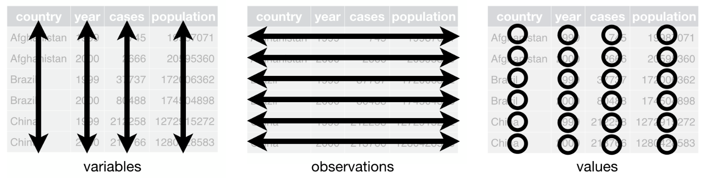

```{r xaringan-themer, include = FALSE}
library(xaringanthemer)
mono_accent(base_color = "#4682B4") #3E8A83?
```

```{r, echo = FALSE}
knitr::opts_chunk$set(warning = FALSE, message = FALSE)
```

```{r, include = FALSE}
library(tidyverse)
library(mdsr)
library(lubridate)
library(fivethirtyeight)
library(nycflights13)
```

<!--
pagedown::chrome_print("~/Dropbox/Teaching/03-Simmons Courses/MATH228-Introduction to Data Science/Lecture Slides/04-Tidy_Data/04-Tidy_Data.html")
-->

class: center, middle

# Tidy Data

---

# Needed Packages

```{r, eval = FALSE, warning = FALSE}
library(tidyverse)
library(mdsr)
library(lubridate)
library(fivethirtyeight)
library(nycflights13)
```

---

# `bush_approval` data

Download the `bush_approval` data from Moodle, and import it into R. 

```{r, echo = FALSE, message = FALSE, warning = FALSE}
bush_approval <- read_csv("~/Dropbox/Teaching/03-Simmons Courses/STAT228-Introduction to Data Science/Data/bush_approval.csv")
```


The `bush_approval` data frame consists of approval ratings (out of 100%) of former US President George W. Bush. 

- `date`: date of poll
- `Approve`: overall percent who approve of President Bush
- `Disapprove`: overall percent who disapprove of President Bush
- `Republican`: percent approval among Republican voters
- `Independent`: percent approval among Independent voters
- `Democrat`: percent approval among Democrat voters
- `Pres.Party`: President Bush's political party

--

Simplify the data a bit:
```{r}
bush_approval = bush_approval %>%
  select(date, Republican, Independent, Democrat)
```

---

# Wide Data

```{r}
head(bush_approval, 5)
```

The `bush_approval` data are currently in **wide format**. 

- Each party's approval of Bush is located in a separate column. 

--

If *visual inspection* is the primary analytical technique, this format can be convenient. 

- However, it can be more difficult to implement anything other than *visual inspection*. 

---

# Tidy Data

As is, the `bush_approval` data are not **tidy**!

--

```{r, echo = FALSE, eval = TRUE}

```

From [Wickham (2014)](https://vita.had.co.nz/papers/tidy-data.pdf)
  
1. Each variable forms a column.

2. Each observation forms a row.

3. Each type of observational unit forms a table.

---

# Tidy Data

Why is `bush_approval` *not* tidy?

```{r, comment = ""}
head(bush_approval, 5)
```

What are the **three unique pieces of information** in this data frame?

--

1. Date
2. Approval Rating
3. Political Party

--

But... there are more than three columns!

---

# Tidy Data

We want to end up with this:

```{r, echo = FALSE}
bush_tidy = bush_approval %>%
  gather(key = Party, value = Approval, -date)
```
```{r, comment = ""}
bush_tidy
```

---

# How do we convert to "tidy" data?

.center[
```{r, echo = F, eval = T, out.width = "40%", dpi = 300}
knitr::include_graphics("tidyr_hex.png")
```
]

---

# `pivot_longer()`

We convert a data frame to "tidy" (long format) by using the `pivot_longer()` function from the `tidyr` package.

- The `tidyr` package loads with the `tidyverse`. 

```{r}
head(bush_approval, 5)
```

```{r, echo = TRUE, eval = FALSE}
bush_tidy = bush_approval %>%
  pivot_longer(names_to = "Party", 
               values_to = "Approval", 
               cols = -date)
```

---

# `pivot_longer()`

```{r, comment = ""}
bush_tidy = bush_approval %>%
  pivot_longer(names_to = "Party", 
               values_to = "Approval", 
               cols = -date)
bush_tidy
```

---

# `pivot_longer()`

The `pivot_longer()` function takes the following *arguments*:

- `names_to` is the name of the column/variable in the new "tidy" frame that contains the column names of the original data frame that you want to tidy.
    - When we set `names_to = Party`, the `Party` column in `bush_tidy` contains the original Party names from `bush_approval`. 

--

- `values_to` is the name of the column/variable in the "tidy" frame that contains the rows and columns of values in the original data frame you want to tidy. 
    - When we set `values_to = Approval`, the `Approval` column in `bush_tidy` contains all of the approval ratings from `bush_approval`. 

--

- The third argument, `cols`, is the column(s) you either want to or don’t want to tidy. 
    - The `date` variable was already tidy, so we didn't need to further modify it. 
    
---

# Benefits of Tidy Data

While we sacrificed our ability to see the data *all at once*, it is much more straightforward to use *data visualization* and *data wrangling* techniques with **tidy data**. 

```{r, dpi = 300, out.width = "40%"}
ggplot(data = bush_tidy, aes(x = date, y = Approval, color = Party)) + 
  geom_line(size = 1.5) + 
  labs(x = "", title = "Approval Rate for George W. Bush", subtitle = "by party")
```

---

# Going from tidy to wide format

If you have a *tidy* dataset but want to transform it to *wide format*, use the `pivot_wider()` function:

```{r}
bush_wide = bush_tidy %>%
  pivot_wider(names_from = "Party", 
              values_from = "Approval")
head(bush_wide, 5)
```

The `pivot_wider()` syntax is nearly *identical* to `pivot_longer()`, except with the `names_from` and `values_from` arguments. 

---

# Example

Let's look at the `drinks` data frame from the `fivethirtyeight` package. 

```{r, comment = ""}
library(fivethirtyeight)
drinks
```

---

# Example

```{r, echo = FALSE, out.width = "50%"}

```

---

# Example

Run the following code to simplify the data frame a bit:

```{r, eval = FALSE}
drinks_smaller = drinks %>%
  filter(country %in% c("USA", "France", "China", "Italy", "Ireland")) %>%
  select(-total_litres_of_pure_alcohol)
View(drinks_smaller)
```

```{r, echo = FALSE, comment = ""}
drinks_smaller = drinks %>%
  filter(country %in% c("USA", "France", "China", "Italy", "Ireland")) %>%
  select(-total_litres_of_pure_alcohol)
drinks_smaller
```

---

# Practice

Convert `drinks_smaller` to a **tidy** data frame. 

**Starting Point**
```{r, comment = ""}
drinks_smaller
```

---

# Practice

Convert `drinks_smaller` to a **tidy** data frame. 

**Ending Point**
```{r, echo = FALSE, eval = TRUE}
drinks_tidy = drinks_smaller %>%
  gather(key = type, value = servings, -country)
```
```{r, comment = ""}
drinks_tidy
```

---

class: center, middle

# Data Cleaning: Tips and Tricks

## (Anthony's Favorite Things)

---

# Counting Observations per group

```{r, message = FALSE, warning = FALSE}
video_games <- read_csv("https://raw.githubusercontent.com/rfordatascience/tidytuesday/master/data/2019/2019-07-30/video_games.csv")
```

- `number`:	Game number
- `game`: Game Title
- `release_date`:	Release date
- `price`: US Dollars + Cents
- `owners`: Estimated number of people owning this game
- `developer`: Group that developed the game
- `publisher`: Group that published the game
- `average_playtime`: Average playtime in minutes
- `median_playtime`: Median playtime in minutes
- `metascore`: Metascore rating

**Question**: How would you count the number of games *per publisher*, and then *arrange* by count?

---

# Counting Observations per group

Using some of `dplyr`'s data wrangling functions, we can do this in several lines:

```{r, results = 'hide'}
video_games %>%
  group_by(publisher) %>%
  summarize(N_games = n()) %>%
  arrange(desc(N_games))
```

--

This pipeline:

1. **groups by** `publisher`, 

2. **summarizes** the data by simply counting the *number of rows* (`n()`) per publisher, and 

3. **arranges in descending order** by the newly-created `N_games`. 

---

# `count()`

The `count()` function is one of my **favorites**!

- `count()` simply *count* the number of observations **by group**. 

```{r, eval = FALSE}
video_games %>%
  count(publisher)
```

- This returns a table with the groups and the number of observations per group. 

---

# `count()`

If you want to `arrange` by `n` (the number of observations per group), you *could* use arrange...

```{r, eval = FALSE}
video_games %>%
  count(publisher) %>%
  arrange(desc(n))
```

---

# `count()`

You *could also* just use the `sort = TRUE` option in `count()` to sort in **descending order**:

```{r}
video_games %>%
  count(publisher, sort = TRUE)
```

---

# Lumping Factors

<strike>Let's make a **barplot** of *games per publisher*:</strike>

**Caution**: Don't actually make a barplot. There are 13,954 *unique publishers* (as seen in the previous `count()` table). 

```{r, eval = FALSE}
ggplot(video_games, aes(x = publisher)) + 
  geom_bar() + 
  coord_flip()
```

---

# `fct_lump()`

The `fct_lump()` function is one of my **favorites**!

- `fct_lump()` is a `forcats` package function (part of the `tidyverse`) that **lumps together** the least common *factor* levels into a level named `"Other"`. 

```{r}
video_games %>%
  mutate(publisher_lump = fct_lump(publisher, n = 5)) %>% #<<
  count(publisher_lump, sort = TRUE)
```

---

# `fct_lump()`

**Now** we can make a barplot without R crashing!

```{r, out.width = "40%", dpi = 300}
video_games %>%
  mutate(publisher_lump = fct_lump(publisher, n = 5)) %>% 
  ggplot(aes(x = publisher_lump)) + 
  geom_bar() + 
  labs(x = "Publisher", y = "Count") + 
  coord_flip()
```

---

# `fct_lump()`

**Note**: In this case, I would probably make the barplot *without* the `Other` category in this context. 

- But using `fct_lump()` makes it a bit easier to `filter()` afterwards:

```{r, eval = FALSE}
video_games %>%
  mutate(publisher_lump = fct_lump(publisher, n = 5)) %>% 
  filter(publisher_lump != "Other") %>% #<<
  ggplot(aes(x = publisher_lump)) + 
  geom_bar() + 
  labs(x = "Publisher", y = "Count") + 
  coord_flip()
```

---

# `fct_reorder()` with `geom_col()`

Let's stay with `forcats` for a bit. 

It is usually preferable to arrange a *barplot* (or *boxplots*/*stripplots*) so that the bars are in **ascending** or **descending order** based on the *y*-axis variable. 

- Using `fct_reorder()` within `ggplot()` (with `geom_col()`) can get us there!

```{r, eval = FALSE}
video_games %>%
  mutate(publisher_lump = fct_lump(publisher, n = 5)) %>% 
  filter(publisher_lump != "Other") %>%
  count(publisher_lump) %>% 
  ggplot(aes(x = fct_reorder(publisher_lump, n), y = n)) + 
  geom_col() + 
  labs(x = "Publisher", y = "Count") + 
  coord_flip()
```

---

# `fct_reorder()` with `geom_col()`

You can also use `fct_reorder()` with a *summary statistic*, so that the bars in `geom_col()` are arranged based on the statistic (instead of *Count*):

```{r, eval = FALSE}
video_games %>%
  mutate(publisher_lump = fct_lump(publisher, n = 5)) %>% 
  filter(publisher_lump != "Other") %>%
  group_by(publisher_lump) %>% #<<
  summarize(mean_price = mean(price, na.rm = TRUE)) %>% #<<
  ggplot(aes(x = fct_reorder(publisher_lump, mean_price), y = mean_price)) + 
  geom_col() + 
  labs(x = "Publisher", y = "Average Price (in $, by publisher)") + 
  coord_flip()
```

---

# `separate()`

`separate()` is a `tidyr` function that can be used if you convert a *character* column into multiple other character columns. 

We'll use the `nyc_restaurants` data from *TidyTuesday* (more on this dataset [HERE](https://github.com/rfordatascience/tidytuesday/tree/master/data/2018/2018-12-11)):

```{r, warning = FALSE, message = FALSE}
nyc_restaurants <- read_csv("https://raw.githubusercontent.com/rfordatascience/tidytuesday/master/data/2018/2018-12-11/nyc_restaurants.csv")
```

```{r, eval = FALSE}
View(nyc_restaurants)
```

--

One variable, `inspection_type`, is defined as follows:

> A combination of the inspection program and the type of inspection performed; See Data Dictionary for full list of expected values

---

# `separate()`

There are **a lot** of different `inspection_type` categories:

```{r}
nyc_restaurants %>%
  count(inspection_type, sort = TRUE) 
```

---

# `separate()`

This means that making a useful visualization with all of these categories could be challenging!

```{r, eval = FALSE}
nyc_restaurants %>%
  count(inspection_type, sort = TRUE) %>%
  ggplot(aes(x = fct_reorder(inspection_type, n), y = n)) + 
  geom_col() + 
  labs(x = "", y = "Count") +
  coord_flip() 
```

---

# `separate()`

Let's take `inspection_type` and `separate()` it into two columns: `inspection_program` and `inspection_type`:

```{r}
nyc_restaurants_sep = nyc_restaurants %>%
  separate(inspection_type, 
           into = c("inspection_program", "inspection_type"), 
           sep = "/")
```

--

**Notes**

- The `into` argument gives the names of the **new columns** into which we are *separating* the original column. 

- The `sep` argument is the character that serves as the *separator* between columns. 
    - In the original dataset, the `inspection_type` variable includes the different pieces of information separated by a `"/"`.

---

# `separate()`

```{r, eval = FALSE}
nyc_restaurants_sep %>%
  count(inspection_program) %>%
  na.omit() %>% # REMOVES NA CATEGORY
  ggplot(aes(x = fct_reorder(inspection_program, n), y = n)) + 
  geom_col(aes(fill = inspection_program), color = "black") + 
  labs(x = "", y = "Count") + 
  coord_flip() + 
  theme_bw() + 
  theme(legend.position = "none")
```

---

# `separate()`

Another way to **reorder** categories by frequency is by `fct_infreq()`. 
- With this we'll use `geom_bar()` instead of `geom_col()`, since we aren't first creating a *summary table*. 

```{r, eval = FALSE}
nyc_restaurants_sep %>%
  filter(!is.na(inspection_program)) %>%
  ggplot(aes(x = fct_infreq(inspection_program))) + #<<
  geom_bar(aes(fill = inspection_type), color = "black") + 
  labs(x = "", y = "Count", fill = "Inspection Type") + 
  coord_flip() + 
  theme_bw()
```

---

# `scales::comma`

Many visualizations will have an axis that uses a *continuous numerical* scale. By default, R does not add commas to large numbers. 

- We can fix this by using `label = scales::comma` within `scale_x_continuous()` or `scale_y_continuous()`:

```{r, eval = FALSE}
nyc_restaurants_sep %>%
  filter(!is.na(inspection_program)) %>%
  ggplot(aes(x = fct_infreq(inspection_program))) + #<<
  geom_bar(aes(fill = inspection_type), color = "black") + 
  labs(x = "", y = "Count", fill = "Inspection Type") + 
  coord_flip() + 
  theme_bw() + 
  scale_y_continuous(label = scales::comma)
```

---

# Filtering Using Text Expressions

The `violation_description` column contains a **plain text** description of each unique violation. 

- Let's see which **boroughs** have restaurants with the most *roach-related* violations!

--

We can use one of many `stringr` package (part of the `tidyverse`) functions to extract information about a particular *text pattern* from a character vector. 

In particular, `str_detect()` detects the *presence* of a pattern within a string of text. 

```{r, eval = FALSE}
?str_detect
```

---

# Filtering Using Text Expressions

We will use `str_detect()` in combination with `mutate()` to create a `logical` variable for whether or not each restaurant had a roach-related violation:

- `str_detect()` returns `TRUE` or `FALSE` depending on whether the given `pattern` appears within the `string`. 

```{r}
nyc_restaurants = nyc_restaurants %>%
  mutate(roach_violation =
    str_detect(string = violation_description, 
               pattern = "roach"))
```

---

# Roach Violations in NY

```{r, dpi = 300, out.width = "40%"}
nyc_restaurants %>%
  filter(roach_violation == TRUE) %>%
  ggplot(aes(x = fct_infreq(boro))) + 
  geom_bar() + 
  labs(x = "", y = "Count", 
       title = "Which NYC Boroughs have the most Roach-related Violations?") +
  coord_flip() + 
  theme_bw() 
```

---

# `case_when()`

Are there more **resort** hotel reservations (compared to **city** hotel reservations) during the *summer* months?

This dataset contains open data on **hotel booking demand** via [TidyTuesday](https://github.com/rfordatascience/tidytuesday/blob/master/data/2020/2020-02-11/readme.md). 

```{r, warning = FALSE, message = FALSE}
hotels <- readr::read_csv('https://raw.githubusercontent.com/rfordatascience/tidytuesday/master/data/2020/2020-02-11/hotels.csv')
```

--

**Two variables of interest**:

- `hotel`: `city` or `resort`
- `arrival_date_month`: the *month* (in words) of arrival

---

# `case_when()`

From `?case_when`:

> This function allows you to vectorise multiple `if_else()` statements. 

--

Let's create a new `season` variable:

- If `arrival_date_month %in% c("December", "January", "February")`, then `season = "Winter"`

- If `arrival_date_month %in% c("March", "April", "May")`, then `season = "Spring"`

- If `arrival_date_month %in% c("June", "July", "August")`, then `season = "Summer"`

- If `arrival_date_month %in% c("September", "October", "November")`, then `season = "Fall"`

---

# `case_when()`

From `?case_when`:

> This function allows you to vectorise multiple `if_else()` statements. 

The general syntax within a `case_when()` statement is: 

.center[
case_when(`CONDITION1 ~ CATEGORY NAME IF CONDITION1 IS TRUE`, 
`CONDITION1 ~ CATEGORY NAME IF CONDITION1 IS TRUE`
]
```{r, eval = FALSE}
mutate(new_variable = 
         case_when(`CONDITION1 ~ CATEGORY NAME IF CONDITION1 IS TRUE`, 
                   `CONDITION2 ~ CATEGORY NAME IF CONDITION2 IS TRUE`, 
                   ... )
       )
```

---

# `case_when()`

From `?case_when`:

> This function allows you to vectorise multiple `if_else()` statements. 

Let's create a new `season` variable:

```{r}
hotels = hotels %>%
  mutate(season = 
           case_when(arrival_date_month %in% c("December", "January", "February") ~ "Winter", 
                     arrival_date_month %in% c("March", "April", "May") ~ "Spring", 
                     arrival_date_month %in% c("June", "July", "August") ~ "Summer", 
                     arrival_date_month %in% c("September", "October", "November") ~ "Fall"))

```

---

# Hotel Reservations (by season)

Now let's make a bar graph using the new `season` variable!

```{r, eval = FALSE}
hotels %>%
  ggplot(aes(x = season, fill = hotel)) + 
  geom_bar(position = "dodge") + 
  labs(x = "", y = "", fill = "",
       title = "Hotel Reservations (by season)") + 
  scale_y_continuous(labels = scales::comma) +
  coord_flip() +
  theme_minimal()
```

