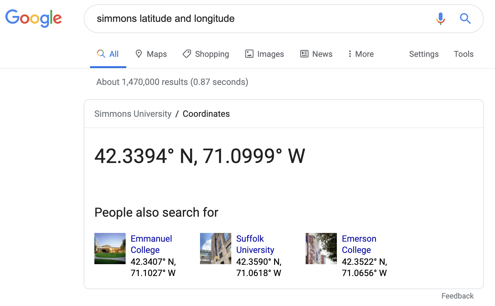

```{r xaringan-themer, include = FALSE}
library(xaringanthemer)
mono_accent(base_color = "#4682B4") #3E8A83?
```

```{r, echo = FALSE}
knitr::opts_chunk$set(
  message = FALSE, warning = FALSE
)
```

```{r, include = FALSE}
library(tidyverse)
library(tidytext)

library(plotly)
library(mdsr)
library(babynames)
library(ggthemes)
library(gapminder)
library(leaflet)
library(nycflights13)
```

<!--
pagedown::chrome_print("~/Dropbox/Teaching/03-Simmons Courses/MATH228-Introduction to Data Science/Lecture Slides/06-Topics_in_DS/06-Topics_in_DS.html")
-->

# Needed Packages

```{r, eval = FALSE}
library(tidyverse)
library(tidytext)
```

---

class: center, middle, frame

# Working with Text

---

# Why text data?

So far, we have been working almost exclusively with **numerical**, **categorical**, and **character** data. 

--

```{r}
diamonds %>%
  select(carat, cut, color, price) %>%
  head(4)
```

--

However, much of the data in the world today are **text heavy**. 

- Acquiring a basic understanding of working with *text data* is **crucial**!

---

# Regular Experessions using Friends

We'll look at transcript data from the TV show, **Friends**. 

- TidyTuesday link: [HERE](https://github.com/rfordatascience/tidytuesday/blob/master/data/2020/2020-09-08/readme.md)

- Also available via the `friends` R package. 

.center[


]


---

# `friends` data

```{r}
friends <- readr::read_csv('https://raw.githubusercontent.com/rfordatascience/tidytuesday/master/data/2020/2020-09-08/friends.csv')
nrow(friends)
```

```{r}
set.seed(228)
friends %>% sample_n(5)
```

---

# Text Mining

An aim of analyzing text data is to *quantify the ideas embedded in text*. 

- How many times does **Rachel Green** speak?

- How many times do other characters *mention* **Ross Geller**?

- Which character says the *most words*?

Unfortunately, R doesn't *just know this*. But we can answer this question by counting *text patterns*. 

--

```{r}
# How many TOTAL lines does Rachel Green have?
friends %>%
  filter(speaker == "Rachel Green") %>%
  nrow()
```

---

# `str_()` 

The `stringr` package's `str_...()` functions count text patterns within character vectors. 

For instance, let's find how many times **Ross** was mentioned:
```{r, eval = FALSE}
str_which(friends$text, pattern = "Ross")
str_subset(friends$text, pattern = "Ross")
```

--

**Notes**:

- The first argument in `str_which()` and `str_subset()` is the **character vector** in which you want to find the pattern, and the second argument is the pattern itself. 
    - Like finding a "needle in a haystack," except R does all the work

--

- `str_which()` and `str_subset()` take *identical arguments*. 
    - `str_which()` returns **indices** with the text pattern, while `str_subset()` returns the **text** that contained the pattern. 
    
---

# `str_detect()` 

The `str_detect()` function uses the *same syntax* as `str_which()` and `str_subset()`, except it returns a **logical vector** that is *the same length as the character vector* (i.e., the haystack):

```{r, eval = FALSE}
str_detect(friends$text, pattern = "Ross")
```

--

We can use this to count how many times **Ross** was mentioned:

```{r}
sum(str_detect(friends$text, pattern = "Ross"))
```

---

# `str_detect()` 

**Who mentioned Ross the most?**

```{r}
friends %>%
  group_by(speaker) %>%
  summarize(total_ross = sum(str_detect(text, pattern = "Ross"))) %>%
  slice_max(order_by = total_ross, n = 10) 
```

---

# `str_detect()` 

**Who mentioned Ross the most?**

```{r, dpi = 300}
friends %>%
  group_by(speaker) %>%
  summarize(total_ross = sum(str_detect(text, pattern = "Ross"))) %>%
  slice_max(order_by = total_ross, n = 10) %>%
  ggplot(aes(x = fct_reorder(speaker, total_ross), y = total_ross)) + 
  geom_col(fill = "dodgerblue", alpha = 0.4) + 
  labs(x = "", y = "Number of lines that mentioned 'Ross'") +
  coord_flip() + 
  theme_minimal()
```

---

# `str_detect()` 

**Who started the most lines with "Ross"?**

- (With a **regular expression**, `^`)

```{r, eval = FALSE}
friends %>%
  group_by(speaker) %>%
  summarize(total_ross = sum(str_detect(text, pattern = "^Ross"))) %>% #<<
  slice_max(order_by = total_ross, n = 10) %>%
  ggplot(aes(x = fct_reorder(speaker, total_ross), y = total_ross)) + 
  geom_col(fill = "dodgerblue", alpha = 0.4) + 
  labs(x = "", y = "Number of lines that begin with 'Ross'") +
  coord_flip() + 
  theme_minimal()
```

---

# Example: Speaking Patterns in Friends

Let's look into speaking patterns of the six main characters of *Friends*, as a function of *line number*. 

- We'll create a *strip plot* that shows the line numbers for which each character speaks.

- **Season 1, Episode 1 only!**

```{r, eval = FALSE}
friends %>%
  ... # What comes next?
```


```{r, echo = FALSE, eval = FALSE}
friends %>%
  filter(season == 1, episode == 1) %>%
  mutate(line_number = row_number()) %>%
  filter(speaker %in% 
           c("Monica Geller", "Ross Geller", "Rachel Green", 
             "Phoebe Buffay", "Chandler Bing", "Joey Tribbiani")) %>%
  ggplot(aes(x = speaker, y = utterance, color = speaker)) +
  geom_jitter() + 
  theme_bw() + 
  labs(x = "", y = "Line Number", 
       title = "Speaking Parts in Friends S01:E01", 
       caption = "Data: {friends}") + 
  coord_flip() + 
  theme(legend.position = "none", 
        axis.text.x = element_text(size = 11, face = "bold"), 
        axis.text.y = element_text(size = 11, face = "bold"))
```

---

# Tidy Text Format

Text data is often simpler to analyze if it is in *tidy* format. 

- In text analysis, this means **one word per row**. 

- The `unnest_tokens()` function from the `tidytext` package can help with this!

--

We'll only focus on **Season 1** because this dataset will be *huge*!

```{r}
friends_s01_tidy = friends %>%
  filter(season == 1) %>%
  unnest_tokens(output = word, input = text)
```

--

**Some Notes**

`unnest_tokens()` takes two *arguments*:

- `output`: The name of the new column that contains individual words
- `input`: The name of the column with text that gets split

---

# Word Count

Now that the text is in **tidy format**, we can, among other things, count up the number of *words* per character. 

```{r}
friends_s01_tidy %>%
  filter(speaker %in% 
           c("Monica Geller", "Ross Geller", "Rachel Green", 
             "Phoebe Buffay", "Chandler Bing", "Joey Tribbiani")) %>%
  count(speaker, sort = TRUE)
```

---

# Word Count

Now that the text is in **tidy format**, we can, among other things, count up the number of *words* per character. 

```{r, eval = FALSE}
friends_s01_tidy %>%
  filter(speaker %in% 
           c("Monica Geller", "Ross Geller", "Rachel Green", 
             "Phoebe Buffay", "Chandler Bing", "Joey Tribbiani")) %>%
  count(episode, speaker) %>%
  ggplot(aes(x = factor(episode), y = n)) + 
  geom_col() + 
  facet_wrap( ~ speaker) + 
  labs(x = "Episode Number", y = "Number of words spoken", 
       title = "How many words were spoken in Season 1 of Friends?", 
       subtitle = "(six main characters only)") +
  coord_flip() + 
  theme_minimal()
```

---

class: center, middle, frame

# Sentiment Analysis

---

# Sentiment Analysis

Using the text mining techniques covered previously, one piece of information we can extract from text is the **sentiment of the text**. 

- Is the text positive or negative? Does it evoke *surprise* or *disgust*?

- If we *sum* the sentiment for *each word in a document*, does this reflect an accurate measure of sentiment for the document as a whole?

--

There are a variety of ways to judge the **sentiment** of a text. 

- One such *sentiment lexicon* is the `bing` lexicon from [Bing Liu and collaborators](https://www.cs.uic.edu/~liub/FBS/sentiment-analysis.html). 

From `tidytext`:

```{r, eval = FALSE}
get_sentiments("bing")
```

---

# Taylor Swift

I would Love to tell a Story about the sentiment of Taylor Swift's songs. 

From [TidyTuesday](https://github.com/rfordatascience/tidytuesday/blob/master/data/2020/2020-09-29/readme.md) via Rosie Baillie and Dr. Sara Stoudt:

```{r}
taylor_swift_lyrics <- readr::read_csv('https://raw.githubusercontent.com/rfordatascience/tidytuesday/master/data/2020/2020-09-29/taylor_swift_lyrics.csv')
```

---

# Tidy Text

Let's use `unnest_tokens()` to convert the data to *tidy* format!

- Each word will appear in its own row.

```{r}
tswift_tidy = taylor_swift_lyrics %>%
  unnest_tokens(output = word, input = Lyrics)
```

--

First, we'll want to *remove* **stop words**:

```{r}
head(stop_words) # 'stop_words' from 'tidytext' package
```

---

# `anti_join()`

Here's where we can use `anti_join()`!

- *Remove* stop words from `tswift_tidy`. 

```{r}
tswift_tidy_anti = tswift_tidy %>%
  anti_join(stop_words, by = "word")
```

---

# Which words does T. Swift say the most?

```{r, dpi = 300}
tswift_tidy_anti %>%
  count(word, sort = TRUE) %>% 
  slice_max(n, n = 22) %>%
  ggplot(aes(x = fct_reorder(word, n), y = n)) + 
  geom_col() + 
  labs(x = "", y = "Count", 
       title = "Which words does Taylor Swift LOVE the most?") +
  coord_flip() + 
  theme_minimal()
```

---

# Back to Sentiment Analysis

The text is in **tidy format** (one word per row), so we can proceed with the **sentiment analysis**. 

Let's **join** the `bing` lexicon to `tswift_tidy_anti`. 

- We'll use `inner_join()`, because we want only the words that appear in **both** the song and the `bing` lexicon:

```{r}
song_sentiment = tswift_tidy_anti %>%
  inner_join(get_sentiments("bing"), by = "word")
```

---

# Taylor Swift Sentiment Analysis

Next, we'll `count()` up the `word` and `sentiment` combinations, extract the **top 22** for each sentiment, and pass them off to `ggplot()` and `geom_col()`. 

- I used `scales = "free_y"` in `facet_wrap()` so that each facet contained a different set of words (positive vs negative sentiments).

```{r, eval = FALSE}
sentiment_counts = song_sentiment %>%
  count(word, sentiment, sort = TRUE)

sentiment_counts %>%
  group_by(sentiment) %>%
  top_n(10, wt = n) %>%
  ggplot(aes(x = fct_reorder(word, n), y = n, 
             fill = sentiment)) + 
  geom_col() + 
  facet_wrap( ~ sentiment, scales = "free_y") + 
  labs(x = "", y = "Contribution to sentiment", 
       title = "Sentiment Analysis of Taylor Swift Songs") +
  theme_bw() + 
  theme(legend.position = "none") +
  coord_flip()
```

---

# Taylor Swift Sentiment Analysis

.center[
```{r, echo = FALSE, dpi = 300, out.width = "65%"}
sentiment_counts = song_sentiment %>%
  count(word, sentiment, sort = TRUE)

sentiment_counts %>%
  group_by(sentiment) %>%
  top_n(10, wt = n) %>%
  ggplot(aes(x = fct_reorder(word, n), y = n, 
             fill = sentiment)) + 
  geom_col() + 
  facet_wrap( ~ sentiment, scales = "free_y") + 
  labs(x = "", y = "Contribution to sentiment", 
       title = "Sentiment Analysis of Taylor Swift Songs") +
  theme_bw() + 
  theme(legend.position = "none") +
  coord_flip()
```
]

---

class: center, middle, frame

# Interactive Data Graphics

---

# Needed Packages

```{r, eval = FALSE}
library(plotly)
library(mdsr)
library(babynames)
library(ggthemes)
library(gapminder)
library(leaflet)
library(nycflights13)
```


---

# 2D Data Graphics

.center[
```{r, echo = FALSE, dpi = 300, out.width = "70%"}
library(nycdogs)
bite_tab = nyc_bites %>%
  count(breed) %>%
  arrange(desc(n)) %>%
  slice(1:6)

bite_tab_bor = nyc_bites %>%
  count(breed, borough) %>%
  arrange(desc(n)) %>%
  filter(breed %in% bite_tab$breed)

bite_tab_bor = bite_tab_bor[-which(bite_tab_bor$borough == "Other"), ]

bite_tab_bor$breed[c(5, 7, 10, 19, 20, 21, 24, 25, 27, 30)] <- c("Terrier-Pit Bull", "Pit Bull Mix", "Pit Bull Mix",
                                                                 "Pit Bull Mix", "Terrier-Pit Bull", "Pit Bull Mix",
                                                                 "Terrier-Pit Bull", "Terrier-Pit Bull", "Pit Bull Mix", 
                                                                 "Terrier-Pit Bull")

names(bite_tab_bor) <- c("Breed", "Borough", "Count")

bite_tab_bor = bite_tab_bor %>%
  group_by(Borough) %>%
  mutate(Breed = fct_reorder(Breed, Count))

bite_tab_bor %>%
  ggplot(aes(x = Borough, y = Count, fill = Breed, color = Breed)) + 
  geom_linerange(aes(x = Borough, ymin = 0, ymax = Count), 
                 position = position_dodge(width = 1)) + 
  geom_vline(xintercept = 4.5, col = "gray20", linetype = "dashed", size = 0.7) +
  geom_vline(xintercept = 3.5, col = "gray20", linetype = "dashed", size = 0.7) +
  geom_vline(xintercept = 2.5, col = "gray20", linetype = "dashed", size = 0.7) +
  geom_vline(xintercept = 1.5, col = "gray20", linetype = "dashed", size = 0.7) +
  geom_point(size = 4, alpha = 0.6, position = position_dodge(width = 1)) + 
  coord_flip() + 
  labs(y = "Number of bite incidents") + 
  theme_bw()
```
]

---

# 2D Data Graphics

.center[
```{r, echo = FALSE, dpi = 300, out.width = "65%", message = FALSE, warning = FALSE}
ggplot(data = CIACountries, mapping = aes(x = educ, y = gdp)) + 
  geom_point(aes(color = net_users, size = roadways)) + 
  labs(x = "Education spending (% of GDP)", y = "GDP per capita", 
       color = "% Internet users", size = "Roadways per unit area") + 
  theme_bw()
```
]

---

# 2D Data Graphics

.center[
```{r, echo = FALSE, dpi = 300, out.width = "70%", message = FALSE}
babynames_ant = babynames %>%
  filter(name == "Anthony" & sex == "M")
ggplot(data = babynames_ant, aes(x = year, y = n)) + 
  geom_line(size = 2) + 
  labs(x = "", y = "", 
       title = "Age Distribution of American Boys Named Anthony", 
       subtitle = "By year of birth", caption = "Source: Social Security Administration") + 
  geom_text(x = 1915, y = 21000, label = "Number of Anthonys \n born each year", 
            fontface = "bold", family = "mono") +
  scale_x_continuous(breaks = seq(1880, 2010, by = 10),
                     labels = c("1880", "'90", "1900", "'10", "'20", "'30", "'40",
                                "'50", "'60", "'70", "'80", "'90", "2000", "'10")) +
  scale_y_continuous(breaks = seq(0, 25000, by = 5000),
                     labels = c("0", "5", "10", "15", "20", "25 k")) +
  theme_fivethirtyeight() + 
  theme(axis.text.x = element_text(size = 12), 
        axis.text.y = element_text(size = 12)) +
  geom_vline(xintercept = 1989, col = "blue", linetype = "dashed", size = 0.8) + 
  geom_curve(x = 1975, xend = 1988, y = 3000, yend = 5000, 
             arrow = arrow(length = unit(0.08, "inch")), size = 0.5, 
             color = "gray20", curvature = -0.3) + 
  ggplot2::annotate("text", x = 1975, y = 2000, fontface = "italic", label = "Anthony was \n born HERE")
```
]

---

# Introducing `plotly`

The `plotly` package is used for creating *dynamic* and *interactive* **web-based graphics**. 

- via the open-source Javascript library [plotly.js](https://plot.ly/javascript/). 

.center[
```{r, echo = FALSE}

```
]

--

While there are many uses for `plotly`, one particular convenience is that it can convert any `ggplot2` object into an interactive object using `ggplotly()`. 

---

# Our First Interactive Graphic

Run the following to create a plot that we used earlier in the semester, and assign it to the object `ant_bob_plot`:
```{r, fig.show = 'hide'}
ant_bob_plot = babynames %>%
  filter(name %in% c("Anthony", "Robert") & sex == "M") %>%
  ggplot(aes(x = year, y = n, color = name)) +
  geom_line() +
  geom_point() +
  labs(x = "Year", y = "Name Count by Year", title = "Anthony and Robert Count",
       caption = 'Data: ssa.gov', 
       color = "Name", shape = "Name") + 
  theme_minimal()
ant_bob_plot
```

Next, run `ggplotly(ant_bob_plot)` to make the plot *interactive*. 

---

# Our First Interactive Graphic

```{r}
ggplotly(ant_bob_plot)
```

---

# Practice
Using the `gapminder_2007` data from an earlier homework, make the graph below interactive. 
```{r}
gapminder_2007 = gapminder %>%
  filter(year == 2007)
```

.center[
```{r, echo = FALSE, dpi = 300, out.width = "45%"}
ggplot(gapminder_2007, aes(x = gdpPercap, y = lifeExp, color = continent, size = pop)) + 
  geom_point() + 
  labs(x = "GDP per capita", y = "Life expectancy", color = "Continent", size = "Population")
```
]

---

class: center, middle

# Leaflet

---

# Maps

**Why maps?**

*Maps* (you've probably heard of these) are an additional form of *dataviz* used to display **spatial data**. 

--

**Spatial data** are data that contain *geographic coordinates*. 

- While these coordinates are usually coded *numerically*, they are very different from other numerical data that we have seen so far this semester. 

--

```{r}
library(nycflights13)
airports %>%
  select(name, lat, lon, tzone) %>%
  head(3)
```

---

# U.S. Airports

We've looked at the `airports` data before, but in a slightly different context.
- e.g., using `left_join()` to link airport names to `flights`

Now let's utilize the *location data* in `airports`. 

--

First, let's clean the data a bit:

```{r}
airports_filter = airports %>%
  filter(tzone %in% c("America/New_York", "America/Chicago", "America/Los_Angeles", 
                      "America/Vancouver", "America/Phoenix", "America/Denver"))
```

---

# Our First Interactive Map!

```{r, eval = FALSE}
leaflet(airports_filter) %>%
  addTiles() %>%
  addMarkers(lng = ~lon, lat = ~lat)
```

---

# Add an Icon!

```{r, eval = FALSE}
plane_icon = makeIcon("https://cdn4.iconfinder.com/data/icons/dot/256/air_plane_airport.png", 
                      iconWidth = 30, iconHeight = 30)
leaflet(airports_filter) %>%
  addTiles() %>%
  addMarkers(lng = ~lon, lat = ~lat, icon = plane_icon)
```

--

(Maybe add something clearer than an icon...)

---

# Just use circles. 

```{r, eval = FALSE}
leaflet(airports_filter) %>%
  addTiles() %>%
  addCircleMarkers(lng = ~lon, lat = ~lat, stroke = FALSE, 
                   radius = 5, fillOpacity = 0.7)
```

---

# Adding Information

We can add a `color` and `popup` characteristic to the map. For example, let's make the circle markers different colors for the different *time zones* (`tzone`). 

First, we need to define a color palette based on a factor (`tzone` in this case):

```{r, eval = FALSE}
pal = colorFactor(palette = "Dark2", domain = airports_filter$tzone)
leaflet(airports_filter) %>%
  addTiles() %>%
  addCircleMarkers(lng = ~lon, lat = ~lat, 
                   stroke = FALSE, radius = 5, fillOpacity = 0.7, 
                   color = ~pal(tzone), popup = ~name) #<<
```

The `popup = ~name` gives the name of the airport when you click on the marker. 

---

# Add Legend

```{r, eval = FALSE}
pal = colorFactor(palette = "Dark2", domain = airports_filter$tzone)
leaflet(airports_filter) %>%
  addTiles() %>%
  addCircleMarkers(lng = ~lon, lat = ~lat, 
                   stroke = FALSE, radius = 5, fillOpacity = 0.7, 
                   color = ~pal(tzone), popup = ~name) %>%
  addLegend(position = "bottomright", title = "Time Zone",
            pal = pal, values = ~tzone, opacity = 1)
```

---

# Focus on One Area (and zoom out)

.center[
```{r, echo = FALSE, dpi = 300}

```
]

---

# Focus on One Area (and zoom out)

**Note**: Had to play with the `lng` and `lat` a bit...

```{r, eval = FALSE}
leaflet(airports_filter) %>%
  addTiles() %>%
  addCircleMarkers(lng = ~lon, lat = ~lat, 
                   stroke = FALSE, radius = 5, fillOpacity = 0.7, 
                   color = ~pal(tzone), popup = ~name) %>%
  addLegend(position = "bottomright", title = "Time Zone",
            pal = pal, values = ~tzone, opacity = 1) %>%
  setView(lng = -71.0999, lat = 42.3394, zoom = 20) 
```

---

# Continuous Color Palette 

We can use a continuous color palette (such as `Reds`) to illustrate a **continuous variable** (e.g., `alt`) rather than **categorical** (e.g., `tzone`). 

```{r, eval = FALSE}
pal = colorFactor(palette = "Reds", domain = airports_filter$alt)
leaflet(airports_filter) %>%
  addTiles() %>%
  addCircleMarkers(lng = ~lon, lat = ~lat, 
                   stroke = FALSE, radius = 5, fillOpacity = 0.7, 
                   color = ~pal(alt), popup = ~name) %>%
  setView(lng = -71.00518, lat = 42.36435, zoom = 5)
```

---

# Cluster Options for (Larger) Data

**San Francisco Trees** (from *Tidy Tuesday*)

- Click [HERE](https://github.com/rfordatascience/tidytuesday/tree/master/data/2020/2020-01-28) for more info. 

```{r, eval = FALSE}
sf_trees = read_csv('https://raw.githubusercontent.com/rfordatascience/tidytuesday/master/data/2020/2020-01-28/sf_trees.csv')
#View(sf_trees)

leaflet(sf_trees) %>%
  addTiles() %>%
  addMarkers(lng = ~longitude, lat = ~latitude, 
             clusterOptions = markerClusterOptions(), #<<
             popup = ~address)
```

---

# More Info

If you're interested in `leaflet`, here are some additional resources:

- [Leaflet for R](https://rstudio.github.io/leaflet/)

- [Making interactive leaflet maps with R](https://pakillo.github.io/r-leaflet-maps/r-leaflet-maps-slides.html#1)

- [Leaflet Cheat Sheet](https://ugoproto.github.io/ugo_r_doc/pdf/leaflet-cheat-sheet.pdf)


