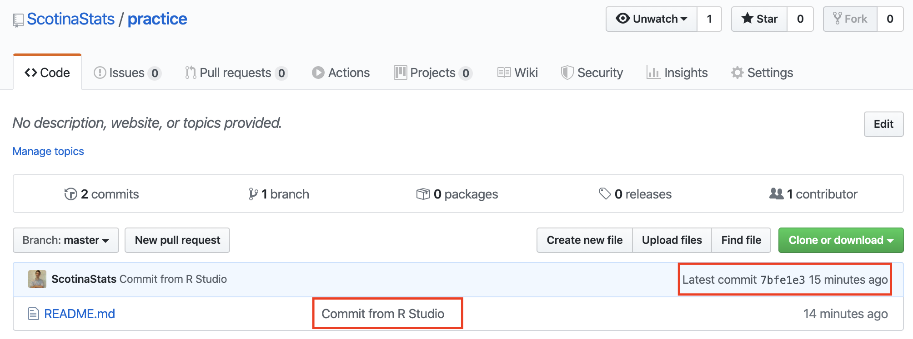
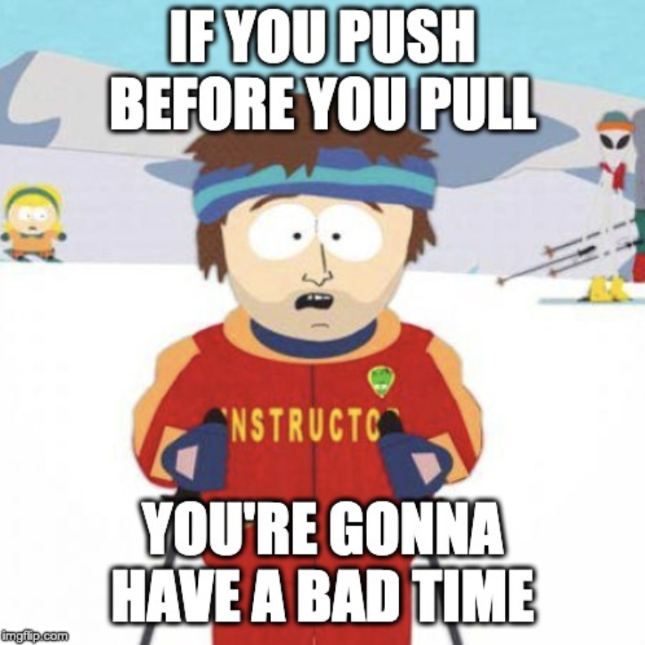

```{r xaringan-themer, include = FALSE}
library(xaringanthemer)
mono_accent(base_color = "#4682B4") #3E8A83?
```

```{r, include = FALSE}
library(tidyverse)
library(mdsr)
library(lubridate)
library(fivethirtyeight)
library(nycflights13)
```

<!--
pagedown::chrome_print("~/Dropbox/Teaching/03-Simmons Courses/MATH228-Introduction to Data Science/Lecture Slides/05-Github/05-Github.html")
-->

class: center, middle, frame

# Getting Started with Git and GitHub

---

# Why Git and GitHub?

**Version control**: Record *changes* to a set of files over time so you can recall specific versions

- Essential for **collaboration** on projects with others

- Plays nicely with **R Studio**

- Provides a means for building a **public portfolio** (helpful for *internships* and *JOBS*)

--

**Analogy**: **GitHub** is to *R Studio* as **Google Docs** is to *Word*. 

While working on your projects, you can each make changes to a `.Rmd` file, but your collaborators can only see those changes through *email*. 

- With **GitHub**, collaborators can view your changes more easily!

---

# Git vs. GitHub

**Git** is a *version control system* that lives on your computer, which you can access through R Studio. 

**GitHub** is an *online hosting service* that provides a home for your projects. 
- Like Dropbox, but way cooler. 

**Some first steps**

1. Create a GitHub account. 

2. Install Git. 

3. 🥳🥳🥳

.pull-left[
.center[
```{r, echo = FALSE, dpi = 200}
knitr::include_graphics("git_logo.png")
```
]
]

.pull-right[
.center[
```{r, echo = FALSE, dpi = 250, out.width = "75%"}
knitr::include_graphics("github_logo.png")
```
]
]

---

# Create a GitHub account

Sign up for a **free account** [HERE](https://github.com/). 

.pull-left[
```{r, echo = FALSE, dpi = 250}

```
]

.pull-right[
**Tips**

Put some thought into your **username**! 

- Make sure you incorporate your *actual name* so (1) it's easy to remember and (2) people know who they're dealing with.
    
- Be sure to use **all lowercase** (Clearly, I got the memo *after* creating my account...).

- Use a **personal email** that won't go away in a few years.
]

---

# Installing Git

First, let's check in the R Studio **Terminal** to see if Git is already installed. 

.center[
```{r, echo = FALSE, dpi = 300}

```
]

Enter `git --version` and press `enter`/`return` to see its version. If you see a version, you're all set!

- My version is `2.21.1`. 

- If Git is *not installed*, you'll see something like `git: command not found`. 

---

# Windows Installation

Install [Git for Windows](https://gitforwindows.org/). 

- When asked about “Adjusting your PATH environment”, make sure to select “Git from the command line and also from 3rd-party software”.

Read more [HERE](https://happygitwithr.com/install-git.html). 

---

# macOS Installation

Install the Xcode command line tools (not all of Xcode). 

Go to the **Terminal** and enter
```{r, eval = FALSE}
git --version
```

or

```{r, eval = FALSE}
git config
```

Accept the offer and click on "Install". 

If this doesn't work, type in the **Terminal**:
```{r, eval = FALSE}
xcode-select --install
```

**OR** install Git from here: [http://git-scm.com/downloads](http://git-scm.com/downloads)

---

# Introducing Yourself to Git

Now we have to "sign in" to Git. 

You *could* do this through the **Terminal**:
```{r, eval = FALSE}
git config --global user.name 'ScotinaStats'

git config --global user.email 'adscotina@gmail.com'

git config --global --list
```

**OR** run the following R Code (I prefer this way):
```{r, message = FALSE}
# install.packages("usethis")

library(usethis)
use_git_config(user.name = "ScotinaStats", 
               user.email = "adscotina@gmail.com")
```

---

# Connecting to GitHub

The main objectives of connecting to GitHub are the abilities to:

- **pull** an existing project from GitHub to your computer

- **push** newer versions of the project back to GitHub

But first, we'll have to make a **repository** (or a "repo") on GitHub. 

---

class: center, middle, frame

# Creating a GitHub Repo

---

# GitHub Repository

A **repository** is essentially a **project folder** (you've used these for assignments) that lives on GitHub. 

- A repository contains all of the project files (e.g., the `.Rmd` file, any data files, image files, etc.)

- Stores **revision history** (very important!)

--

First, go to [https://github.com/](https://github.com/) and make sure you are **logged in**. 

- Click the green **New** (repository) button on the left. 

.center[
```{r, echo = FALSE, dpi = 300}

```
]

---

# GitHub Repository

In general, name your repo something **memorable** and **related** to the project. 

- I'm calling mine `practice` for now. 

.center[
```{r, echo = FALSE, dpi = 300}

```
]

---

# GitHub Repository

Once you click the green **Create repository** at the bottom, you'll see something like this:
.center[
```{r, echo = FALSE, dpi = 300}

```

]

**Congrats**, you have made your first GitHub repo!

---

# Adding Collaborators

You can use GitHub for collaboration! Only **one team member** needs to create a project repo. 

- The other(s) can be added as **collaborators**. 

- You can search for collaborators with *username*, *full name*, or *email*. 

Once an invite is sent, collaborators will receive an email with a link to accept the invitation.

--

To invite collaborators:

1. Click **Settings** while in your current repo. 

2. Click **Manage access** on the left. 

3. Click the green **Invite a collaboratory** at the bottom of the page. 

---

# Adding Collaborators

.center[
```{r, echo = FALSE, dpi = 300}

```
]

---

# Cloning/Downloading a Repo

**Cloning** a repo is how we connect a GitHub repo to an **R Studio project** (through a `.Rproj`). 

- You have used `.Rproj` files before. Think of them as project folders that allow for simple organization of all relevant project files. 

--

We'll start the **cloning** process through GitHub. 

- Within your new repo, click **Clone or download**, and the **copy** the URL (don't click *Open in Desktop* or *Download ZIP*)

--

.center[
```{r, echo = FALSE, dpi = 300}
knitr::include_graphics("cloning.png")
```
]

---

# New R Project

In R Studio, click **File** -- **New Project** -- **Version Control** -- **Git**. 

- **Repository URL**: [Enter the URL that you copied when you cloned the repo on GitHub]
    - My URL: `https://github.com/ScotinaStats/practice.git`
    
- **Project Directory Name**: This should fill in automatically once you enter the Repository URL. 
    - My Directory Name:`practice`
    
- **Create Project as a Subdirectory of**: Use `Browse` to pick a folder for this repo to live in. 
    - I chose my `STAT228` folder for this. I recommend choosing a folder that's related to the course and/or easy to find. 
    
---

# New R Project

I also checked off **Open in new session**, but this isn't required and more of a personal preference. 

.center[
```{r, echo = FALSE, dpi = 300}

```
]
    
---

# New R Project

.center[
```{r, echo = FALSE, dpi = 300}

```
]

---

# Practice

Within the `practice` (or whatever you named your repo) R Studio session, modify the `README.md` file by adding the line "This is a line from R Studio."

- Save your changes. 

.center[
```{r, echo = FALSE, dpi = 300}

```
]

---

# Commit Changes

A **Github commit** action is *saving the local changes you have made*. 

- Each commit is associated with a **tag** and a **commit message** . 
    - You write the message to described changes that were made.

After you *saved* the changes, you need to *commit* them to your local repo. 

- Click the **Git** tab in the upper right-hand panel. 

- Check **Staged** box for `README.md`. 

- Click **Commit**. 
    - A new window will pop up reviewing the changes that you made. Write a **Commit message** (such as "commit from R Studio") and click **Commit**. 

--

.center[
```{r, echo = FALSE, dpi = 300}

```
]

---

# Commit Process (Summary)

1. **Save** your work. This isn't a new step - you already do this when typing in a `.Rmd` file!

2. **Stage** (check the boxes next to the file names in the "Git" tab in the upper right-hand corner in RStudio)
    - Only stage files that get sent to other people! (e.g., `.Rmd` files)
    - If you didn't just change it, then don't stage it. 
    
3. **Commit**
    - Write a **commit message** that is useful and provides information. 
    - You want your collaborator (and... **you**!) to know *what changes you made*. 
    
--

**Good commit message**: Added section that describes the filter() function. 

**Bad commit message**: idk what this code does but hopefully it works?

---

# Push

While a **Commit** action *saves* your work, your collaborator can't see the latest version of the project yet because the revisions have not been *uploaded* to GitHub. 

- This is where a **Push** action comes in!

To **push** a **commit**, click the green push button (the *Up* arrow) in the "Git" panel after a commit. 

--

.center[
```{r, echo = FALSE, dpi = 300}

```
]

---

# Push

When pushing a commit, provide your **username** and **password** if you are asked. 

You should see a message that looks something like this when the push is finished:

.center[
```{r, echo = FALSE, dpi = 300}

```
]

---

# Push

After the push is finished, check your **GitHub** repository on [https://github.com/](https://github.com/). 

Your latest commit is now viewable by all collaborators!

.center[
```{r, echo = FALSE, dpi = 300}

```
]

---

# Commit History

You can also access **older commits** by clicking on **commits** towards the top left-hand side of your GitHub repository. 
- In the screenshot from the last slide, this says "2 commits" for me. 

.center[
```{r, echo = FALSE, dpi = 300}

```
]

--

You can use this page to **pull** older commits (in case of emergency). 

- This brings us to...

---

# Pull

The **Pull** action merges changes from your collaborators into your own local copy. 

- *Always* pull when you first sit down to work on your project. 

- *Always* pull **before you push** (in order to minimize merge conflicts). 

--

Complete a **pull* by clicking the *Down* arrow in the "Git" panel. 

.center[
```{r, echo = FALSE, dpi = 300}

```
]

---

# Summary

While I presented them in a different order, the order you should follow when working with Git and GitHub is:

1. **Commit**: Save any changes you made to a project *locally* (i.e., on your personal computer). 

2. **Pull**: Pull/merge any changes your collaborators might have made from `GitHub.com` into your local copy. 

3. **Push**: Push your commits to GitHub. 

---

# Practice

Within the `practice` R project, create a new `.Rmd` file. 

- **File** -- **New File** -- **R Markdown** -- **OK**

You can keep the template that's provided by R Studio, or add in something of your own.

- The point of this is that you're creating a new `.Rmd` file that's part of your project. 

- Save it as `practice.Rmd` **in the practice folder** (shouldn't be an issue if you're working in the `practice` R project). 

**Commit** these changes, and then **push** the commits to GitHub. 

---

# Practice

.center[
```{r, echo = FALSE, dpi = 300}

```
]

---

# Merge Conflicts

A **merge conflict** could occur if you and your collaborator are writing over each other's work and something goes wrong. 

- This usually happens if you **push** *before* you **pull**, so...

--

.center[
**Pull BEFORE you push!!!**
]

--

.center[
```{r, echo = FALSE, dpi = 300}

```
]

---

# Merge Conflicts

Within the **R Project**, I added some content at the end of the `practice.Rmd` file **before pulling from GitHub**. 

.center[
```{r, echo = FALSE, dpi = 300}

```
]

---

# Merge Conflicts

When I tried to **push** this commit, I received the following:

.center[
```{r, echo = FALSE, dpi = 300}

```
]

- This looks scary, but all it means is that my collaborator pushed changes to GitHub that I didn't *pull before adding the new content*. 

---

# Merge Conflicts

So when I try to **pull** now, I receive the following in my `.Rmd` file:

.center[
```{r, echo = FALSE, dpi = 300}

```
]

---

# Merge Conflicts

A **merge conflict** in your `.Rmd` file will start with `<<<<<<<HEAD` and end with `>>>>>>>` and the *commit number* (which is just a bunch of letters and numbers).

- These mark the *beginning* and *end* of where the merge conflict happened. 

- In this example, my collaborator wrote `blah blah blah` on the **same line** that I started the `dplyr::filter()` code, but they *pushed* their commits to GitHub first. 
    - I should've pulled this *before* I wrote the `dplyr:filter()` code, but I didn't. And **bad things happened**. 
    
--

.center[
```{r, echo = FALSE, dpi = 400}

```
]

---

# Fixing Merge Conflicts

Because the merge conflict occurred because my collaborator and I wrote on the same line, I'll just remove all the `<<<` and `>>>` stuff, commit my work, and *push*. 

.center[
```{r, echo = FALSE, dpi = 300}

```
]

- Now my collaborator can *pull* the new changes I made and continue on the project!

---

class: center, middle, frame

# Creating Websites with R

