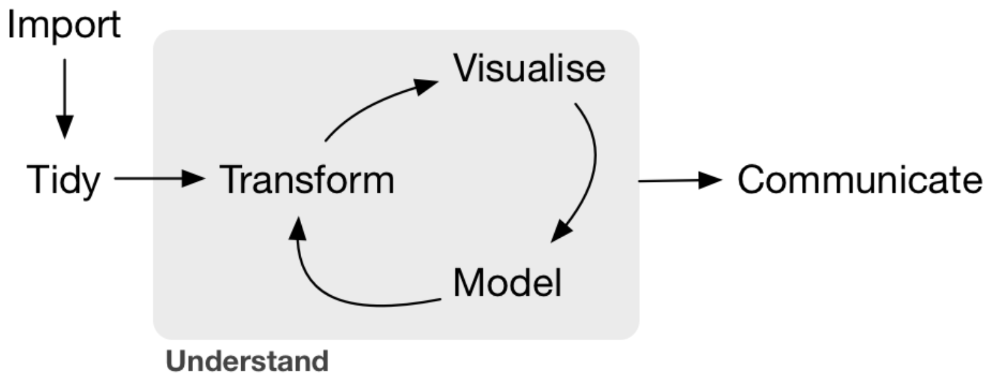
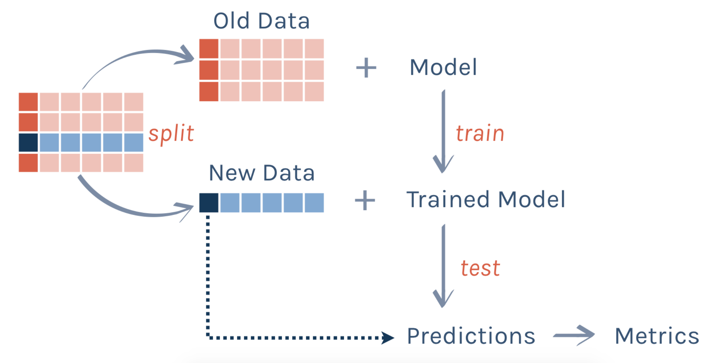
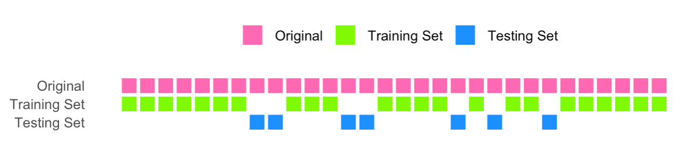

```{r xaringan-themer, include = FALSE}
library(xaringanthemer)
mono_accent(base_color = "#4682B4") #3E8A83?
options(htmltools.preserve.raw = FALSE)
```

```{r, echo = FALSE}
knitr::opts_chunk$set(
  message = FALSE, warning = FALSE
)
```

```{r, include = FALSE}
library(tidyverse)
library(tidymodels)
library(AmesHousing)
library(countdown)
```

<!--
pagedown::chrome_print("~/Dropbox/Teaching/03-Simmons Courses/MATH228-Introduction to Data Science/Lecture Slides/07-Predictive_Modeling/07-Predictive_Modeling.html")
-->

# Needed Packages

```{r, eval = FALSE}
library(tidyverse)
library(tidymodels)
library(AmesHousing)
```

---

# Recap

**The Data Science Pipeline** [(Grolemund and Wickham)](https://r4ds.had.co.nz/)

.center[
```{r, echo = FALSE, dpi = 300}

```
]

**So far**, we have used **graphics** to explore relationships among variables in data. 

- They can help us identify *patterns* and *relationships* from visual inspection of data. 

--

An additional way to investigate relationships in data is through **modeling**.

- Quantify the **magnitude** and **direction** of relationships among variables

- **Predict**, and predict **accurately**

---

# Machine Learning (ML)

The term **machine learning** was first used in the 1950s to label techniques for *extracting information from data* **without human intervention**. 

Before computers were prevalent in statistical analyses, the dominant modeling framework was **regression**. 

- Based on *linear algebra* and *calculus*

--

ML models emerged from regression, but are valued more for their ability to:

- (i) make **accurate predictions** (for never-before-seen data), and 

- (ii) scale to **large datasets**. 


These models can be divided into **supervised** and **unsupervised** learning techniques. 

---

# Supervised Learning

**Supervised learning** techniques aim to find a *function* that accurately describes how different **features** (*explanatory variables*) can be combined to make a **prediction** about a **target** (*response variable*). 

- Also referred to as **predictive models**

--

**Examples**:

- Predict **sales price** using *home attributes* (size, number of bedrooms, etc.)

- Predict likelihood of **attrition** as a function of *employee attributes*

- Predict **risk of readmission** using *patient attributes* (age, clinical measures, demographics, etc.)

---

# Unsupervised Learning

**Unsupervised learning** aims to better understand and describe data, but does so *without* a **target**. 

- The goal is typically to *identify groups* in a dataset. 

--

**Examples**:

- Identify groups of online shoppers with similar browsing/purchase histories, along with items of interest to shoppers within each group

- Identify patients in an observational study receiving *different treatments* but otherwise have *similar characteristics*
    - Can be used to emulate a **randomized trial**

---

class: center, middle, frame

# Predictive Modeling

---

# `AmesHousing`

We'll use property sales information from the `AmesHousing` package to illustrate some of the techniques that follow. 

- 81 variables measured on 2,930 properties in **Ames, IA**
- Main variable of interest (i.e., the **target**): `Sale_Price`

```{r}
# Load the *cleaned* dataset
ames = AmesHousing::make_ames()
dim(ames)
```

First let's attempt to predict `Sale_Price` (Sale price of the property, in dollars) as a *function of* `Gr_Liv_Area` (Above ground living area, in square feet).

---

# Exploratory Data Analysis

For the next few examples, we'll use a smaller version of this dataset, which will help with some illustrations:
```{r}
set.seed(12)
ames_small = ames %>% 
  sample_n(100) 
```

.center[
```{r, echo = FALSE, dpi = 300, out.width = "45%"}
ggplot(ames_small, aes(x = Gr_Liv_Area, y = Sale_Price)) + 
  geom_point(size = 1.5, alpha = 0.4) + 
  geom_smooth(method = "lm", se = FALSE) + 
  theme_bw() + 
  labs(x = "Above Ground Living Area (in sq. ft.)", y = "Sale Price (in dollars)") +
  scale_y_continuous(labels = scales::comma) + 
  scale_x_continuous(labels = scales::comma)
```
]

---

# Refresher: `lm()`

Let's fit a **simple linear regression model**: $$\widehat{Sale\_Price}=b_{0}+b_{1}*(Gr\_Liv\_Area)$$

```{r}
lm_ames = lm(Sale_Price ~ Gr_Liv_Area, data = ames_small)
lm_ames
```

**Interpretation**: The *predicted* sale price increases by 63.06 dollars for *each additional square foot* of above ground living space. 

---

# Refresher: `lm()`

You might remember `lm()` from a previous statistics class!

- It is probably the most frequently-used modeling function in R, because *linear regression* is the most frequently-used modeling technique!

--

However, there are *many* modeling techniques, and each has a different interface in R. 

**Examples**: 
- `glm()` for **logistic regression**
- `rpart()` for **decision trees**
- `randomForest()` for **random forests**

It can get **challenging** to remember all of these, along with the syntax that each takes!

---

# Parsnip

.center[
```{r, echo = FALSE, dpi = 300}
knitr::include_graphics("parsnip_hex.png")
```
]

> A common interface is provided to allow users to specify a model without having to remember the different argument names across different functions or computational engines.

---

# Specifying a model with parsnip

First, **chose a model**. 

- All models listed here: [https://www.tidymodels.org/find/parsnip/](https://www.tidymodels.org/find/parsnip/)
    - **Bookmark this page!**

In this class, we'll mostly use: 

- `linear_reg()`
- `decision_tree()`
- `rand_forest()`

---

# Specifying a model with parsnip

Second, **set the engine**. 

- This is related to which *package* or *system* will be used to fit the model. 

--

Combining these two steps, we can *specify* a **linear regression model** using the following:

```{r}
lm_spec = 
  linear_reg() %>%
  set_engine(engine = "lm")

lm_spec
```

---

# Fitting a model with parsnip

Once we **specify** the model, we can use `fit()` to **fit** the model. 

```{r}
lm_fit = 
  lm_spec %>% # parsnip model
  fit(
    Sale_Price ~ Gr_Liv_Area, # a formula
    data = ames_small         # dataframe
  )
lm_fit
```

---

# So what?

Okay, it looks like the `lm()` code is much simpler (at least shorter) than the `parsnip` code. 

```{r, eval = FALSE}
lm(Sale_Price ~ Gr_Liv_Area, data = ames_small)

# vs

linear_reg() %>%
  set_engine(engine = "lm") %>%
  fit(Sale_Price ~ Gr_Liv_Area, data = ames_small)
```

*Why wouldn't we just use `lm()`*?!

---

# Benefits of parsnip

If you want, you *can* just use `lm()`, **if you are fitting a linear regression model**. 

- But a model doesn't have to be a **straight line**!

--

Here's what you would use if you are fitting a **regression tree** (more on this later):

```{r, results = "hide"}
tree_fit = 
  decision_tree() %>%
  set_engine(engine = "rpart") %>%
  set_mode(mode = "regression") %>%
  fit(Sale_Price ~ Gr_Liv_Area, data = ames_small)

tree_fit
```

**Note**: If there is more than one *mode* for a particular model (i.e., used for either **classification** or **regression**), you need to specify that after `set_engine()`. 
- Check [https://www.tidymodels.org/find/parsnip/](https://www.tidymodels.org/find/parsnip/)!

---

# Regression Tree

```{r, echo = FALSE, dpi = 300, out.width = "65%"}
price_pred = tree_fit %>% 
  predict(new_data = ames_small)
price_pred = data.frame(pred = price_pred$.pred, 
                        Gr_Liv_Area = ames_small$Gr_Liv_Area)

ggplot() + 
  geom_point(data = ames_small, aes(x = Gr_Liv_Area, y = Sale_Price), alpha = 0.3) +
  geom_line(data = price_pred,  aes(x = Gr_Liv_Area, y = pred), color = "blue") + 
  theme_bw() + 
  labs(x = "Above Ground Living Area (in sq. ft.)", y = "Sale Price (in dollars)", 
       title = "Regression Tree") +
  scale_y_continuous(labels = scales::comma) + 
  scale_x_continuous(labels = scales::comma)
```

---

# Random Forest

```{r, echo = FALSE, dpi = 300, out.width = "65%"}
rf_fit = 
  rand_forest() %>%
  set_engine(engine = "randomForest") %>%
  set_mode(mode = "regression") %>%
  fit(Sale_Price ~ Gr_Liv_Area, data = ames_small)

price_pred = rf_fit %>% 
  predict(new_data = ames_small)
price_pred = data.frame(pred = price_pred$.pred, 
                        Gr_Liv_Area = ames_small$Gr_Liv_Area)

ggplot() + 
  geom_point(data = ames_small, aes(x = Gr_Liv_Area, y = Sale_Price), alpha = 0.3) +
  geom_line(data = price_pred,  aes(x = Gr_Liv_Area, y = pred), color = "blue") + 
  theme_bw() + 
  labs(x = "Above Ground Living Area (in sq. ft.)", y = "Sale Price (in dollars)", 
       title = "Random Forest") +
  scale_y_continuous(labels = scales::comma) + 
  scale_x_continuous(labels = scales::comma)
```

---

class: center, middle, frame

# Prediction

---

# Recap

Using the `ames_small` data, we fit a **simple linear regression model** that predicts `Sale_Price` as a function of `Gr_Liv_Area`. 

```{r}
lm_fit = 
  linear_reg() %>%
  set_engine(engine = "lm") %>%
  fit(Sale_Price ~ Gr_Liv_Area, data = ames_small)
```

This gives a **fitted model** of the data. 

---

# What is a fitted model?

A **fitted model** is a combination of **data** and a chosen **model** (e.g., linear regression, random forest, etc.)

.center[
**DATA** (*features*, *target*) + **MODEL** = **FITTED MODEL**
]

--

Once we **fit** the model, we can use that fitted model to **predict** *new target values* from data. 

```{r, results = "hide"}
lm_pred = lm_fit %>%
  predict(new_data = ames_small)

lm_pred
```

--

For convenience, let's append the *predicted values* to the `ames` data (selecting only the two variables of interest):
```{r}
ames_pred = ames_small %>%
  select(Gr_Liv_Area, Sale_Price) %>%
  mutate(Sale_Price_Pred = lm_pred$.pred)
```

---

# Predictions

```{r, dpi = 300, out.width = "40%"}
ggplot(ames_pred, aes(x = Gr_Liv_Area, y = Sale_Price)) + 
  geom_point() + 
  geom_smooth(method = "lm", se = FALSE, color = "blue") +
  geom_point(aes(x = Gr_Liv_Area, y = Sale_Price_Pred), 
             color = "red", alpha = 0.3) +
  labs(x = "Above Ground Living Area (in sq. ft.)", y = "Sale Price (in dollars)")  +
  theme_bw() 
```

---

# What are predictions?

Once we **fit** the model, we can use that fitted model to **predict** *new target values* from data. 

.center[
**DATA** (*features*) + **FITTED MODEL** = **PREDICTIONS**
]

--

Obviously, a goal of prediction is to make **good** predictions. 

- How can we judge the **quality** of the predictions, or of the fitted model in general?

--

- **residuals**

- **mean absolute error**

- **root mean squared error** (RMSE)

- **confusion matrices**

- many more...

---

# Residuals

For each *observation*, the **residual** is the difference between the *observed* and *predicted* target values: $$y_{i}-\hat{y}$$

--

.center[
```{r, echo = FALSE, dpi = 300, out.width = "50%"}
ggplot(ames_small, aes(x = Gr_Liv_Area, y = Sale_Price)) +
  geom_segment(aes(x = Gr_Liv_Area, xend = Gr_Liv_Area, 
                   y = Sale_Price, yend = predict(lm(Sale_Price ~ Gr_Liv_Area))), 
               color = "red") +
  geom_smooth(method = "lm", se = FALSE, color = "blue") +
  geom_point() +  
  geom_point(aes(Gr_Liv_Area, fitted(lm(Sale_Price ~ Gr_Liv_Area))),
             color = "red") + 
  labs(x = "Above Ground Living Area (in sq. ft.)", y = "Sale Price (in dollars)", 
       title = "Residuals for each observation")  +
  theme_bw() 
```
]

---

# Residuals?

Suppose we want to evaluate the **performance** of a model by quantifying its **error**. 

- We might decide to do this by **summing the residuals**. 

The smaller the *sum*, the smaller the *error* - and the *better the model*. 

- ...Right?

--

$$\sum_{i=1}^{n}Sale\_Price_{i}-\widehat{Sale\_Price}_{i}$$


```{r}
sum(residuals(lm_fit$fit))
```

The residuals **always** sum to (approximately) **zero**!

---

# Alternatives

We have the same issue if we calculate the **mean error**: $$\frac{1}{n}\sum_{i=1}^{n}Sale\_Price_{i}-\widehat{Sale\_Price}_{i}$$

```{r}
mean(residuals(lm_fit$fit))
```

--

Instead let's calculate the **mean absolute error** (MAE)

```{r}
mean(abs(residuals(lm_fit$fit)))
```

Now we're getting somewhere. 

- We converted each residual to **absolute value**, so that the positives and negatives don't cancel each other out. 

---

# Root Mean Squared Error

The *mean absolute error* is one of the simplest and most common metrics used to evaluate models with a **quantitative target**. 

- But this penalizes all residuals equally. 

- In other words, if the model *really misses* a prediction for one value, it's weighted the same as if it *barely misses*. 

--

The **root mean squared error** (RMSE) is perhaps the *most common* metric used in this setting: $$\text{RMSE}=\sqrt{\frac{1}{n}\sum_{i=1}^{n}(Sale\_Price_{i}-\widehat{Sale\_Price}_{i})^{2}}$$

---

# Root Mean Squared Error

Luckily, you'll never have to calculate the RMSE **by hand**! 

The `rmse()` function in the `yardstick` package (part of `tidymodels`) calculates the RMSE based on *two columns* in a data frame:

- The **truth**, $y_{i}$

- The predicted **estimate**, $\hat{y}_{i}$

--

```{r}
ames_pred = ames_small %>%
  select(Gr_Liv_Area, Sale_Price) %>%
  mutate(Sale_Price_Pred = lm_pred$.pred)

ames_pred %>%
  rmse(truth = Sale_Price, estimate = Sale_Price_Pred)
```

(smaller RMSE is better)

---

# Summary of Steps

1. **DATA** (*features*, *target*) + **MODEL** = **FITTED MODEL**

2. **DATA** (*features*) + **FITTED MODEL** = **PREDICTIONS**

3. **DATA** (*target*) + **PREDICTIONS** = **METRICS**

--

In other words: 

- **fit** your model using **data**,

- calculate **predictions** using model **fit**,

- obtain prediction **metrics** 

---

# Practice

When constructing a **linear regression model**, you are not limited to a *single feature*. 

1. Using `parsnip` format, construct a **multiple regression model** of `Sale_Price` as a function of `Gr_Liv_Area` and `Year_Built`. Name this model `lm_mult_fit`. 
    - The `lm()` syntax is `lm(Sale_Price ~ Gr_Liv_Area + Year_Built, data = ames_small)`. 

2. Obtain the **predicted values** of `Sale_Price` from the model. Name this `lm_mult_pred`. 

3. Evaluate the model by calculating its RMSE. 
    - Compare this to the RMSE of the simple linear regression model. Did *predictive performance* improve when adding a second feature?
    
```{r, echo = FALSE}
countdown(minutes = 7)
```

---

class: center, middle, frame

# Data Splitting

---

# Modeling Process

Recall: (Good) **machine learning** (ML) models are valued for their ability to

- make **accurate predictions** 

- for **never-before-seen** data

--

```{r}
# Fit model
lm_fit = 
  linear_reg() %>%
  set_engine(engine = "lm") %>%
  fit(Sale_Price ~ Gr_Liv_Area, data = ames_small) #<<

# Obtain predictions
lm_pred = lm_fit %>%
  predict(new_data = ames_small) #<<
```

Are we making predictions for **never-before-seen** data?!

---

# Modeling Process: Training and Testing Sets

From Alison Hill's [Introduction to Machine Learning with the Tidyverse](https://education.rstudio.com/blog/2020/02/conf20-intro-ml/) workshop:

.center[
```{r, echo = FALSE, dpi = 300, out.width = "70%"}

```
]

**Training set**: data used to *build the model* (e.g., develop feature sets, compare different models, etc.)

**Testing set**: data the model have not previously seen, used to generate an unbiased estimate of the model's *performance*

- Typically, we split the data into 70% (training) -- 30% (test), or 80% -- 20%. 

---

# Holdout Method

There are different ways to select training and testing sets from data. 

- For now we'll focus on the **holdout method**. 

.center[
```{r, echo = FALSE, eval = FALSE}
set.seed(12)

one_split <- slice(ames, 1:30) %>% 
  initial_split() %>% 
  tidy() %>% 
  add_row(Row = 1:30, Data = "Original") %>% 
  mutate(Data = case_when(
    Data == "Analysis" ~ "Training Set",
    Data == "Assessment" ~ "Testing Set",
    TRUE ~ Data
  )) %>% 
  mutate(Data = factor(Data, levels = c("Original", "Training Set", "Testing Set")))

ggplot(one_split, aes(x = Row, y = fct_rev(Data), fill = Data)) + 
  geom_tile(color = "white",
            size = 1) +
  scale_fill_manual(values = c("hotpink", "chartreuse", "dodgerblue")) +
  theme_minimal() +
  theme(axis.text.x = element_blank(),
        legend.position = "top",
        panel.grid = element_blank()) +
  coord_equal(ratio = 1) +
  labs(x = "", y = "", fill = "")
```

```{r, echo = FALSE, dpi = 225}

```
]

- In the **holdout method**, a number of rows (usually ~70-80%) are **randomly** selected for the training set, and the rest are *held out* for the testing set. 

---

# `initial_split()`

The `initial_split()` function in the `rsample` package splits data randomly (by row) into a single *training* and *testing* set. 

- We can then pass the result from `initial_split()` to `training()` and `testing()` to create the training and testing sets. 

```{r}
set.seed(12) # Change this to your favorite number!!!
ames_split = initial_split(ames, prop = 0.7)

ames_train = training(ames_split)
ames_test = testing(ames_split)

dim(ames_train)
```

(Notice that we're using the **complete** `ames` data in `initial_split()`. )

---

# Data Splitting

.pull-left[
```{r, dpi = 350}
ggplot() + 
  geom_density(data = ames_train, aes(x = Sale_Price)) + 
  geom_density(data = ames_test, aes(x = Sale_Price), color = "red") + 
  labs(x = "Sales Price (in dollars)", y = "Density") + 
  theme_bw()
```
]

.pull-right[
As long as the sample size is *sufficiently large*, the distribution of *Y* (`Sale_Price`) will be similar between the training and testing sets. 
]

---

# Okay, so now what?

Once we have the **training** and **testing** datasets, we can proceed with *training*, *testing*, and *evaluating*. 

Let's illustrate this with a **simple linear regression model**: $$\widehat{Sale\_Price}=b_{0}+b_{1}*(Gr\_Liv\_Area)$$

- `Sale_Price`: Sale price of the property (in dollars)

- `Gr_Liv_Area`: Above ground living area (in square feet)

- $b_{0}$ and $b_{1}$ are coefficients estimated from the *training set*

---

# Training Data

```{r, echo = FALSE, dpi = 300, out.width = "60%"}
ggplot(ames_train, aes(x = Gr_Liv_Area, y = Sale_Price)) + 
  geom_point(size = 1.5, alpha = 0.4) + 
  geom_smooth(method = "lm", se = FALSE) + 
  theme_bw() + 
  labs(x = "Above Ground Living Area (in sq. ft.)", y = "Sale Price (in dollars)") +
  scale_y_continuous(labels = scales::comma) + 
  scale_x_continuous(labels = scales::comma)
```

---

# Training Model

**Practice**

Using the **training set**, *train* (fit) a **simple linear regression model** that predicts `Sale_Price` as a function of `Gr_Liv_Area`.

- Save this model as `lm_fit_train`. 

---

# Solution

```{r}
lm_fit_train = 
  linear_reg() %>%
  set_engine(engine = "lm") %>%
  fit(Sale_Price ~ Gr_Liv_Area, data = ames_train)

lm_fit_train
```

---

# Predictions

Now let's obtain **predicted values** from the *trained* model, `lm_fit_train`. 

- Remember, we want to see how well `lm_fit_train` predicts *never-before-seen* data. 
    - What this means is data that the *model* hasn't seen, which would be the **testing set**. 

--

We'll use `predict()` again, except `new_data` will actually be new data!

```{r}
lm_pred_test = lm_fit_train %>%
  predict(new_data = ames_test)  #<<

dim(lm_pred_test)
```

---

# Prediction Metrics (RMSE)

Now that we have the **predicted values** for the **testing set**...

- We can see how well the model, fit using the *training set*, predicts the target (`Sale_Price`) from a different set of data.

--

As before, we'll calculate the **root mean squared error**:
```{r}
ames_test %>%
  select(Gr_Liv_Area, Sale_Price) %>% # Optional-can still find RMSE without this
  mutate(Sale_Price_Pred = lm_pred_test$.pred) %>%
  rmse(truth = Sale_Price, estimate = Sale_Price_Pred)
```

The RMSE for the simple linear regression model is 56,915. 
- In using this metric to judge model *performance*, let's compare it to *a different model*. 

---

# Practice

Let's train (fit) another linear regression model to predict `Sale_Price`, but let's include *multiple features*.

- `Lot_Area`, `Street`, `House_Style`, `Year_Built`, `Exter_Qual`, `Total_Bsmt_SF`, `Gr_Liv_Area`, `TotRms_AbvGrd`, `Fireplaces`, `Garage_Area`

Add these all together in `fit()` with `+`:
```{r, eval = FALSE}
fit(Sale_Price ~ Lot_Area + Street + House_Style + Year_Built + Exter_Qual + 
      Total_Bsmt_SF + Gr_Liv_Area + TotRms_AbvGrd + Fireplaces + Garage_Area, 
    data = ames_train)
```

**Fill in the blanks**:

- Fit the model on the training set. 

- Obtain predictions on the testing set. 

- Use the predictions to evaluate the model's performance. 
    - How does this compare to the simple linear regression model?

---

# Solution

```{r}
lm_fit_mult_train = 
  linear_reg() %>%
  set_engine(engine = "lm") %>%
  fit(Sale_Price ~ Lot_Area + Street + House_Style + Year_Built + Exter_Qual + 
      Total_Bsmt_SF + Gr_Liv_Area + TotRms_AbvGrd + Fireplaces + Garage_Area, 
    data = ames_train)

lm_mult_pred = lm_fit_mult_train %>%
  predict(new_data = ames_test)

ames_test %>%
  mutate(Sale_Price_Pred = lm_mult_pred$.pred) %>%
  rmse(truth = Sale_Price, estimate = Sale_Price_Pred)  
```

---

# Comparing the models

The RMSE for the *multiple regression model* was 34,043. This is much lower than the RMSE for the *simple regression model*. 

- This isn't surprising, because we added **more information** to the multiple regression model. 

- Therefore, the multiple regression model is "best."

--

**BUT**

Do not forget about **model concerns** when working with *linear regression models*:

- **Multicollinearity**: Sets of features correlated with one another

- **Non-linear relationships**: Between features and target

- **Constant variance among residuals**: Can make a scatterplot of predicted values vs. residuals to check

- among others (Take STAT 229!)

---

# Constant variance among residuals?

```{r, dpi = 300, out.width = "40%"}
ames_test %>%
  mutate(Sale_Price_Pred = lm_pred_test$.pred, 
         Residuals = Sale_Price - Sale_Price_Pred) %>%
  ggplot(aes(x = Sale_Price_Pred, y = Residuals)) + 
  geom_point(alpha = 0.3) + 
  labs(x = "Predicted values", y = "Residuals", 
       title = "Simple Regression Model (y ~ x1)") +
  theme_bw() 
```

---

# Constant variance among residuals?

```{r, dpi = 300, out.width = "40%"}
ames_test %>%
  mutate(Sale_Price_Pred = lm_mult_pred$.pred, 
         Residuals = Sale_Price - Sale_Price_Pred) %>%
  ggplot(aes(x = Sale_Price_Pred, y = Residuals)) + 
  geom_point(alpha = 0.3) + 
  labs(x = "Predicted values", y = "Residuals", 
       title = "Multiple Regression Model (y ~ x1 + x2 + ...)") +
  theme_bw() 
```

---

# Summary

1. **[TRAINING] DATA** (*features*, *target*) + **MODEL** = **FITTED MODEL**

2. **[TESTING] DATA** (*features*) + **FITTED MODEL** = **PREDICTIONS**

3. **[TESTING] DATA** (*target*) + **PREDICTIONS** = **METRICS**

--

```{r, eval = FALSE}
# TEMPLATE (with linear regression spec)
set.seed(12) # Use this for reproducibility!!!
data_split = initial_split(data, prop = 0.7)

data_train = training(data_split)
data_test = testing(data_split)

fit = linear_reg() %>%
  set_engine(engine = "lm") %>%
  fit(target ~ feature1 + feature2 + ..., data = data_train) #<<

predictions = fit %>%
  predict(new_data = data_test) #<<

data_test %>%
  mutate(target_pred = predictions$.pred) %>%
  rmse(truth = target, estimate = target_pred)
```

