```{r xaringan-themer, include = FALSE}
library(xaringanthemer)
mono_accent(base_color = "#4682B4") #3E8A83?
```

```{r, echo = FALSE}
knitr::opts_chunk$set(
  message = FALSE, warning = FALSE
)
```

```{r, include = FALSE}
library(tidyverse)
library(tidymodels)
library(AmesHousing)
library(rpart.plot)
library(ggridges)
library(nycflights13)
library(vip)
```

<!--
pagedown::chrome_print("~/Dropbox/Teaching/03-Simmons Courses/MATH228-Introduction to Data Science/Lecture Slides/09-Ensemble_Methods/09-Ensemble_Methods.html")
-->

# Needed Packages

```{r, eval = FALSE}
library(tidyverse)
library(tidymodels)
library(AmesHousing)
library(rpart.plot)
library(ggridges)
library(nycflights13)
library(vip)
```

---

class: center, middle

# Bootstrap Resampling

---

# Populations

Suppose we are asked to develop a model for **arrival delay** of flights heading to Boston (Logan Airport) from New York City. 

In practice, this would involve modeling **sample data** from a **population**. 

- To illustrate some of the techniques that follow, we'll consider data from `nycflights13` as our *population*:
    ```{r}
    bos = flights %>%
      filter(dest == "BOS" & !is.na(arr_delay))
    ```
    
--

**Note**: If we actually had the *population* of *all* flights from NYC to Boston, we could just look up information on delayed flights, rather than construct a model!

---

# Sample

We'll work with a **sample** of $n=15$ from `bos`:
```{r}
set.seed(12)
bos_15 = bos %>%
  sample_n(15)
```

--

Some **summary statistics**:
```{r}
bos_15 %>%
  group_by(origin) %>%
  summarize(avg_arr_delay = mean(arr_delay), 
            sd_arr_delay = sd(arr_delay),
            n_flights = n())
```


---

# Hypothesis

**As departure delay increases, so does the arrival delay!**

```{r, echo = FALSE, out.width = "50%", dpi = 300}
ggplot(bos, aes(x = dep_delay, y = arr_delay)) + 
  geom_point(alpha = 0.2) +
  geom_smooth(method = "lm", se = FALSE, col = "hotpink") + 
  theme_bw() + 
  labs(x = "Departure Delay (in mins)", y = "Arrival Delay (in mins)", 
       title = "Population: 2013 flights from NYC to BOS")
```

---

# Hypothesis

**As departure delay increases, so does the arrival delay!**

```{r, echo = FALSE, out.width = "50%", dpi = 300}
ggplot(bos, aes(x = dep_delay, y = arr_delay)) + 
  geom_point(alpha = 0.2, color = "gray80") +
  geom_point(data = bos_15, size = 1.5, color = "dodgerblue") +
  #geom_smooth(method = "lm", se = FALSE, col = "hotpink") + 
  theme_bw() + 
  labs(x = "Departure Delay (in mins)", y = "Arrival Delay (in mins)", 
       title = "Sample: 15 flights from NYC to BOS")
```

---

# Hypothesis

**As departure delay increases, so does the arrival delay!**

```{r, echo = FALSE, out.width = "50%", dpi = 300}
ggplot(bos, aes(x = dep_delay, y = arr_delay)) + 
  geom_point(alpha = 0.2, color = "gray80") +
  geom_point(data = bos_15, size = 1.5, color = "dodgerblue") +
  geom_smooth(data = bos_15, method = "lm", se = FALSE, col = "hotpink") + 
  theme_bw() + 
  labs(x = "Departure Delay (in mins)", y = "Arrival Delay (in mins)", 
       title = "Sample: 15 flights from NYC to BOS")
```

---

# What if...

`bos_15` wasn't my sample? 🤔🤔🤔

--

What if it was *this*:

```{r, echo = FALSE, out.width = "50%", dpi = 300}
set.seed(12)
bos_25_biased = bos %>%
  filter(dep_delay %in% 100:155 & arr_delay %in% 100:125) %>%
  sample_n(15)

ggplot(bos, aes(x = dep_delay, y = arr_delay)) + 
  geom_point(alpha = 0.2, color = "gray80") +
  geom_point(data = bos_25_biased, size = 1.5, color = "dodgerblue") +
  geom_smooth(data = bos_25_biased, method = "lm", se = FALSE, col = "hotpink") + 
  theme_bw() + 
  labs(x = "Departure Delay (in mins)", y = "Arrival Delay (in mins)", 
       title = "(Biased) Sample: 15 flights from NYC to BOS")
```

---

# What if...

`bos_15` wasn't my sample? 🤔🤔🤔

Or *this*:

```{r, echo = FALSE, out.width = "50%", dpi = 300}
set.seed(50)
bos_25_biased = bos %>%
  filter(dep_delay %in% 150:200 & arr_delay %in% 150:200) %>%
  sample_n(15)

ggplot(bos, aes(x = dep_delay, y = arr_delay)) + 
  geom_point(alpha = 0.2, color = "gray80") +
  geom_point(data = bos_25_biased, size = 1.5, color = "dodgerblue") +
  geom_smooth(data = bos_25_biased, method = "lm", se = FALSE, col = "hotpink") + 
  theme_bw() + 
  labs(x = "Departure Delay (in mins)", y = "Arrival Delay (in mins)", 
       title = "(Biased) Sample: 15 flights from NYC to BOS")
```

---

# Random Samples

The previous two samples were *biased* and **not random**. 

- Take **random samples** (like `bos_15`). 

```{r, echo = FALSE, out.width = "50%", dpi = 300}
set.seed(1)
bos_25_1 = bos %>%
  sample_n(15)

ggplot(bos, aes(x = dep_delay, y = arr_delay)) + 
  geom_point(alpha = 0.2, color = "gray80") +
  geom_point(data = bos_25_1, size = 1.5, color = "dodgerblue") +
  geom_smooth(data = bos_25_1, method = "lm", se = FALSE, col = "hotpink") + 
  theme_bw() + 
  labs(x = "Departure Delay (in mins)", y = "Arrival Delay (in mins)", 
       title = "Random Sample (1): 15 flights from NYC to BOS")
```

---

# Random Samples

The previous two samples were *biased* and **not random**. 

- Take **random samples** (like `bos_15`). 

```{r, echo = FALSE, out.width = "50%", dpi = 300}
set.seed(2)
bos_25_2 = bos %>%
  sample_n(15)

ggplot(bos, aes(x = dep_delay, y = arr_delay)) + 
  geom_point(alpha = 0.2, color = "gray80") +
  geom_point(data = bos_25_2, size = 1.5, color = "dodgerblue") +
  geom_smooth(data = bos_25_2, method = "lm", se = FALSE, col = "hotpink") + 
  theme_bw() + 
  labs(x = "Departure Delay (in mins)", y = "Arrival Delay (in mins)", 
       title = "Random Sample (2): 15 flights from NYC to BOS")
```

---

# Many Random Samples

```{r, echo = FALSE, out.width = "50%", dpi = 300, warning = FALSE, message = FALSE}
set.seed(1)
bos_25_1 = bos %>%
  sample_n(15)

set.seed(2)
bos_25_2 = bos %>%
  sample_n(15)

set.seed(3)
bos_25_3 = bos %>%
  sample_n(15)

set.seed(4)
bos_25_4 = bos %>%
  sample_n(15)

set.seed(5)
bos_25_5 = bos %>%
  sample_n(15)

set.seed(6)
bos_25_6 = bos %>%
  sample_n(15)

set.seed(7)
bos_25_7 = bos %>%
  sample_n(15)

set.seed(8)
bos_25_8 = bos %>%
  sample_n(15)

set.seed(9)
bos_25_9 = bos %>%
  sample_n(15)

set.seed(10)
bos_25_10 = bos %>%
  sample_n(15)

set.seed(11)
bos_25_11 = bos %>%
  sample_n(15)

set.seed(12)
bos_25_12 = bos %>%
  sample_n(15)

set.seed(13)
bos_25_13 = bos %>%
  sample_n(15)

set.seed(14)
bos_25_14 = bos %>%
  sample_n(15)

set.seed(15)
bos_25_15 = bos %>%
  sample_n(15)

set.seed(16)
bos_25_16 = bos %>%
  sample_n(15)

set.seed(17)
bos_25_17 = bos %>%
  sample_n(15)

set.seed(18)
bos_25_18 = bos %>%
  sample_n(15)

set.seed(19)
bos_25_19 = bos %>%
  sample_n(15)

set.seed(20)
bos_25_20 = bos %>%
  sample_n(15)

ggplot(bos, aes(x = dep_delay, y = arr_delay)) + 
  geom_point(alpha = 0.2, color = "gray80") +
  geom_smooth(data = bos_25_1, method = "lm", se = FALSE, col = "hotpink", size = 0.5) + 
  geom_smooth(data = bos_25_2, method = "lm", se = FALSE, col = "hotpink", size = 0.5) + 
  geom_smooth(data = bos_25_3, method = "lm", se = FALSE, col = "hotpink", size = 0.5) + 
  geom_smooth(data = bos_25_4, method = "lm", se = FALSE, col = "hotpink", size = 0.5) + 
  geom_smooth(data = bos_25_5, method = "lm", se = FALSE, col = "hotpink", size = 0.5) + 
  geom_smooth(data = bos_25_6, method = "lm", se = FALSE, col = "hotpink", size = 0.5) + 
  geom_smooth(data = bos_25_7, method = "lm", se = FALSE, col = "hotpink", size = 0.5) + 
  geom_smooth(data = bos_25_8, method = "lm", se = FALSE, col = "hotpink", size = 0.5) + 
  geom_smooth(data = bos_25_9, method = "lm", se = FALSE, col = "hotpink", size = 0.5) + 
  geom_smooth(data = bos_25_10, method = "lm", se = FALSE, col = "hotpink", size = 0.5) + 
  geom_smooth(data = bos_25_11, method = "lm", se = FALSE, col = "hotpink", size = 0.5) + 
  geom_smooth(data = bos_25_12, method = "lm", se = FALSE, col = "hotpink", size = 0.5) + 
  geom_smooth(data = bos_25_13, method = "lm", se = FALSE, col = "hotpink", size = 0.5) + 
  geom_smooth(data = bos_25_14, method = "lm", se = FALSE, col = "hotpink", size = 0.5) + 
  geom_smooth(data = bos_25_15, method = "lm", se = FALSE, col = "hotpink", size = 0.5) + 
  geom_smooth(data = bos_25_16, method = "lm", se = FALSE, col = "hotpink", size = 0.5) + 
  geom_smooth(data = bos_25_17, method = "lm", se = FALSE, col = "hotpink", size = 0.5) + 
  geom_smooth(data = bos_25_18, method = "lm", se = FALSE, col = "hotpink", size = 0.5) + 
  geom_smooth(data = bos_25_19, method = "lm", se = FALSE, col = "hotpink", size = 0.5) + 
  geom_smooth(data = bos_25_20, method = "lm", se = FALSE, col = "hotpink", size = 0.5) + 
  theme_bw() + 
  xlim(-30, 200) +
  labs(x = "Departure Delay (in mins)", y = "Arrival Delay (in mins)", 
       title = "Many Random Samples: 15 flights from NYC to BOS")
```

---

# Many Random Samples 

- (with flexible models)

```{r, echo = FALSE, out.width = "50%", dpi = 300, warning = FALSE, message = FALSE}
ggplot(bos, aes(x = dep_delay, y = arr_delay)) + 
  geom_point(alpha = 0.2, color = "gray80") +
  geom_smooth(data = bos_25_1, se = FALSE, col = "hotpink", size = 0.5) + 
  geom_smooth(data = bos_25_2, se = FALSE, col = "hotpink", size = 0.5) + 
  geom_smooth(data = bos_25_3, se = FALSE, col = "hotpink", size = 0.5) + 
  geom_smooth(data = bos_25_4, se = FALSE, col = "hotpink", size = 0.5) + 
  geom_smooth(data = bos_25_5, se = FALSE, col = "hotpink", size = 0.5) + 
  geom_smooth(data = bos_25_6, se = FALSE, col = "hotpink", size = 0.5) + 
  geom_smooth(data = bos_25_7, se = FALSE, col = "hotpink", size = 0.5) + 
  geom_smooth(data = bos_25_8, se = FALSE, col = "hotpink", size = 0.5) + 
  geom_smooth(data = bos_25_9, se = FALSE, col = "hotpink", size = 0.5) + 
  geom_smooth(data = bos_25_10, se = FALSE, col = "hotpink", size = 0.5) + 
  geom_smooth(data = bos_25_11, se = FALSE, col = "hotpink", size = 0.5) + 
  geom_smooth(data = bos_25_12, se = FALSE, col = "hotpink", size = 0.5) + 
  geom_smooth(data = bos_25_13, se = FALSE, col = "hotpink", size = 0.5) + 
  geom_smooth(data = bos_25_14, se = FALSE, col = "hotpink", size = 0.5) + 
  geom_smooth(data = bos_25_15, se = FALSE, col = "hotpink", size = 0.5) + 
  geom_smooth(data = bos_25_16, se = FALSE, col = "hotpink", size = 0.5) + 
  geom_smooth(data = bos_25_17, se = FALSE, col = "hotpink", size = 0.5) + 
  geom_smooth(data = bos_25_18, se = FALSE, col = "hotpink", size = 0.5) + 
  geom_smooth(data = bos_25_19, se = FALSE, col = "hotpink", size = 0.5) + 
  geom_smooth(data = bos_25_20, se = FALSE, col = "hotpink", size = 0.5) + 
  theme_bw() + 
  xlim(-30, 200) +
  labs(x = "Departure Delay (in mins)", y = "Arrival Delay (in mins)", 
       title = "Many Random Samples: 15 flights from NYC to BOS")
```

---

# Sampling Variability

If sampling is done at **random**, then the sample is *unbiased* and *representative* of the population.

In most cases: 

- We don't have access to *population data*, and...
- We don't have access to *more than one sample*!

--

How do we use a **single sample** to get some idea of how other samples might **vary**?

- **Bootstrapping**

---

# Bootstrapping

A **bootstrap sample** is a sample taken from the **SAMPLE** **with replacement**. 

- After an observation is randomly selected for inclusion in the bootstrap sample, it can be randomly selected *again*.

--

[(Boehmke and Greenwell, 2020)](https://bradleyboehmke.github.io/HOML/)

.center[
```{r, echo = FALSE, dpi = 300}
knitr::include_graphics("bootstrap.png")
```
]

--

**Two Rules**:

1. A **bootstrap sample** must be the *same size as the original sample*. 

2. A **bootstrap sample** must contain only the observations that were included in the original sample. 

---

# Bootstrapping

When using the bootstrap, it might help to think of our original sample *as if* it were the population. 

- If the sample is *representative*, then the population might as well just be tons of copies of the original sample. 

--

**Example**:

Meet some "data":
.center[
```{r, echo = FALSE, dpi = 300}

knitr::include_graphics("ac_diva.jpeg")

knitr::include_graphics("ac_pango.jpeg")

knitr::include_graphics("ac_dora.jpeg")
```
]

---

# How Bootstrapping Works

**One Sample** $\implies$ *One Sample Statistic*

.center[
```{r, echo = FALSE, dpi = 300}
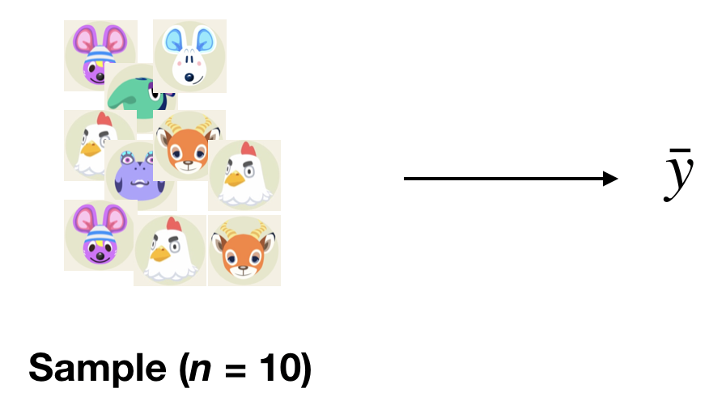
```
]

---

# How Bootstrapping Works

**One Sample** $\implies$ **Bootstrap Sample** $\implies$ *Bootstrap Statistic*

.center[
```{r, echo = FALSE, dpi = 300}
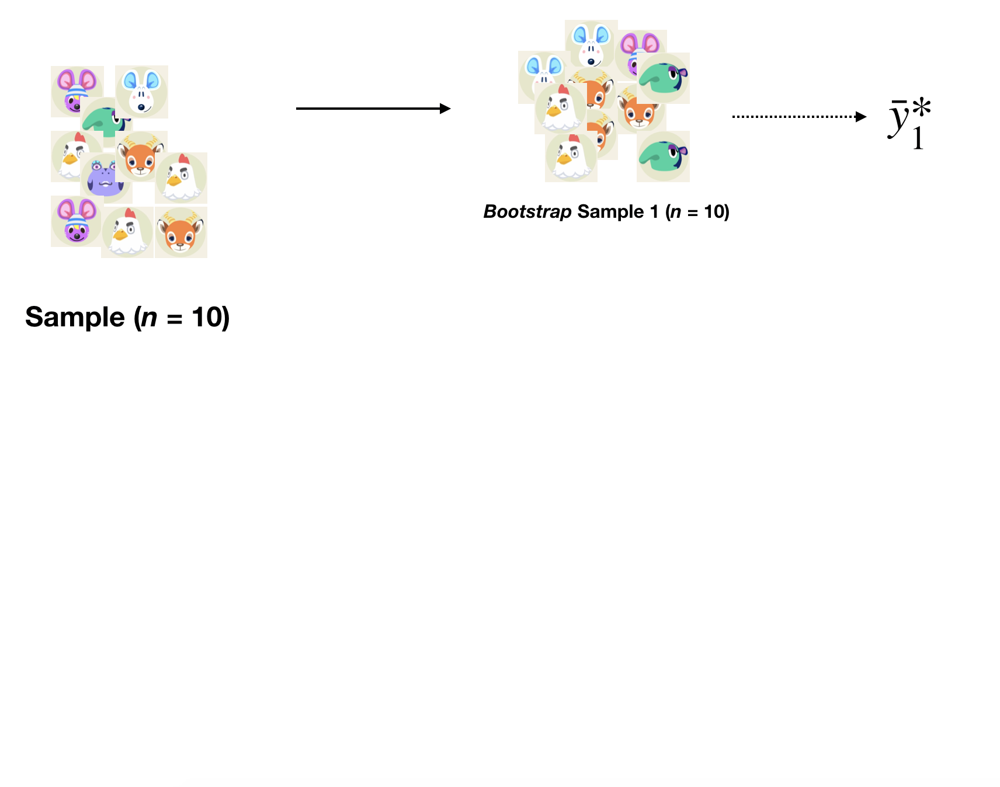
```
]

---

# How Bootstrapping Works

**One Sample** $\implies$ **Bootstrap Samples** $\implies$ *Bootstrap Statistics*

.center[
```{r, echo = FALSE, dpi = 300}
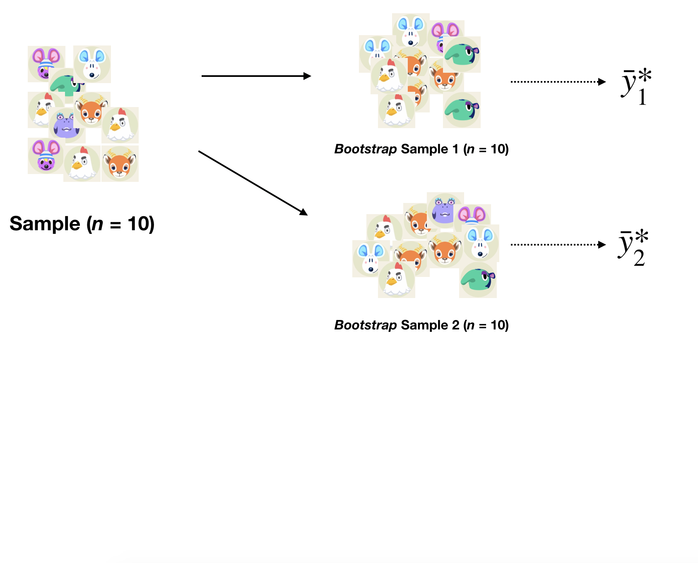
```
]

---

# How Bootstrapping Works

**One Sample** $\implies$ **Many Bootstrap Samples** $\implies$ *Many Bootstrap Statistics*

.center[
```{r, echo = FALSE, dpi = 300}
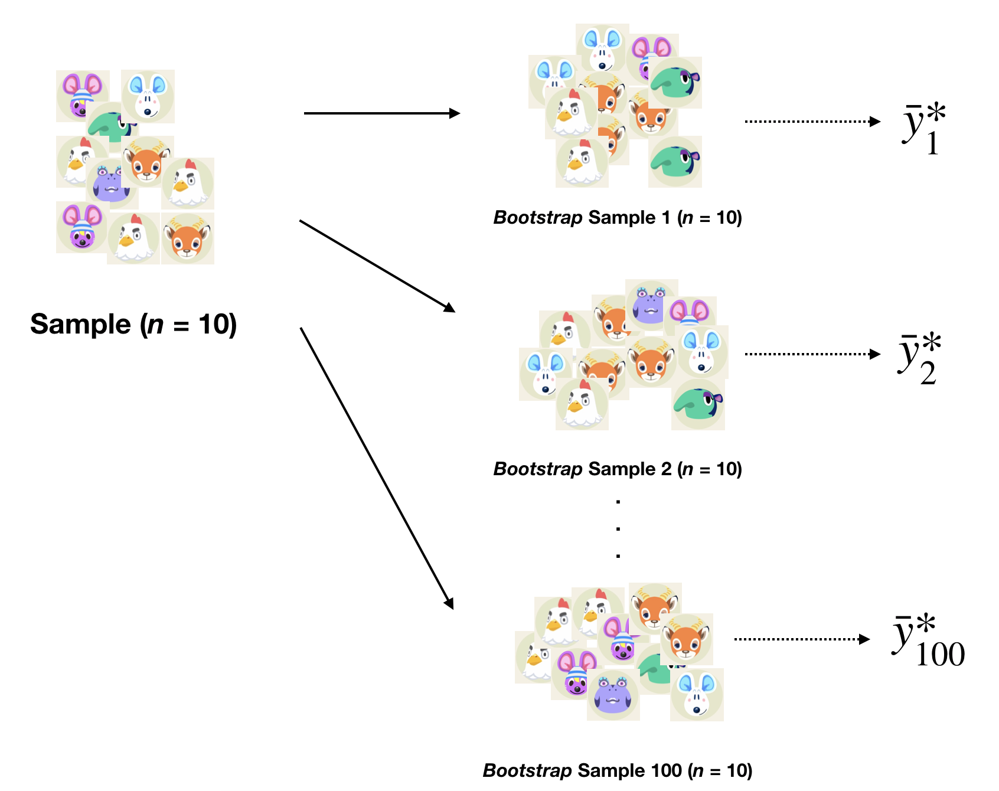
```
]

---

# Why Bootstrapping Works

If the sample is **representative**, the *population* might as well be *many copies of the sample*. 

.center[
```{r, echo = FALSE, dpi = 300}
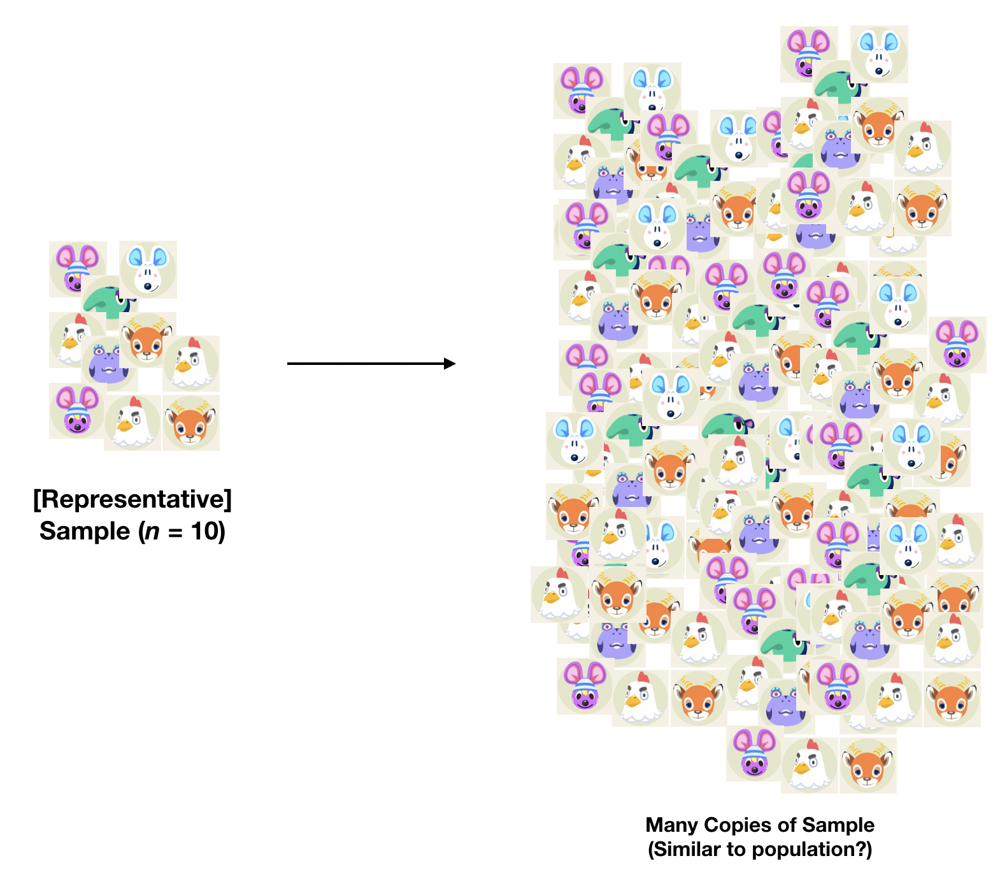
```
]

---

# Why Bootstrapping Works

If the sample is **representative**, the *population* might as well be *many copies of the sample*. 

.center[
```{r, echo = FALSE, dpi = 300}
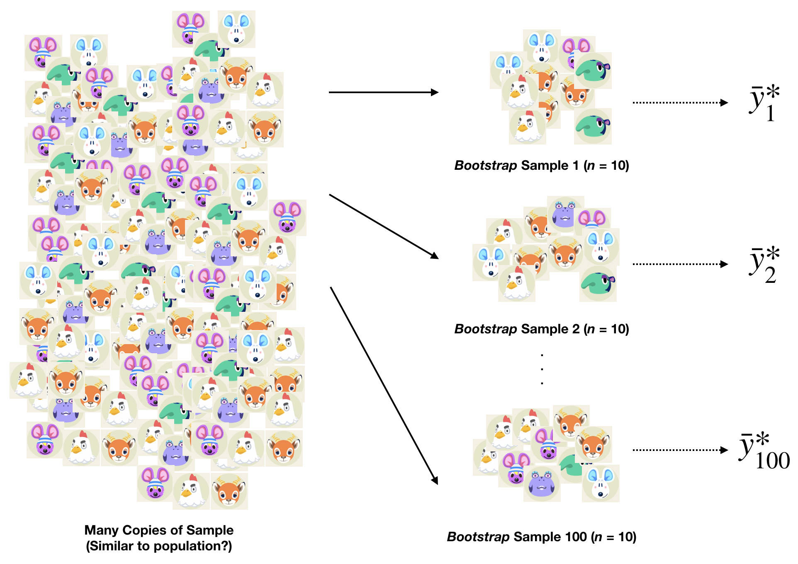
```
]

---

# Bootstrapped Samples

Taken from `bos_15`...

```{r, echo = FALSE, out.width = "60%", dpi = 300}
set.seed(12)

bos_15_boot = bos_15 %>%
  sample_n(15, replace = TRUE)

ggplot(bos_15, aes(x = dep_delay, y = arr_delay)) + 
  geom_point(color = "gray80") +
  geom_count(data = bos_15_boot, color = "dodgerblue") +
  geom_smooth(data = bos_15_boot, method = "lm", se = FALSE, col = "hotpink", size = 0.75) + 
  theme_minimal() + 
  labs(x = "Departure Delay (in mins)", y = "Arrival Delay (in mins)", 
       title = "(1) Bootstrapped Sample: 15 flights from NYC to BOS") + 
  theme(legend.position = "none")
```

---

# Bootstrapped Samples

Taken from `bos_15`...

```{r, echo = FALSE, out.width = "60%", dpi = 300}
set.seed(50)

bos_15_boot = bos_15 %>%
  sample_n(15, replace = TRUE)

ggplot(bos_15, aes(x = dep_delay, y = arr_delay)) + 
  geom_point(color = "gray80") +
  geom_count(data = bos_15_boot, color = "dodgerblue") +
  geom_smooth(data = bos_15_boot, method = "lm", se = FALSE, col = "hotpink", size = 0.75) + 
  theme_minimal() + 
  labs(x = "Departure Delay (in mins)", y = "Arrival Delay (in mins)", 
       title = "(2) Bootstrapped Sample: 15 flights from NYC to BOS") + 
  theme(legend.position = "none")
```

---

# Bootstrapped Samples

Taken from `bos_15`...

```{r, echo = FALSE, out.width = "60%", dpi = 300}
set.seed(5)

bos_15_boot = bos_15 %>%
  sample_n(15, replace = TRUE)

ggplot(bos_15, aes(x = dep_delay, y = arr_delay)) + 
  geom_point(color = "gray80") +
  geom_count(data = bos_15_boot, color = "dodgerblue") +
  geom_smooth(data = bos_15_boot, method = "lm", se = FALSE, col = "hotpink", size = 0.75) + 
  theme_minimal() + 
  labs(x = "Departure Delay (in mins)", y = "Arrival Delay (in mins)", 
       title = "(3) Bootstrapped Sample: 15 flights from NYC to BOS") + 
  theme(legend.position = "none")
```

---

# My Code (if interested)

```{r, eval = FALSE}
set.seed(12) 
# Change seed number to change bootstrapped sample

bos_15_boot = bos_15 %>%
  sample_n(15, replace = TRUE)

ggplot(bos_15, aes(x = dep_delay, y = arr_delay)) + 
  geom_point(color = "gray80") +
  geom_count(data = bos_15_boot, color = "dodgerblue") +
  geom_smooth(data = bos_15_boot, method = "lm", 
              se = FALSE, col = "hotpink", size = 0.75) + 
  theme_minimal() + 
  labs(x = "Departure Delay (in mins)", 
       y = "Arrival Delay (in mins)", 
       title = "Bootstrapped Sample: 15 flights from NYC to BOS") + 
  theme(legend.position = "none")
```

---

# Bootstrapping vs. Many Samples

.pull-left[
```{r, echo = FALSE, dpi = 300, warning = FALSE, message = FALSE}
ggplot(bos, aes(x = dep_delay, y = arr_delay)) + 
  geom_point(alpha = 0.2, color = "gray80") +
  geom_smooth(data = bos_25_1, method = "lm", se = FALSE, col = "hotpink", size = 0.5) + 
  geom_smooth(data = bos_25_2, method = "lm", se = FALSE, col = "hotpink", size = 0.5) + 
  geom_smooth(data = bos_25_3, method = "lm", se = FALSE, col = "hotpink", size = 0.5) + 
  geom_smooth(data = bos_25_4, method = "lm", se = FALSE, col = "hotpink", size = 0.5) + 
  geom_smooth(data = bos_25_5, method = "lm", se = FALSE, col = "hotpink", size = 0.5) + 
  geom_smooth(data = bos_25_6, method = "lm", se = FALSE, col = "hotpink", size = 0.5) + 
  geom_smooth(data = bos_25_7, method = "lm", se = FALSE, col = "hotpink", size = 0.5) + 
  geom_smooth(data = bos_25_8, method = "lm", se = FALSE, col = "hotpink", size = 0.5) + 
  geom_smooth(data = bos_25_9, method = "lm", se = FALSE, col = "hotpink", size = 0.5) + 
  geom_smooth(data = bos_25_10, method = "lm", se = FALSE, col = "hotpink", size = 0.5) + 
  geom_smooth(data = bos_25_11, method = "lm", se = FALSE, col = "hotpink", size = 0.5) + 
  geom_smooth(data = bos_25_12, method = "lm", se = FALSE, col = "hotpink", size = 0.5) + 
  geom_smooth(data = bos_25_13, method = "lm", se = FALSE, col = "hotpink", size = 0.5) + 
  geom_smooth(data = bos_25_14, method = "lm", se = FALSE, col = "hotpink", size = 0.5) + 
  geom_smooth(data = bos_25_15, method = "lm", se = FALSE, col = "hotpink", size = 0.5) + 
  geom_smooth(data = bos_25_16, method = "lm", se = FALSE, col = "hotpink", size = 0.5) + 
  geom_smooth(data = bos_25_17, method = "lm", se = FALSE, col = "hotpink", size = 0.5) + 
  geom_smooth(data = bos_25_18, method = "lm", se = FALSE, col = "hotpink", size = 0.5) + 
  geom_smooth(data = bos_25_19, method = "lm", se = FALSE, col = "hotpink", size = 0.5) + 
  geom_smooth(data = bos_25_20, method = "lm", se = FALSE, col = "hotpink", size = 0.5) + 
  theme_bw() + 
  xlim(-30, 200) +
  ylim(-30, 200) +
  labs(x = "Departure Delay (in mins)", y = "Arrival Delay (in mins)", 
       title = "Many Random Samples: 15 flights from NYC to BOS")
```
]

.pull-right[
```{r, echo = FALSE, dpi = 300, warning = FALSE, message = FALSE}
set.seed(1)
bos_25_1 = bos_15 %>%
  sample_n(15, replace = TRUE)

set.seed(2)
bos_25_2 = bos_15 %>%
  sample_n(15, replace = TRUE)

set.seed(3)
bos_25_3 = bos_15 %>%
  sample_n(15, replace = TRUE)

set.seed(4)
bos_25_4 = bos_15 %>%
  sample_n(15, replace = TRUE)

set.seed(5)
bos_25_5 = bos_15 %>%
  sample_n(15, replace = TRUE)

set.seed(6)
bos_25_6 = bos_15 %>%
  sample_n(15, replace = TRUE)

set.seed(7)
bos_25_7 = bos_15 %>%
  sample_n(15, replace = TRUE)

set.seed(8)
bos_25_8 = bos_15 %>%
  sample_n(15, replace = TRUE)

set.seed(9)
bos_25_9 = bos_15 %>%
  sample_n(15, replace = TRUE)

set.seed(10)
bos_25_10 = bos_15 %>%
  sample_n(15, replace = TRUE)

set.seed(11)
bos_25_11 = bos_15 %>%
  sample_n(15, replace = TRUE)

set.seed(12)
bos_25_12 = bos_15 %>%
  sample_n(15, replace = TRUE)

set.seed(13)
bos_25_13 = bos_15 %>%
  sample_n(15, replace = TRUE)

set.seed(14)
bos_25_14 = bos_15 %>%
  sample_n(15, replace = TRUE)

set.seed(15)
bos_25_15 = bos_15 %>%
  sample_n(15, replace = TRUE)

set.seed(16)
bos_25_16 = bos_15 %>%
  sample_n(15, replace = TRUE)

set.seed(17)
bos_25_17 = bos_15 %>%
  sample_n(15, replace = TRUE)

set.seed(18)
bos_25_18 = bos_15 %>%
  sample_n(15, replace = TRUE)

set.seed(19)
bos_25_19 = bos_15 %>%
  sample_n(15, replace = TRUE)

set.seed(20)
bos_25_20 = bos_15 %>%
  sample_n(15, replace = TRUE)

ggplot(bos_15, aes(x = dep_delay, y = arr_delay)) + 
  geom_point(color = "gray80") +
  geom_smooth(data = bos_25_1, method = "lm", se = FALSE, col = "hotpink", size = 0.5) + 
  geom_smooth(data = bos_25_2, method = "lm", se = FALSE, col = "hotpink", size = 0.5) + 
  geom_smooth(data = bos_25_3, method = "lm", se = FALSE, col = "hotpink", size = 0.5) + 
  geom_smooth(data = bos_25_4, method = "lm", se = FALSE, col = "hotpink", size = 0.5) + 
  geom_smooth(data = bos_25_5, method = "lm", se = FALSE, col = "hotpink", size = 0.5) + 
  geom_smooth(data = bos_25_6, method = "lm", se = FALSE, col = "hotpink", size = 0.5) + 
  geom_smooth(data = bos_25_7, method = "lm", se = FALSE, col = "hotpink", size = 0.5) + 
  geom_smooth(data = bos_25_8, method = "lm", se = FALSE, col = "hotpink", size = 0.5) + 
  geom_smooth(data = bos_25_9, method = "lm", se = FALSE, col = "hotpink", size = 0.5) + 
  geom_smooth(data = bos_25_10, method = "lm", se = FALSE, col = "hotpink", size = 0.5) + 
  geom_smooth(data = bos_25_11, method = "lm", se = FALSE, col = "hotpink", size = 0.5) + 
  geom_smooth(data = bos_25_12, method = "lm", se = FALSE, col = "hotpink", size = 0.5) + 
  geom_smooth(data = bos_25_13, method = "lm", se = FALSE, col = "hotpink", size = 0.5) + 
  geom_smooth(data = bos_25_14, method = "lm", se = FALSE, col = "hotpink", size = 0.5) + 
  geom_smooth(data = bos_25_15, method = "lm", se = FALSE, col = "hotpink", size = 0.5) + 
  geom_smooth(data = bos_25_16, method = "lm", se = FALSE, col = "hotpink", size = 0.5) + 
  geom_smooth(data = bos_25_17, method = "lm", se = FALSE, col = "hotpink", size = 0.5) + 
  geom_smooth(data = bos_25_18, method = "lm", se = FALSE, col = "hotpink", size = 0.5) + 
  geom_smooth(data = bos_25_19, method = "lm", se = FALSE, col = "hotpink", size = 0.5) + 
  geom_smooth(data = bos_25_20, method = "lm", se = FALSE, col = "hotpink", size = 0.5) + 
  theme_bw() + 
  xlim(-30, 200) +
  labs(x = "Departure Delay (in mins)", y = "Arrival Delay (in mins)", 
       title = "Many Bootstrap Samples: 15 flights from NYC to BOS")
```
]

--

While we cannot *realistically* take **many random samples**, the *bootstrap samples* provide a good **approximation** to the **variability between samples**. 

---

# Larger Sample Size

$n=100$ instead of $n=15$

.pull-left[
```{r, echo = FALSE, dpi = 300, warning = FALSE, message = FALSE}
set.seed(1)
bos_25_1 = bos %>%
  sample_n(100)

set.seed(2)
bos_25_2 = bos %>%
  sample_n(100)

set.seed(3)
bos_25_3 = bos %>%
  sample_n(100)

set.seed(4)
bos_25_4 = bos %>%
  sample_n(100)

set.seed(5)
bos_25_5 = bos %>%
  sample_n(100)

set.seed(6)
bos_25_6 = bos %>%
  sample_n(100)

set.seed(7)
bos_25_7 = bos %>%
  sample_n(100)

set.seed(8)
bos_25_8 = bos %>%
  sample_n(100)

set.seed(9)
bos_25_9 = bos %>%
  sample_n(100)

set.seed(10)
bos_25_10 = bos %>%
  sample_n(100)

set.seed(11)
bos_25_11 = bos %>%
  sample_n(100)

set.seed(12)
bos_25_12 = bos %>%
  sample_n(100)

set.seed(13)
bos_25_13 = bos %>%
  sample_n(100)

set.seed(14)
bos_25_14 = bos %>%
  sample_n(100)

set.seed(15)
bos_25_15 = bos %>%
  sample_n(100)

set.seed(16)
bos_25_16 = bos %>%
  sample_n(100)

set.seed(17)
bos_25_17 = bos %>%
  sample_n(100)

set.seed(18)
bos_25_18 = bos %>%
  sample_n(100)

set.seed(19)
bos_25_19 = bos %>%
  sample_n(100)

set.seed(20)
bos_25_20 = bos %>%
  sample_n(100)

ggplot(bos, aes(x = dep_delay, y = arr_delay)) + 
  geom_point(alpha = 0.2, color = "gray80") +
  geom_smooth(data = bos_25_1, method = "lm", se = FALSE, col = "hotpink", size = 0.5) + 
  geom_smooth(data = bos_25_2, method = "lm", se = FALSE, col = "hotpink", size = 0.5) + 
  geom_smooth(data = bos_25_3, method = "lm", se = FALSE, col = "hotpink", size = 0.5) + 
  geom_smooth(data = bos_25_4, method = "lm", se = FALSE, col = "hotpink", size = 0.5) + 
  geom_smooth(data = bos_25_5, method = "lm", se = FALSE, col = "hotpink", size = 0.5) + 
  geom_smooth(data = bos_25_6, method = "lm", se = FALSE, col = "hotpink", size = 0.5) + 
  geom_smooth(data = bos_25_7, method = "lm", se = FALSE, col = "hotpink", size = 0.5) + 
  geom_smooth(data = bos_25_8, method = "lm", se = FALSE, col = "hotpink", size = 0.5) + 
  geom_smooth(data = bos_25_9, method = "lm", se = FALSE, col = "hotpink", size = 0.5) + 
  geom_smooth(data = bos_25_10, method = "lm", se = FALSE, col = "hotpink", size = 0.5) + 
  geom_smooth(data = bos_25_11, method = "lm", se = FALSE, col = "hotpink", size = 0.5) + 
  geom_smooth(data = bos_25_12, method = "lm", se = FALSE, col = "hotpink", size = 0.5) + 
  geom_smooth(data = bos_25_13, method = "lm", se = FALSE, col = "hotpink", size = 0.5) + 
  geom_smooth(data = bos_25_14, method = "lm", se = FALSE, col = "hotpink", size = 0.5) + 
  geom_smooth(data = bos_25_15, method = "lm", se = FALSE, col = "hotpink", size = 0.5) + 
  geom_smooth(data = bos_25_16, method = "lm", se = FALSE, col = "hotpink", size = 0.5) + 
  geom_smooth(data = bos_25_17, method = "lm", se = FALSE, col = "hotpink", size = 0.5) + 
  geom_smooth(data = bos_25_18, method = "lm", se = FALSE, col = "hotpink", size = 0.5) + 
  geom_smooth(data = bos_25_19, method = "lm", se = FALSE, col = "hotpink", size = 0.5) + 
  geom_smooth(data = bos_25_20, method = "lm", se = FALSE, col = "hotpink", size = 0.5) + 
  theme_bw() + 
  xlim(-30, 200) +
  ylim(-30, 200) +
  labs(x = "Departure Delay (in mins)", y = "Arrival Delay (in mins)", 
       title = "Many (Bigger) Random Samples: 100 flights from NYC to BOS")
```
]

.pull-right[
```{r, echo = FALSE, dpi = 300, warning = FALSE, message = FALSE}
set.seed(1)

bos_100 = bos %>%
  sample_n(100)

bos_25_1 = bos_100 %>%
  sample_n(100, replace = TRUE)

set.seed(2)
bos_25_2 = bos_100 %>%
  sample_n(100, replace = TRUE)

set.seed(3)
bos_25_3 = bos_100 %>%
  sample_n(100, replace = TRUE)

set.seed(4)
bos_25_4 = bos_100 %>%
  sample_n(100, replace = TRUE)

set.seed(5)
bos_25_5 = bos_100 %>%
  sample_n(100, replace = TRUE)

set.seed(6)
bos_25_6 = bos_100 %>%
  sample_n(100, replace = TRUE)

set.seed(7)
bos_25_7 = bos_100 %>%
  sample_n(100, replace = TRUE)

set.seed(8)
bos_25_8 = bos_100 %>%
  sample_n(100, replace = TRUE)

set.seed(9)
bos_25_9 = bos_100 %>%
  sample_n(100, replace = TRUE)

set.seed(10)
bos_25_10 = bos_100 %>%
  sample_n(100, replace = TRUE)

set.seed(11)
bos_25_11 = bos_100 %>%
  sample_n(100, replace = TRUE)

set.seed(12)
bos_25_12 = bos_100 %>%
  sample_n(100, replace = TRUE)

set.seed(13)
bos_25_13 = bos_100 %>%
  sample_n(100, replace = TRUE)

set.seed(14)
bos_25_14 = bos_100 %>%
  sample_n(100, replace = TRUE)

set.seed(15)
bos_25_15 = bos_100 %>%
  sample_n(100, replace = TRUE)

set.seed(16)
bos_25_16 = bos_100 %>%
  sample_n(100, replace = TRUE)

set.seed(17)
bos_25_17 = bos_100 %>%
  sample_n(100, replace = TRUE)

set.seed(18)
bos_25_18 = bos_100 %>%
  sample_n(100, replace = TRUE)

set.seed(19)
bos_25_19 = bos_100 %>%
  sample_n(100, replace = TRUE)

set.seed(20)
bos_25_20 = bos_100 %>%
  sample_n(100, replace = TRUE)

ggplot(bos_100, aes(x = dep_delay, y = arr_delay)) + 
  geom_point(color = "gray80") +
  geom_smooth(data = bos_25_1, method = "lm", se = FALSE, col = "hotpink", size = 0.5) + 
  geom_smooth(data = bos_25_2, method = "lm", se = FALSE, col = "hotpink", size = 0.5) + 
  geom_smooth(data = bos_25_3, method = "lm", se = FALSE, col = "hotpink", size = 0.5) + 
  geom_smooth(data = bos_25_4, method = "lm", se = FALSE, col = "hotpink", size = 0.5) + 
  geom_smooth(data = bos_25_5, method = "lm", se = FALSE, col = "hotpink", size = 0.5) + 
  geom_smooth(data = bos_25_6, method = "lm", se = FALSE, col = "hotpink", size = 0.5) + 
  geom_smooth(data = bos_25_7, method = "lm", se = FALSE, col = "hotpink", size = 0.5) + 
  geom_smooth(data = bos_25_8, method = "lm", se = FALSE, col = "hotpink", size = 0.5) + 
  geom_smooth(data = bos_25_9, method = "lm", se = FALSE, col = "hotpink", size = 0.5) + 
  geom_smooth(data = bos_25_10, method = "lm", se = FALSE, col = "hotpink", size = 0.5) + 
  geom_smooth(data = bos_25_11, method = "lm", se = FALSE, col = "hotpink", size = 0.5) + 
  geom_smooth(data = bos_25_12, method = "lm", se = FALSE, col = "hotpink", size = 0.5) + 
  geom_smooth(data = bos_25_13, method = "lm", se = FALSE, col = "hotpink", size = 0.5) + 
  geom_smooth(data = bos_25_14, method = "lm", se = FALSE, col = "hotpink", size = 0.5) + 
  geom_smooth(data = bos_25_15, method = "lm", se = FALSE, col = "hotpink", size = 0.5) + 
  geom_smooth(data = bos_25_16, method = "lm", se = FALSE, col = "hotpink", size = 0.5) + 
  geom_smooth(data = bos_25_17, method = "lm", se = FALSE, col = "hotpink", size = 0.5) + 
  geom_smooth(data = bos_25_18, method = "lm", se = FALSE, col = "hotpink", size = 0.5) + 
  geom_smooth(data = bos_25_19, method = "lm", se = FALSE, col = "hotpink", size = 0.5) + 
  geom_smooth(data = bos_25_20, method = "lm", se = FALSE, col = "hotpink", size = 0.5) + 
  theme_bw() + 
  xlim(-30, 200) +
  labs(x = "Departure Delay (in mins)", y = "Arrival Delay (in mins)", 
       title = "Many Bootstrap Samples: 100 flights from NYC to BOS")
```
]

---

# Larger Sample Size (with flexible models)

$n=100$ instead of $n=15$

.pull-left[
```{r, echo = FALSE, dpi = 300, warning = FALSE, message = FALSE}
set.seed(1)
bos_25_1 = bos %>%
  sample_n(100)

set.seed(2)
bos_25_2 = bos %>%
  sample_n(100)

set.seed(3)
bos_25_3 = bos %>%
  sample_n(100)

set.seed(4)
bos_25_4 = bos %>%
  sample_n(100)

set.seed(5)
bos_25_5 = bos %>%
  sample_n(100)

set.seed(6)
bos_25_6 = bos %>%
  sample_n(100)

set.seed(7)
bos_25_7 = bos %>%
  sample_n(100)

set.seed(8)
bos_25_8 = bos %>%
  sample_n(100)

set.seed(9)
bos_25_9 = bos %>%
  sample_n(100)

set.seed(10)
bos_25_10 = bos %>%
  sample_n(100)

set.seed(11)
bos_25_11 = bos %>%
  sample_n(100)

set.seed(12)
bos_25_12 = bos %>%
  sample_n(100)

set.seed(13)
bos_25_13 = bos %>%
  sample_n(100)

set.seed(14)
bos_25_14 = bos %>%
  sample_n(100)

set.seed(15)
bos_25_15 = bos %>%
  sample_n(100)

set.seed(16)
bos_25_16 = bos %>%
  sample_n(100)

set.seed(17)
bos_25_17 = bos %>%
  sample_n(100)

set.seed(18)
bos_25_18 = bos %>%
  sample_n(100)

set.seed(19)
bos_25_19 = bos %>%
  sample_n(100)

set.seed(20)
bos_25_20 = bos %>%
  sample_n(100)

ggplot(bos, aes(x = dep_delay, y = arr_delay)) + 
  geom_point(alpha = 0.2, color = "gray80") +
  geom_smooth(data = bos_25_1, se = FALSE, col = "hotpink", size = 0.5) + 
  geom_smooth(data = bos_25_2, se = FALSE, col = "hotpink", size = 0.5) + 
  geom_smooth(data = bos_25_3, se = FALSE, col = "hotpink", size = 0.5) + 
  geom_smooth(data = bos_25_4, se = FALSE, col = "hotpink", size = 0.5) + 
  geom_smooth(data = bos_25_5, se = FALSE, col = "hotpink", size = 0.5) + 
  geom_smooth(data = bos_25_6, se = FALSE, col = "hotpink", size = 0.5) + 
  geom_smooth(data = bos_25_7, se = FALSE, col = "hotpink", size = 0.5) + 
  geom_smooth(data = bos_25_8, se = FALSE, col = "hotpink", size = 0.5) + 
  geom_smooth(data = bos_25_9, se = FALSE, col = "hotpink", size = 0.5) + 
  geom_smooth(data = bos_25_10, se = FALSE, col = "hotpink", size = 0.5) + 
  geom_smooth(data = bos_25_11, se = FALSE, col = "hotpink", size = 0.5) + 
  geom_smooth(data = bos_25_12, se = FALSE, col = "hotpink", size = 0.5) + 
  geom_smooth(data = bos_25_13, se = FALSE, col = "hotpink", size = 0.5) + 
  geom_smooth(data = bos_25_14, se = FALSE, col = "hotpink", size = 0.5) + 
  geom_smooth(data = bos_25_15, se = FALSE, col = "hotpink", size = 0.5) + 
  geom_smooth(data = bos_25_16, se = FALSE, col = "hotpink", size = 0.5) + 
  geom_smooth(data = bos_25_17, se = FALSE, col = "hotpink", size = 0.5) + 
  geom_smooth(data = bos_25_18, se = FALSE, col = "hotpink", size = 0.5) + 
  geom_smooth(data = bos_25_19, se = FALSE, col = "hotpink", size = 0.5) + 
  geom_smooth(data = bos_25_20, se = FALSE, col = "hotpink", size = 0.5) + 
  theme_bw() + 
  xlim(-30, 200) +
  ylim(-30, 200) +
  labs(x = "Departure Delay (in mins)", y = "Arrival Delay (in mins)", 
       title = "Many (Bigger) Random Samples: 100 flights from NYC to BOS")
```
]

.pull-right[
```{r, echo = FALSE, dpi = 300, warning = FALSE, message = FALSE}
set.seed(1)

bos_100 = bos %>%
  sample_n(100)

bos_25_1 = bos_100 %>%
  sample_n(100, replace = TRUE)

set.seed(2)
bos_25_2 = bos_100 %>%
  sample_n(100, replace = TRUE)

set.seed(3)
bos_25_3 = bos_100 %>%
  sample_n(100, replace = TRUE)

set.seed(4)
bos_25_4 = bos_100 %>%
  sample_n(100, replace = TRUE)

set.seed(5)
bos_25_5 = bos_100 %>%
  sample_n(100, replace = TRUE)

set.seed(6)
bos_25_6 = bos_100 %>%
  sample_n(100, replace = TRUE)

set.seed(7)
bos_25_7 = bos_100 %>%
  sample_n(100, replace = TRUE)

set.seed(8)
bos_25_8 = bos_100 %>%
  sample_n(100, replace = TRUE)

set.seed(9)
bos_25_9 = bos_100 %>%
  sample_n(100, replace = TRUE)

set.seed(10)
bos_25_10 = bos_100 %>%
  sample_n(100, replace = TRUE)

set.seed(11)
bos_25_11 = bos_100 %>%
  sample_n(100, replace = TRUE)

set.seed(12)
bos_25_12 = bos_100 %>%
  sample_n(100, replace = TRUE)

set.seed(13)
bos_25_13 = bos_100 %>%
  sample_n(100, replace = TRUE)

set.seed(14)
bos_25_14 = bos_100 %>%
  sample_n(100, replace = TRUE)

set.seed(15)
bos_25_15 = bos_100 %>%
  sample_n(100, replace = TRUE)

set.seed(16)
bos_25_16 = bos_100 %>%
  sample_n(100, replace = TRUE)

set.seed(17)
bos_25_17 = bos_100 %>%
  sample_n(100, replace = TRUE)

set.seed(18)
bos_25_18 = bos_100 %>%
  sample_n(100, replace = TRUE)

set.seed(19)
bos_25_19 = bos_100 %>%
  sample_n(100, replace = TRUE)

set.seed(20)
bos_25_20 = bos_100 %>%
  sample_n(100, replace = TRUE)

ggplot(bos_100, aes(x = dep_delay, y = arr_delay)) + 
  geom_point(color = "gray80") +
  geom_smooth(data = bos_25_1, se = FALSE, col = "hotpink", size = 0.5) + 
  geom_smooth(data = bos_25_2, se = FALSE, col = "hotpink", size = 0.5) + 
  geom_smooth(data = bos_25_3, se = FALSE, col = "hotpink", size = 0.5) + 
  geom_smooth(data = bos_25_4, se = FALSE, col = "hotpink", size = 0.5) + 
  geom_smooth(data = bos_25_5, se = FALSE, col = "hotpink", size = 0.5) + 
  geom_smooth(data = bos_25_6, se = FALSE, col = "hotpink", size = 0.5) + 
  geom_smooth(data = bos_25_7, se = FALSE, col = "hotpink", size = 0.5) + 
  geom_smooth(data = bos_25_8, se = FALSE, col = "hotpink", size = 0.5) + 
  geom_smooth(data = bos_25_9, se = FALSE, col = "hotpink", size = 0.5) + 
  geom_smooth(data = bos_25_10, se = FALSE, col = "hotpink", size = 0.5) + 
  geom_smooth(data = bos_25_11, se = FALSE, col = "hotpink", size = 0.5) + 
  geom_smooth(data = bos_25_12, se = FALSE, col = "hotpink", size = 0.5) + 
  geom_smooth(data = bos_25_13, se = FALSE, col = "hotpink", size = 0.5) + 
  geom_smooth(data = bos_25_14, se = FALSE, col = "hotpink", size = 0.5) + 
  geom_smooth(data = bos_25_15, se = FALSE, col = "hotpink", size = 0.5) + 
  geom_smooth(data = bos_25_16, se = FALSE, col = "hotpink", size = 0.5) + 
  geom_smooth(data = bos_25_17, se = FALSE, col = "hotpink", size = 0.5) + 
  geom_smooth(data = bos_25_18, se = FALSE, col = "hotpink", size = 0.5) + 
  geom_smooth(data = bos_25_19, se = FALSE, col = "hotpink", size = 0.5) + 
  geom_smooth(data = bos_25_20, se = FALSE, col = "hotpink", size = 0.5) + 
  theme_bw() + 
  xlim(-30, 200) +
  labs(x = "Departure Delay (in mins)", y = "Arrival Delay (in mins)", 
       title = "Many Bootstrap Samples: 100 flights from NYC to BOS")
```
]

---

# Bootstrap Distribution

If we calculate the sample mean `arr_delay` *within each bootstrap sample*...

```{r, echo = FALSE, dpi = 300, out.width = "40%", warning = FALSE, message = FALSE}
library(moderndive)
set.seed(12)
bootstraps = bos %>%
  rep_sample_n(size = 100, reps = 1000, replace = TRUE)
bootstraps %>%
  group_by(replicate) %>%
  summarize(mean_arr_delay = mean(arr_delay)) %>%
  ggplot(aes(x = mean_arr_delay)) + 
  geom_histogram(color = "white", binwidth = 2) + 
  theme_bw() + 
  labs(x = "Mean Arrival Delay (per bootstrapped sample)", y = "Count", 
       title = "Simulation-Based Bootstrap Distribution")
```

...we can get a pretty good *visual representation* of how much the *mean arrival delay* will **vary** from sample-to-sample. 

- Remember, with the **bootstrap** we have *only one sample*. We just take many *bootstrap samples* from the sample **with replacement**. 

---

class: center, middle

# Ensemble Methods

---

# Recap: tidymodels

.center[
```{r, echo = FALSE, dpi = 300}
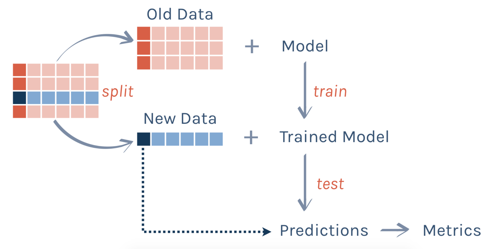
```
]

---

# Recap: parsnip

.pull-left[
To specify a model (with **training data**):

1. Pick a [model](https://www.tidymodels.org/find/parsnip/). 

2. Set the [engine](https://www.tidymodels.org/find/parsnip/).

3. Set the [mode](https://www.tidymodels.org/find/parsnip/) (if necessary; it's either `"classification"` or `"regression"`). 
]

.pull-right[
```{r, echo = FALSE, dpi = 300}

```
]

---

# Examples

**Numerical Target**

*Linear Regression*

```{r, eval = FALSE}
fit_lm = linear_reg() %>%
  set_engine(engine = "lm") %>%
  fit(y ~ x, data = data_train)
```

*Regression Tree*

```{r, eval = FALSE}
fit_rt = decision_tree() %>%
  set_engine(engine = "rpart") %>%
  set_mode(mode = "regression") %>%
  fit(y ~ x, data = data_train)
```

---

# Examples

**Categorical Target**

*Logistic Regression*

```{r, eval = FALSE}
fit_log = logistic_reg() %>%
  set_engine(engine = "glm") %>%
  fit(y ~ x, data = data_train)
```

*Classification Tree*

```{r, eval = FALSE}
fit_ct = decision_tree() %>%
  set_engine(engine = "rpart") %>%
  set_mode(mode = "classification") %>%
  fit(y ~ x, data = data_train)
```

---

# Practice 

```{r, echo = FALSE, warning = FALSE, message = FALSE}
stackoverflow <- read_csv("~/Dropbox/Teaching/03-Simmons Courses/STAT228-Introduction to Data Science/Data/stackoverflow.csv")
```


Let's combine **bootstrapping** with **decision trees**!

1. Get into **groups of 3 or 4** (I'll randomize with Zoom's *breakout rooms*). 

2. Using the `stackoverflow` data, each group member train a **decision tree** predicting `remote` (whether the employee works *remotely* or *not remotely*), **using a different bootstrapped sample**. 
    - I'll give a code template on the next slide. 
    
3. Predict your observations from the **testing set**. 

4. Tally up your group's *predictions* for the 10 **testing set** observations. The outcome (`Remote` or `Not remote`) for each observation with the most *predictions* wins. This will be the "group prediction."
    - Example: For *observation 1* (who actually works `Remote`) in the testing set, my model predicted they are `Not remote`. 
    - However my two friends trained models that predicted this individual is `Remote`. Therefore `"Remote"` is the "group prediction."

---

# Code Template (PART 1)

```{r, eval = FALSE}
stackoverflow = stackoverflow %>%
  mutate(remote = factor(remote)) # Convert to factor

set.seed(1) # Keep this!
stack_split = initial_split(stackoverflow, prop = 0.991)

set.seed(🤔) # EACH GROUP MEMBER CHOOSE A DIFFERENT NUMBER!
stack_train = training(stack_split) %>%
  sample_n(size = n(), replace = TRUE)
stack_test = testing(stack_split)
```

---

# Code Template (PART 2)

```{r, eval = FALSE}
stack_fit = decision_tree() %>%
  set_engine(engine = "rpart") %>%
  set_mode(mode = 🤔) %>%
  fit(remote ~ salary + company_size_number_cat + years_coded_job, 
      data = 🤔)

stack_pred = stack_fit %>%
  predict(new_data = 🤔)

stack_test %>%
  select(remote) %>%
  rename(remote_truth = remote) %>%
  mutate(remote_pred = stack_pred$.pred_class)
```

```{r, echo = FALSE, results = "hide"}
stackoverflow = stackoverflow %>%
  mutate(remote = factor(remote))

set.seed(1) # Keep this!
stack_split = initial_split(stackoverflow, prop = 0.991)

set.seed(12) # EACH GROUP MEMBER CHOOSE A DIFFERENT NUMBER!
stack_train = training(stack_split) %>%
  sample_n(size = n(), replace = TRUE)
stack_test = testing(stack_split)

stack_fit = decision_tree() %>%
  set_engine(engine = "rpart") %>%
  set_mode(mode = "classification") %>%
  fit(remote ~ salary + company_size_number_cat + years_coded_job, 
      data = stack_train)

stack_pred = stack_fit %>%
  predict(new_data = stack_test)

stack_test %>%
  select(remote) %>%
  rename(remote_truth = remote) %>%
  mutate(remote_pred = stack_pred$.pred_class)

```

---

# Here's how my "group" did

```{r, echo = FALSE}
stackoverflow = stackoverflow %>%
  mutate(remote = factor(remote))

set.seed(1) # Keep this!
stack_split = initial_split(stackoverflow, prop = 0.991)

set.seed(12) # EACH GROUP MEMBER CHOOSE A DIFFERENT NUMBER!
stack_train = training(stack_split) %>%
  sample_n(size = n(), replace = TRUE)
stack_test = testing(stack_split)

stack_fit = decision_tree() %>%
  set_engine(engine = "rpart") %>%
  set_mode(mode = "classification") %>%
  fit(remote ~ salary + company_size_number_cat + years_coded_job, 
      data = stack_train)

stack_pred = stack_fit %>%
  predict(new_data = stack_test)

stack_test %>%
  select(remote) %>%
  rename(remote_truth = remote) %>%
  mutate(remote_pred_ant1 = stack_pred$.pred_class, 
         remote_pred_ant2 = c("Remote", "Remote", "Remote", "Not remote", "Not remote", 
                              "Remote", "Not remote", "Remote", "Not remote", "Not remote"), 
         remote_pred_ant3 = c("Remote", "Remote", "Remote", "Remote", "Not remote", 
                              "Remote", "Not remote", "Remote", "Not remote", "Not remote")) 
```

---

# Here's how my "group" did

**Majority vote** wins the prediction for each observation!

```{r, echo = FALSE}
stack_test %>%
  select(remote) %>%
  rename(remote_truth = remote) %>%
  mutate(remote_pred_winner = c("Remote", "Remote", "Remote", "Remote", "Not remote",
                                "Remote", "Not remote", "Remote", "Note remote", "Not remote")) 
```

**Accuracy**: 80%

---

# What did we just do?

**B**ootstrap **Agg**regat**ing**

- (*Bagging*)

--

**Bagging** is an example of an **ensemble method**

- We used *multiple classifiers* (e.g., decision trees with different *bootstrapped* training sets) to create an **ensemble** of predictions. 

.center[
```{r, echo = FALSE, dpi = 100}

```
]

---

# How does bagging work?

**Bagging** works by fitting *multiple versions* of a prediction model, and then combining them into an *aggregated prediction*. 

- *b* **bootstrapped copies** of the training set are created, and the regression/classification model is fit to each copy. 

- Predictions are made by *averaging* the predictions together from each separate model. 
    - Though in classification models, predictions are made by "majority rule."
    
--

**Example**: Meet our "data"

.pull-left[
```{r, echo = FALSE, dpi = 300}

```
**Rod**

```{r, echo = FALSE, dpi = 300}
knitr::include_graphics("ac_dora.jpeg")
```
**Dora**
]
    
---

# Bagging

**Sample**: *n = 8*, split evenly between *testing* and *training*

.center[
```{r, echo = FALSE, dpi = 300}
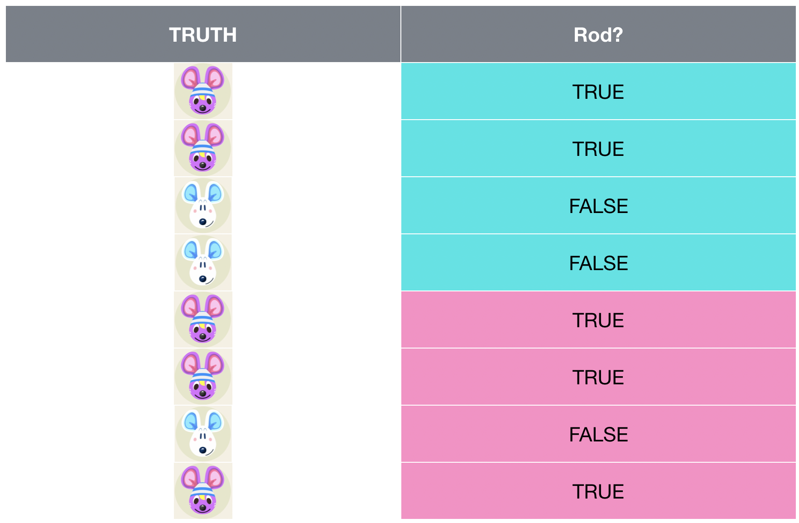
```
]

(Shoutout to [Alison Hill's workshop](https://conf20-intro-ml.netlify.com/) for inspiring this illustration!)

---

# Bagging

.center[
```{r, echo = FALSE, dpi = 300}
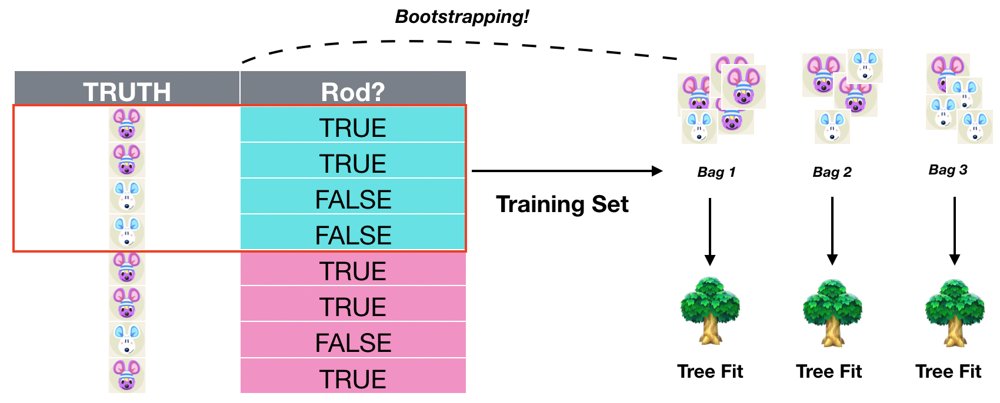
```
]

---

# Bagging

.center[
```{r, echo = FALSE, dpi = 300}
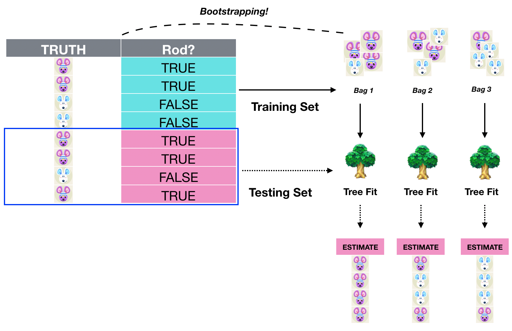
```
]


---

# Bagging

.center[
```{r, echo = FALSE, dpi = 300}
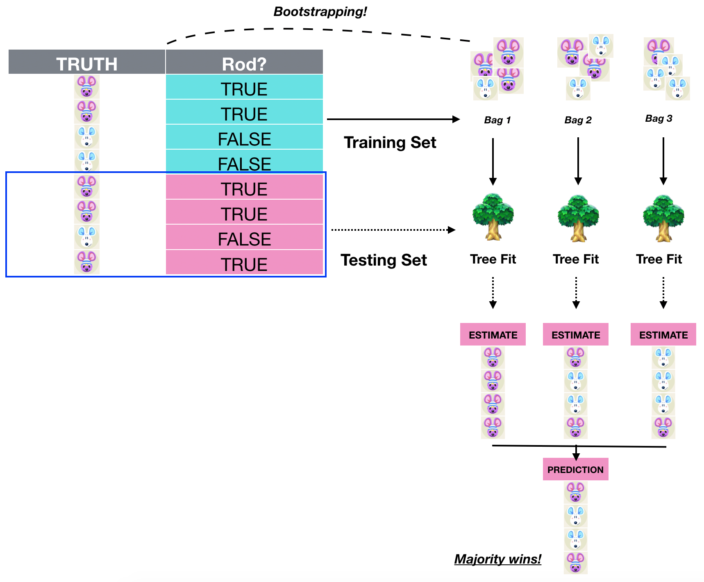
```
]


---

# Bagging

.center[
```{r, echo = FALSE, dpi = 300}
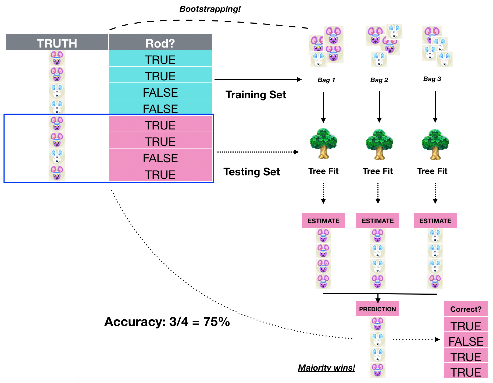
```
]

- **Note**: I *strongly recommend* never actually training a model with *n = 4* observations, or using a testing set with *n = 4* observations!

---

class: center, middle

# Random Forests

---

# Random Forests

A **random forest** is a modification of a **bagged decision tree** that builds a large collection of trees to improve predictive performance. 

A limitation of **bagging** is that we are using the *same set of features* with each bootstrapped training set. 

- This results in a **correlated tree structure** which might limit the model's performance. 
- In other words, trees from different bootstrap samples could have similar structure to one another, especially at the *top* of the trees. 

--

**Random forest** models add an extra layer of *randomness* to the model by limiting the *split features* to a random subset (of length $m_{try}$) from the original *p* features. 

- You may think of a **random forest** as *extended bagging*. 

---

# Random Forests

From [Boehmke and Greenwell, 2020](https://bradleyboehmke.github.io/HOML/):

1. Given a *training data set*
2. Select *number* of trees to build (`n_trees`)
3. for `i = 1 ` to `n_trees` do:
    - Generate a *bootstrap sample* of the original training data
    - Grow a regression/classification tree to the *bootstrapped data*
    - for each split do:
        - Select `m_try` variables at random from all `p` variables
        - Pick the best variable/split-point among the `m_try`
        - Split the node into two child nodes
    - end
4. end
5. Output ensemble of trees 

- When `mtry` = `p`, this is equivalent to a **bagged decision tree**. 

--

In R (specifically using `parsnip` through `tidymodels`), we can build a **random forest** with `rand_forest()`!

---

# Random Forests (in R)

```{r, eval = FALSE}
fit_rf = rand_forest(
  mtry = 4,    # 4 randomly chosen predictors seen at each tree split
  trees = 500, # 500 trees per forest
) %>%
  set_engine(engine = "randomForest") %>%
  set_mode(mode = "classification") %>%
  fit(y ~ x1 + x2 + ..., data = data_train)
```

**Note**: `mtry` and `trees` have *default values* in `rand_forest()`, so it's OK to leave them out. 

- And `mode = "regression"` works if the target is **numerical**!

---

# Comparing Models

Let's use the `ames` housing dataset to compare different models' **predictive performance**. 
- List of `parsnip` models [HERE](https://tidymodels.github.io/parsnip/articles/articles/Models.html)

First, split the data into **training** and **testing** sets. 

```{r}
ames = AmesHousing::make_ames()
 
set.seed(12) 
ames_split = initial_split(ames, prop = 0.7)

ames_train = training(ames_split)
ames_test = testing(ames_split)
```

---

# Model 1: Linear Regression

**Fitting the model**

```{r}
fit_lm = linear_reg() %>%
  set_engine(engine = "lm") %>%
  fit(Sale_Price ~ Lot_Area + Street + House_Style + 
        Year_Built + Exter_Qual + Total_Bsmt_SF + 
        Gr_Liv_Area + TotRms_AbvGrd + 
        Fireplaces + Garage_Area, 
    data = ames_train)
```

---

# Model 1: Linear Regression

**Generating predictions/prediction metrics** (on *testing set*)

```{r}
pred_lm = fit_lm %>%
  predict(new_data = ames_test)

ames_test %>%
  mutate(Sale_Price_Pred = pred_lm$.pred) %>%
  rmse(truth = Sale_Price, estimate = Sale_Price_Pred)  
```

---

# Model 2: Vanilla Decision Tree

**Fitting the model**

```{r}
fit_tree = decision_tree() %>%
  set_engine(engine = "rpart") %>%
  set_mode(mode = "regression") %>%
  fit(Sale_Price ~ Lot_Area + Street + House_Style + 
        Year_Built + Exter_Qual + Total_Bsmt_SF + 
        Gr_Liv_Area + TotRms_AbvGrd + 
        Fireplaces + Garage_Area, 
    data = ames_train)
```

---

# Model 2: Vanilla Decision Tree

**Generating predictions/prediction metrics** (on *testing set*)

```{r}
pred_tree = fit_tree %>%
  predict(new_data = ames_test)

ames_test %>%
  mutate(Sale_Price_Pred = pred_tree$.pred) %>%
  rmse(truth = Sale_Price, estimate = Sale_Price_Pred)  
```

---

# Model 3: Bagging

**Fitting the model**

```{r}
# Setting mtry equal to number of predictors
fit_bag = rand_forest(mtry = .preds()) %>%
  set_engine(engine = "randomForest") %>%
  set_mode(mode = "regression") %>%
  fit(Sale_Price ~ Lot_Area + Street + House_Style + 
        Year_Built + Exter_Qual + Total_Bsmt_SF + 
        Gr_Liv_Area + TotRms_AbvGrd + 
        Fireplaces + Garage_Area, 
    data = ames_train)
```

---

# Model 3: Bagging

**Generating predictions/prediction metrics** (on *testing set*)

```{r}
pred_bag = fit_bag %>%
  predict(new_data = ames_test)

ames_test %>%
  mutate(Sale_Price_Pred = pred_bag$.pred) %>%
  rmse(truth = Sale_Price, estimate = Sale_Price_Pred)  
```

---

# Model 4: Random Forest

**Fitting the model**

```{r}
fit_rf = rand_forest() %>%
  set_engine(engine = "randomForest") %>%
  set_mode(mode = "regression") %>%
  fit(Sale_Price ~ Lot_Area + Street + House_Style + 
        Year_Built + Exter_Qual + Total_Bsmt_SF + 
        Gr_Liv_Area + TotRms_AbvGrd + 
        Fireplaces + Garage_Area, 
    data = ames_train)
```

---

# Model 4: Random Forest

**Generating predictions/prediction metrics** (on *testing set*)

```{r}
pred_rf = fit_rf %>%
  predict(new_data = ames_test)

ames_test %>%
  mutate(Sale_Price_Pred = pred_rf$.pred) %>%
  rmse(truth = Sale_Price, estimate = Sale_Price_Pred)  
```

---

# Random Forests, with food data!

Let's use a **random forest** to predict the `restaurant` based on nutrition information of menu items. 

```{r, message = FALSE, warning = FALSE}
food = read_csv("https://raw.githubusercontent.com/rfordatascience/tidytuesday/master/data/2018/2018-09-04/fastfood_calories.csv")
#View(food)

food = food %>%
  select(-X1, -item, -vit_a, -vit_c, -calcium, -salad) %>%
  mutate(restaurant = factor(restaurant)) %>%
  na.omit()
```

---

# Building Model

**Data splitting**

```{r}
set.seed(12)
food_split = initial_split(food)
food_train = training(food_split)
food_test = testing(food_split)
```

--

**Building Random Forest**

**Note**: Use `fit(y ~ ., data = ...)` to include all columns as features. 

```{r}
fit_food = rand_forest() %>%
  set_engine(engine = "randomForest") %>%
  set_mode(mode = "classification") %>%
  fit(restaurant ~ ., data = food_train)
```

---

# Evaluating Model Performance

```{r}
pred_food = fit_food %>%
  predict(new_data = food_test)

food_test %>%
  mutate(restaurant_pred = pred_food$.pred_class) %>%
  accuracy(truth = restaurant, estimate = restaurant_pred)  
```

---

# Variable Importance

Use `vip()` in the `vip` package to plot **variable importance scores** for a model. 
- `vip()` also returns a `ggplot2` object, so you can add other layers like `theme_bw()`. 
```{r, dpi = 300, out.width = "35%"}
library(vip)
vip(fit_food, geom = "point") + 
  theme_bw()
```


